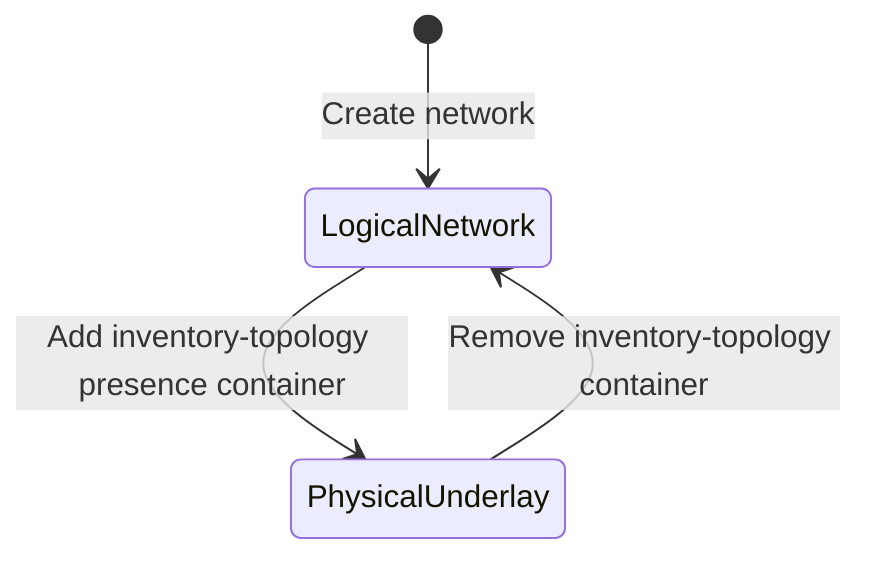

# Feature: Feature 22: Network Inventory Topology Network Type (Issue #57)

**Parent Epic:** [Epic 5: Network Inventory Topology (Issue #60)](https://github.com/gintatkinson/cogctl-ux-09/blob/main/docs/epics/epic-05-network-inventory-topology.md)

This feature introduces a new physical topology network type identifier under `nw:network-types` representing a physical underlay containing physical mapping attributes.

## 1. Schema Definitions & Constraints

### Nodes
- `inventory-topology`: Container for the inventory-topology network type.
  - **Type:** container (presence)
  - **Path:** `/nw:networks/nw:network/nw:network-types/nwit:inventory-topology`
  - **Presence:** "Indicates this is a bottom-most physical topology instance, containing physical-layer attributes including inventory mapping, port breakout capabilities, and link media types."

## 2. Logical System Integration & UI Capabilities
- **Physical Underlay Signaling Rule**: When the `inventory-topology` presence container is instantiated, it signals that the network contains physical-layer augmentations and mapping capabilities defined in the `ietf-network-inventory-topology` module.
- **Underlay Mapping Constraint**: This network type serves as the underlay for logical networks (e.g. L2, L3, TE topology).
- **Logical UI Representation**: The network visualizer UI renders a badge "Physical Inventory Underlay" when this network type presence container is active.

## 3. State Machine and Validation Flow

## 4. BDD Given-When-Then Acceptance Criteria
- **Scenario 1: Instantiate physical inventory underlay network type**
  - **Given** a network entry exists in the topology datastore
    **When** we instantiate the `inventory-topology` container under `network-types`
    **Then** the system enables physical inventory-mapping attributes on nodes and links in that network.
- **Scenario 2: Reject physical mapping attributes on logical-only networks**
  - **Given** a network entry does not have the `inventory-topology` presence container
    **When** attempting to write physical mapping attributes (e.g. ne-ref) to a node
    **Then** the validation rule rejects the edit.

## 5. Specification Context (Verbatim)
> Introduces a new network type for inventory topology mapping.
> Container for the inventory-topology network type.
> This network type is intended to serve as the underlay for logical network topologies (Layer 2, Layer 3, Traffic Engineering (TE), etc.).

## 6. Source References
YANG Schema: [ietf-network-inventory-topology.yang](https://github.com/ietf-ivy-wg/network-inventory-topology/blob/main/yang/ietf-network-inventory-topology.yang)
Normative Specification: [draft-ietf-ivy-network-inventory-topology](https://datatracker.ietf.org/doc/html/draft-ietf-ivy-network-inventory-topology)
