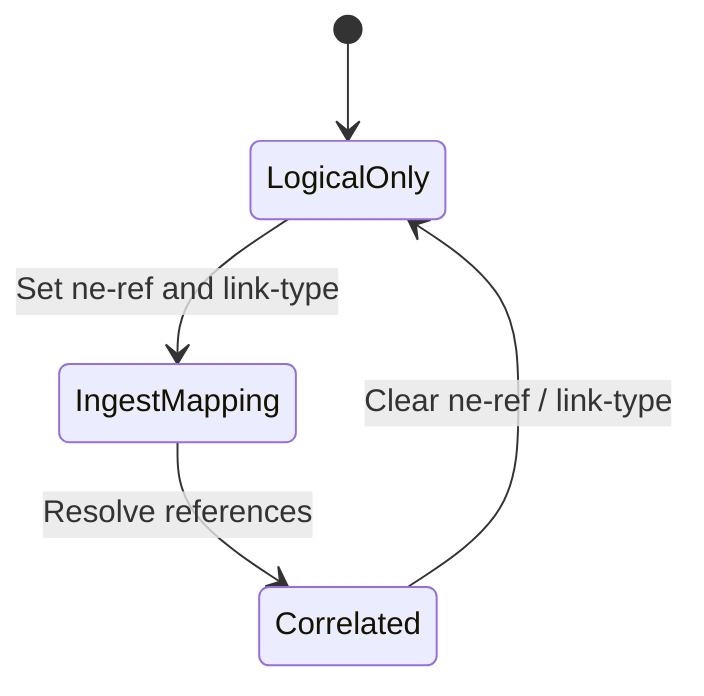

# Feature: Feature 23: Topology Inventory Mapping & Link Classification (Issue #58)

This feature implements the correlation between topology logical nodes/links and physical network elements, as well as lightweight classification of physical media link types.

## 1. Schema Definitions & Constraints

### Identities
- `link-type`: Base identity for physical media link classification.
- `copper`: Derived identity for copper physical link.
- `fiber`: Derived identity for fiber physical link.
- `coax`: Derived identity for coax physical link.
- `microwave`: Derived identity for microwave wireless link.
- `wlan`: Derived identity for IEEE 802.11 wireless link.
- `unknown`: Fallback classification when media type cannot be determined.
- `leased-fiber`: Derived identity representing a fiber link leased from a third party.

### Nodes
- `inventory-mapping-attributes` (Node level): Container for mapping a logical topology node to a physical element.
  - **Type:** container
  - **When:** `../network-types/inventory-topology`
  - `ne-ref`: Link ref to the physical Network Element.
    - **Type:** `nwi:ne-ref`
- `inventory-mapping-attributes` (Link level): Container for physical link classifications.
  - **Type:** container
  - **When:** `../network-types/inventory-topology`
  - `link-type`: The physical media type.
    - **Type:** `identityref link-type`

## 2. Logical System Integration & UI Capabilities
- **Correlation Rule**: Assigning `ne-ref` establishes a 1:1 correlation between a logical network topology node and its physical hardware element in the inventory registry.
- **Link Classification Rule**: The `link-type` classification helps identify whether to look up resources in a passive network inventory model (fiber, copper) or wireless inventory (microwave, WLAN).
- **Logical UI Representation**: In the topology map, hovering over a logical node displays the physical manufacturer serial and name using the correlation link. Hovering over a link displays the physical medium badge (e.g., Fiber, Microwave).

## 3. State Machine and Validation Flow

## 4. BDD Given-When-Then Acceptance Criteria
- **Scenario 1: Map node to physical network element**
  - **Given** a network element "ne-500" exists in inventory
    **When** we set the `ne-ref` attribute of a topology node to "ne-500"
    **Then** the configuration stores the logical-to-physical correlation.
- **Scenario 2: Set wireless microwave media link type**
  - **Given** a link in the physical underlay topology
    **When** we set the `link-type` leaf to `nwit:microwave`
    **Then** the system classifies the link as a wireless microwave media channel.

## 5. Specification Context (Verbatim)
> This reference establishes a 1:1 mapping between the logical node and its physical NE.
> This container provides lightweight media classification.
> Base identity for classifying the physical media type of a link at the inventory topology layer.

## 6. Source References
YANG Schema: [ietf-network-inventory-topology.yang](https://github.com/ietf-ivy-wg/network-inventory-topology/blob/main/yang/ietf-network-inventory-topology.yang)
Normative Specification: [draft-ietf-ivy-network-inventory-topology](https://datatracker.ietf.org/doc/html/draft-ietf-ivy-network-inventory-topology)
