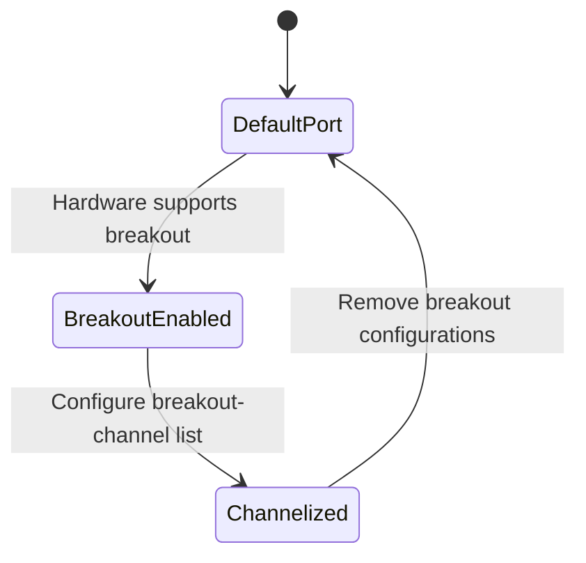

# Feature: Feature 24: Port Breakout & Channelization Capabilities (Issue #59)

**Parent Epic:** [Epic 5: Network Inventory Topology (Issue #60)](https://github.com/gintatkinson/cogctl-ux-09/blob/main/docs/epics/epic-05-network-inventory-topology.md)

This feature implements the capability to define physical breakout configurations and sub-port channels for termination points in the topology underlay.

## 1. Schema Definitions & Constraints

### Nodes
- `port-breakout`: Container representing port breakout capabilities.
  - **Type:** container (presence)
  - **Config:** false
  - **Presence:** "Indicates the port supports channel breakout."
- `breakout-channel`: List of breakout channels.
  - **Type:** list
  - **Key:** `channel-id`
- `channel-id`: Unique identifier for the breakout channel within the scope of the parent port.
  - **Type:** uint16

## 2. Logical System Integration & UI Capabilities
- **Breakout Capability Rule**: The `port-breakout` container is present only when the underlying physical port hardware supports channel breakout (e.g. splitting a 400G port into 4x100G lanes).
- **Sub-port Independence**: Each channel defined in the `breakout-channel` list represents an independent channelized sub-interface.
- **Logical UI Representation**: In the port/termination point detail panel, if breakout is supported, the UI displays the list of sub-port breakout lanes (e.g. Channel 1, Channel 2) next to the parent port representation.

## 3. State Machine and Validation Flow

## 4. BDD Given-When-Then Acceptance Criteria
- **Scenario 1: Read breakout channels from channelized physical port**
  - **Given** a termination point "tp-1" maps to a 400G physical port
    **When** querying breakout capabilities on "tp-1"
    **Then** the system returns a `port-breakout` presence container containing breakout channels with IDs 1, 2, 3, and 4.
- **Scenario 2: Validate unique channel IDs**
  - **Given** a channelized port breakout list
    **When** registering breakout channels
    **Then** each channel entry must have a unique `channel-id` value within that port scope.

## 5. Specification Context (Verbatim)
> Breakout capability of the physical port represented by this TP.
> This container is present only when the underlying hardware supports partitioning the port into multiple independent channels (e.g., 400G to 4x100G).
> Unique identifier for the breakout channel within the scope of the parent port.

## 6. Source References
YANG Schema: [ietf-network-inventory-topology.yang](https://github.com/ietf-ivy-wg/network-inventory-topology/blob/main/yang/ietf-network-inventory-topology.yang)
Normative Specification: [draft-ietf-ivy-network-inventory-topology](https://datatracker.ietf.org/doc/html/draft-ietf-ivy-network-inventory-topology)
