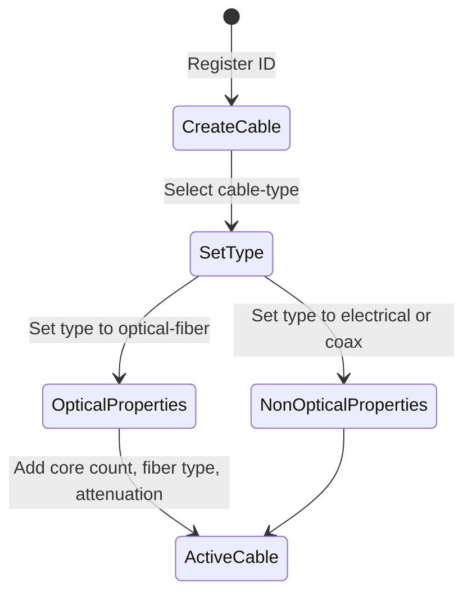

# Feature: Feature 25: Passive Cable Inventory & Types (Issue #65)

This feature implements physical cable asset registrations, categorizations (optical, electrical, coax), routing roles (backbone, access, branch), and optical transmission characteristics (core count, fiber type, attenuation).

## 1. Schema Definitions & Constraints

### Covered YANG Nodes
The following nodes from `ietf-nwi-passive-inventory` are defined and covered:
- `cable`
- `cable-type`
- `cable-role`
- `optical-cable`
- `fiber-core-num`
- `fiber-type`
- `attenuation`

### Covered Identities
- Fiber types:
  - `fiber-type`
  - `G652A`
  - `G652B`
  - `G652C`
  - `G652D`
  - `G653`
  - `G654`
  - `G655`
  - `G656`
  - `G657A1`
  - `G657A2`
  - `G657B`
  - `other`
- Cable types:
  - `cable-type`
  - `optical-fiber`
  - `electrical-cable`
  - `coaxial-cable`
- Cable roles:
  - `cable-role`
  - `backbone`
  - `aggregation`
  - `access`
  - `trunk`
  - `distribution`
  - `branch`

## 2. Logical System Integration & UI Capabilities
- **Asset Registration Rule**: All cables must be registered under the central grouping. They utilize name, alias, and description for asset identification.
- **Optical Schema Validation**: The `optical-cable` container is only valid and accessible when the `cable-type` is set to `optical-fiber`.
- **Logical UI Representation**: The network management portal renders a "Cable Registry" page listing physical lines, highlighting optical cables with color-coded tags indicating fiber types (e.g. G.652D, G.657A1) and current attenuation levels.

## 3. State Machine and Validation Flow

## 4. BDD Given-When-Then Acceptance Criteria
- **Scenario 1: Instantiate a fiber optic cable with G.652D cores**
  - **Given** a new cable "cable-99" is registered
    **When** we set `cable-type` to `nwi-passive:optical-fiber` and `fiber-type` to `nwi-passive:G652D`
    **Then** the configuration stores the optical attributes.
- **Scenario 2: Prevent optical attributes on electrical cables**
  - **Given** a cable has `cable-type` set to `nwi-passive:electrical-cable`
    **When** attempting to write `fiber-core-num` under the `optical-cable` container
    **Then** the validation rule rejects the configuration due to the `when` constraint.

## 5. Specification Context (Verbatim)
> This YANG module specifies a data model for passive devices, such as fibers, cables, and passive sites, deployed within and between network elements.
> Container for attributes associated with fiber optic cables.
> The fiber attenuation in dB.

## 6. Source References
YANG Schema: [ietf-nwi-passive-inventory.yang](https://github.com/aguoietf/draft-ygb-ivy-passive-network-inventory/blob/main/yang/ietf-nwi-passive-inventory.yang)
Normative Specification: [draft-ygb-ivy-passive-network-inventory](https://datatracker.ietf.org/doc/draft-ygb-ivy-passive-network-inventory/)
