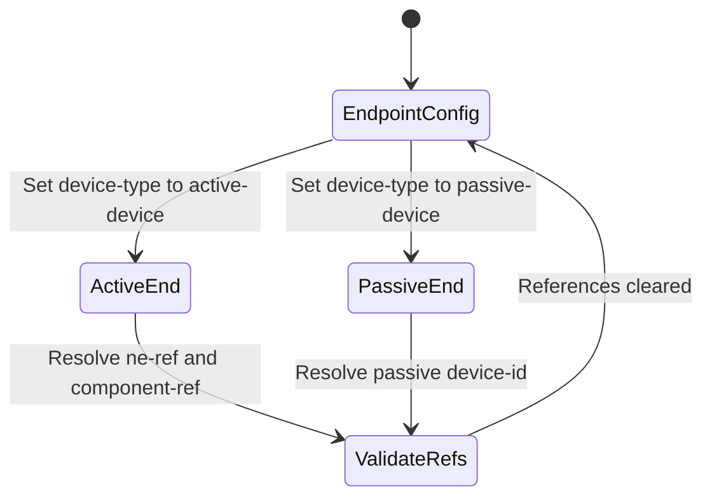

# Feature: Feature 26: Connected Device Ends & Cable Concatenation (Issue #66)

This feature implements the mapping of physical cable connection ends (A-end and Z-end) to either passive devices or active Network Element components (e.g. transceiver ports), as well as concatenating multiple child cables into a single composite cable run.

## 1. Schema Definitions & Constraints

### Covered YANG Nodes
The following nodes from `ietf-nwi-passive-inventory` are defined and covered:
- `a-end`
- `z-end`
- `device-type`
- `device-id`
- `ne-ref`
- `component-ref`
- `child-cable`
- `index`
- `length`
- `id`

### Covered Choices, Cases, and Identities
- `connected-device-type`
- `passive-device`
- `active-device`
- `passive`
- `active`

## 2. Logical System Integration & UI Capabilities
- **End-Point Constraint Rule**: If `device-type` is set to `active-device`, the system requires configuring `ne-ref` and `component-ref` which link to a registered physical chassis slot or port. If set to `passive-device`, the system requires `device-id`.
- **Concatenation Ordering**: The `child-cable` list requires at least 2 child cables (min-elements 2). The `index` specifies the sequence in which the segments are spliced.
- **Logical UI Representation**: In the cable map view, clicking on a composite cable expands it to display the sequence of sub-segments (child cables) with splicing coordinates, listing the active transceiver or ODF terminal at each end.

## 3. State Machine and Validation Flow

## 4. BDD Given-When-Then Acceptance Criteria
- **Scenario 1: Connect cable end to active router port component**
  - **Given** Network Element "router-1" with component "port-5" is registered in inventory
    **When** we set the cable `a-end` `device-type` to `active-device`, `ne-ref` to "router-1", and `component-ref` to "port-5"
    **Then** the validation verifies the existence of the target component and establishes the physical connection.
- **Scenario 2: Define a concatenated multi-segment fiber run**
  - **Given** a composite cable run is registered
    **When** we add two `child-cable` entries with indexes 1 and 2 respectively
    **Then** the system registers the composite path and calculates the total length as the sum of the child cable segments.

## 5. Specification Context (Verbatim)
> Device end based on the type of connected device.
> Referenced connected active device's component, e.g. port component.
> Ordered list of concatenated child cables.

## 6. Source References
YANG Schema: [ietf-nwi-passive-inventory.yang](https://github.com/aguoietf/draft-ygb-ivy-passive-network-inventory/blob/main/yang/ietf-nwi-passive-inventory.yang)
Normative Specification: [draft-ygb-ivy-passive-network-inventory](https://datatracker.ietf.org/doc/draft-ygb-ivy-passive-network-inventory/)
