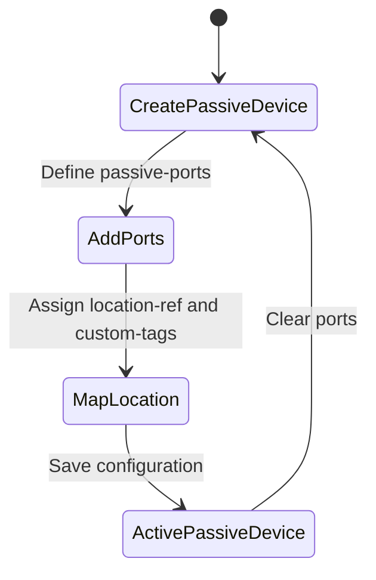

# Feature: Feature 27: Passive Device Management & Ports (Issue #67)

**Parent Epic:** [Epic 6: Passive Network Inventory (Issue #68)](https://github.com/gintatkinson/cogctl-ux-09/blob/main/docs/epics/epic-06-passive-inventory.md)

This feature implements passive device entries (ODFs, optical splitters, termination boxes), passive ports (service ports, inputs, outputs), tracking tags (RFID, barcode, QR codes), and geographical site references.

## 1. Schema Definitions & Constraints

### Covered YANG Nodes
The following nodes from `ietf-nwi-passive-inventory` are defined and covered:
- `passive-device`
- `device-type`
- `custom-tags`
- `location-ref`
- `passive-port`
- `port-type`
- `fiber-core-num`

### Covered Identities
- Passive Port Types:
  - `passive-port-type`
  - `service-port`
  - `input-port`
  - `output-port`
  - `p2mp-port`
- Passive Device Types:
  - `passive-device-type`
  - `ODF`
  - `WDM`
  - `FAT`
  - `FDT`
  - `ATB`

## 2. Logical System Integration & UI Capabilities
- **Geographic Reference Integrity**: The `location-ref` utilizes the location reference defined in `ietf-ni-location` to map the passive frame or box to a specific datacenter room, cabinet, or postal address.
- **Tracking Tags Lookup**: Field technicians can scan barcodes or RFID tags (`custom-tags`) to immediately fetch the passive device status and port mapping in the network portal.
- **Logical UI Representation**: In the site map, clicking on a passive site shows the layout of ODF patches, listing individual ports with their classifications (Input, Output, Service) and connected fiber channels.

## 3. State Machine and Validation Flow

## 4. BDD Given-When-Then Acceptance Criteria
- **Scenario 1: Register an Optical Distribution Frame (ODF) with RFID**
  - **Given** location "room-101" is registered in inventory
    **When** we create a passive device with type `nwi-passive:ODF`, custom-tags "RFID-990-12", and `location-ref` "room-101"
    **Then** the configuration stores the ODF details and binds it to room 101.
- **Scenario 2: Add passive input/output splitter ports**
  - **Given** an optical splitter passive device exists
    **When** we add passive ports with type `nwi-passive:input-port` and `nwi-passive:output-port` respectively
    **Then** the splitter configuration registers the input and output lanes.

## 5. Specification Context (Verbatim)
> List of passive devices.
> Customized tags, e.g. RFID, QR code that are attached to the device.
> Referenced location for the passive device.
> List of ports on a passive device.

## 6. Source References
YANG Schema: [ietf-nwi-passive-inventory.yang](https://github.com/aguoietf/draft-ygb-ivy-passive-network-inventory/blob/main/yang/ietf-nwi-passive-inventory.yang)
Normative Specification: [draft-ygb-ivy-passive-network-inventory](https://datatracker.ietf.org/doc/draft-ygb-ivy-passive-network-inventory/)
