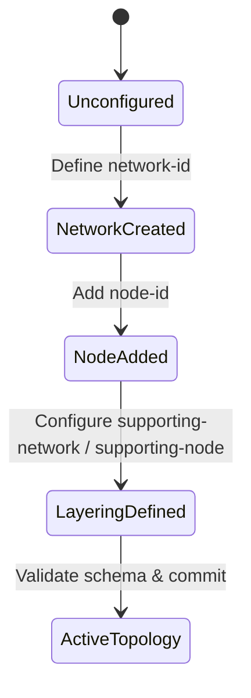

# Feature 28: Network and Node Base Models (Issue #73)

This feature implements the base network and node elements of RFC 8345, providing a common data model for describing collections of nodes, network relationships, and underlay network topologies.

## 1. Schema Definitions & Constraints

### Covered YANG Nodes
The following nodes from `ietf-network` are defined and covered:
- `networks`: Serves as a top-level container for a list of networks.
- `network`: Describes a network. A network typically contains an inventory of nodes, topological information, and layering information.
- `network-id`: Identifies a network.
- `network-types`: Serves as an augmentation target for indicating network types.
- `supporting-network`: An underlay network, used to represent layered network topologies.
- `network-ref`: References a network, e.g. an underlay network.
- `node`: The inventory of nodes of this network.
- `node-id`: Uniquely identifies a node within the containing network.
- `supporting-node`: Represents another node that is in an underlay network and that supports this node.
- `node-ref`: References a node.

### Typedefs
- `network-id`: Identifier for a network. Type is `inet:uri`.
- `node-id`: Identifier for a node. Type is `inet:uri`.

## 2. Logical System Integration & UI Capabilities
- **Multi-layer Representation**: The `supporting-network` and `supporting-node` structures are used to model multi-layer relationship hierarchies (e.g., optical underlay supporting L3 IP overlay).
- **Topology Dashboards**: Network mapping interfaces visualize networks as logical containers of nodes. Selecting a node displays its layering details (underlay support relationships).

## 3. State Machine and Validation Flow

## 4. BDD Given-When-Then Acceptance Criteria
- **Scenario 1: Configure a base network overlay on top of an underlay**
  - **Given** an underlay network "underlay-1" exists in the datastore
    **When** we create a network "overlay-1" with a supporting-network referencing "underlay-1"
    **Then** the configuration stores the network overlay and establishes the underlay hierarchy.
- **Scenario 2: Add a supported node with underlay mapping**
  - **Given** network "overlay-1" and supporting node "node-underlay" in "underlay-1" exist
    **When** we add node "node-overlay" to network "overlay-1" and define supporting-node referencing "underlay-1" and "node-underlay"
    **Then** the node is successfully registered with its supporting node mapping.

## 5. Specification Context (Verbatim)
> This module defines a common base data model for a collection of nodes in a network. Node definitions are further used in network topologies and inventories.
>
> typedef node-id { type inet:uri; description "Identifier for a node. The precise structure of the node-id will be up to the implementation." }
> typedef network-id { type inet:uri; description "Identifier for a network. The precise structure of the network-id will be up to the implementation." }

## 6. Source References
YANG Schema: [ietf-network.yang](https://github.com/YangModels/yang/blob/main/standard/ietf/RFC/ietf-network%402018-02-26.yang)
Normative Specification: [RFC 8345](https://datatracker.ietf.org/doc/rfc8345/)
