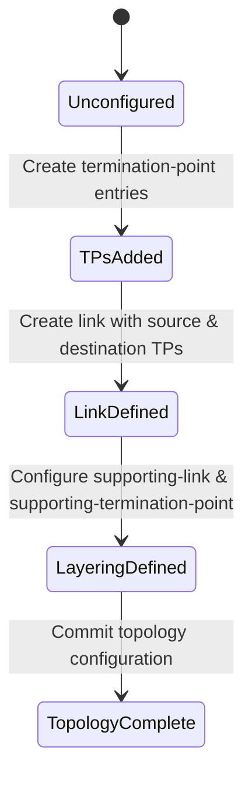

# Feature 29: Network Topology Model (Issue #74)

This feature implements the network topology model of RFC 8345, augmenting the base network model with links, source-to-destination connections, and termination points.

## 1. Schema Definitions & Constraints

### Covered YANG Nodes
The following nodes from `ietf-network-topology` are defined and covered:
- `link`: Describes a link connecting a source node/tp and destination node/tp.
- `link-id`: Uniquely identifies a link.
- `source`: The source point of a link.
- `source-node`: The source node of a link.
- `source-tp`: The source termination-point of a link.
- `destination`: The destination point of a link.
- `dest-node`: The destination node of a link.
- `dest-tp`: The destination termination-point of a link.
- `supporting-link`: An underlay link supporting this link.
- `link-ref`: References a link.
- `network-ref`: References a network.
- `node-ref`: References a node.
- `termination-point`: Describes a termination-point (TP) where links terminate.
- `tp-id`: Uniquely identifies a termination-point within a node.
- `supporting-termination-point`: An underlay termination-point supporting this TP.
- `tp-ref`: References a termination-point.

### Typedefs
- `link-id`: Identifier for a link. Type is `inet:uri`.
- `tp-id`: Identifier for a termination-point. Type is `inet:uri`.

## 2. Logical System Integration & UI Capabilities
- **Topology Mapping**: Nodes are logically interconnected via unidirectional links defined between specific termination-points (ports/interfaces).
- **Overlay Link Mapping**: Logical connections (e.g., overlay VPN links) map to physical paths via the `supporting-link` container.
- **Visual Path Audits**: Operates as the foundation for plotting and rendering graphic representations of link paths and endpoints.

## 3. State Machine and Validation Flow

## 4. BDD Given-When-Then Acceptance Criteria
- **Scenario 1: Connect two nodes via termination points**
  - **Given** network "net-1" has node "node-A" with TP "tp-1" and node "node-B" with TP "tp-2"
    **When** we define a link "link-1" in network "net-1" with source node "node-A", source TP "tp-1", destination node "node-B", and destination TP "tp-2"
    **Then** the configuration stores the unidirectional link connecting the two nodes.
- **Scenario 2: Define underlay mapping for a logical link**
  - **Given** logical link "link-1" and physical supporting link "phys-link-1" exist
    **When** we add a supporting-link entry to "link-1" referencing "phys-link-1" and its physical network
    **Then** the relationship is saved, binding the logical link to its underlay link.

## 5. Specification Context (Verbatim)
> This module defines a common base data model for network topology, augmenting the ietf-network model with links and termination points.
>
> typedef link-id { type inet:uri; description "Identifier for a link." }
> typedef tp-id { type inet:uri; description "Identifier for a termination point." }

## 6. Source References
YANG Schema: [ietf-network-topology.yang](https://github.com/YangModels/yang/blob/main/standard/ietf/RFC/ietf-network-topology%402018-02-26.yang)
Normative Specification: [RFC 8345](https://datatracker.ietf.org/doc/rfc8345/)
