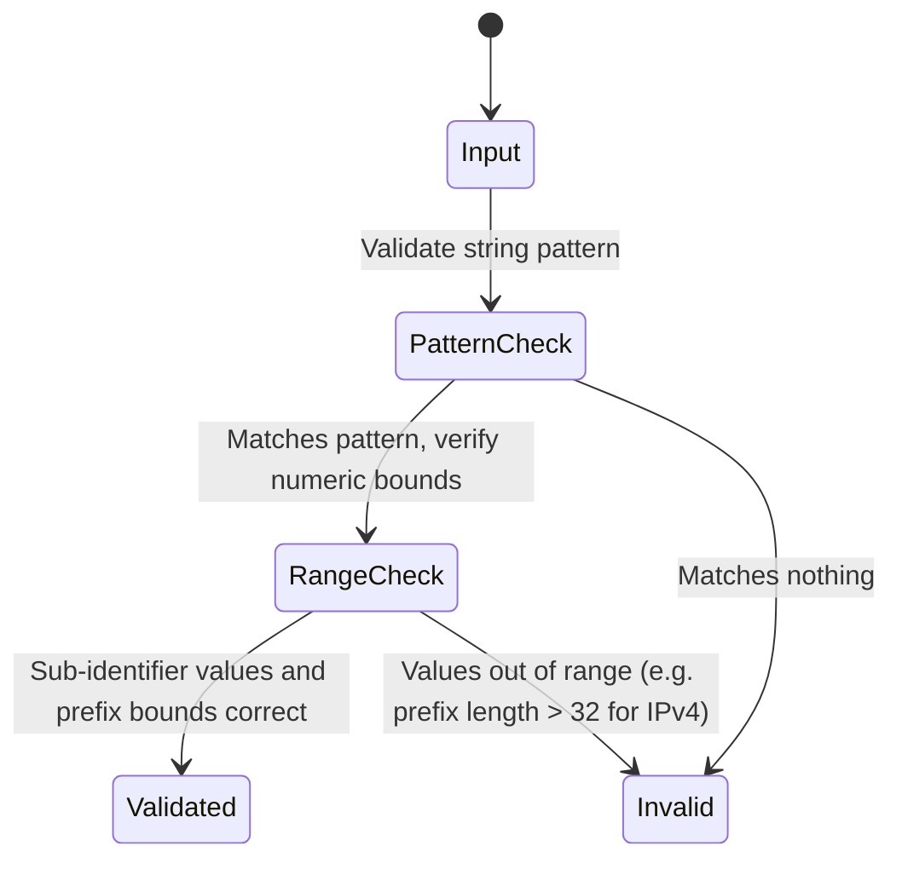

# Feature: Feature 30: IP Address and Prefix Types

This feature implements the validation rules, canonical structures, and UI representations for IP address and prefix data types defined in RFC 6021 (`ietf-inet-types`).

## 1. Schema Definitions & Constraints

### Typedefs
- `ip-address`: Union of `ipv4-address` and `ipv6-address`. Version neutral, supports zone identifiers.
- `ipv4-address`: String pattern in dotted-quad notation, optionally including a zone index separated by `%`.
- `ipv6-address`: String pattern representing full, mixed, shortened, and shortened-mixed notation, optionally including a zone index.
- `ip-address-no-zone`: Union of `ipv4-address-no-zone` and `ipv6-address-no-zone`. Banned zone identifiers.
- `ipv4-address-no-zone`: Restricted version of `ipv4-address` without zone indices.
- `ipv6-address-no-zone`: Restricted version of `ipv6-address` without zone indices.
- `ip-prefix`: Union of `ipv4-prefix` and `ipv6-prefix`. Version neutral.
- `ipv4-prefix`: Dotted-quad address followed by slash and prefix length (0..32).
- `ipv6-prefix`: IPv6 address followed by slash and prefix length (0..128).

### Nodes
No container or leaf nodes are defined in this YANG module since it contains only typedefs.

## 2. Logical System Integration & UI Capabilities
- **Logical Data Model:** Maps IP addresses and prefixes to validated database attributes.
- **Logical Processing Rules:**
  - Zone validation: Zone index `%` allows interface name or index mapping (typically local link scope).
  - Canonical conversion: Normalizes IPv6 addresses to lowercase and removes redundant leading zeros inside segments.
- **Logical UI Representation:** Validated fields that display IPv4/IPv6 badge indicators and highlight prefix validity.

## 3. State Machine and Validation Flow

## 4. BDD Given-When-Then Acceptance Criteria
- **Scenario 1: IPv4 prefix validation**
  - **Given** an ipv4-prefix input field
    **When** the user inputs `192.168.1.0/33`
    **Then** the validation fails because the prefix length bounds are exceeded.
- **Scenario 2: IPv6 address normalization**
  - **Given** an ipv6-address validator
    **When** input is `2001:0db8::0001`
    **Then** it is normalized to `2001:db8::1`.

## 5. Specification Context (Verbatim)
> The ip-address type represents an IP address and is IP version neutral. The format of the textual representation implies the IP version. This type supports scoped addresses by allowing zone identifiers.

## 6. Source References
YANG Schema: [ietf-inet-types.yang](https://github.com/YangModels/yang/blob/main/standard/ietf/RFC/ietf-inet-types%402013-07-15.yang)
Normative Specification: [RFC 6021 Common YANG Data Types](https://datatracker.ietf.org/doc/rfc6021/)
