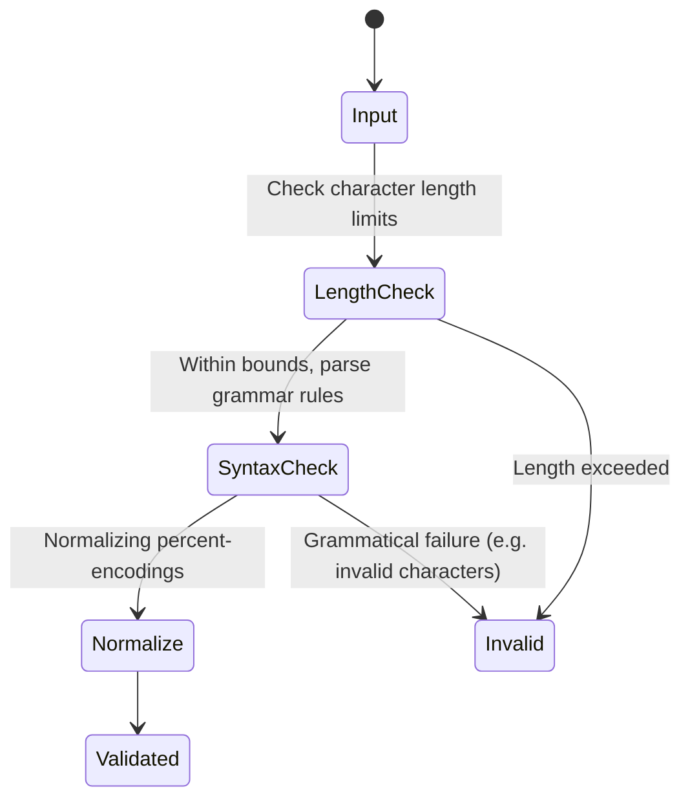

# Feature: Feature 31: Internet Domain Names and URIs

This feature implements the validation rules, domain restrictions, and URI canonical normalization criteria defined in RFC 6021 (`ietf-inet-types`).

## 1. Schema Definitions & Constraints

### Typedefs
- `domain-name`: DNS domain name with length between 1 and 253 characters. Regulated label sizes.
- `host`: Union of `ip-address` and `domain-name`. Represents either an IP address or a DNS domain name.
- `uri`: Uniform Resource Identifier (URI) as defined by STD 66, normalized as per RFC 3986 guidelines.

### Nodes
No container or leaf nodes are defined in this YANG module since it contains only typedefs.

## 2. Logical System Integration & UI Capabilities
- **Logical Data Model:** Stores domains, host addresses, and resource identifiers as structured schemas.
- **Logical Processing Rules:**
  - URI Normalization: All unnecessary percent-encoding is removed, case-insensitive scheme/hosts set to lowercase, hex digits in percent-encoding normalized to uppercase.
  - DNS Length constraints: Limits FQDNs to 253 characters and sub-labels to 63 characters.
- **Logical UI Representation:** Validated text inputs that warn when a URI lacks a scheme or a domain name has invalid characters (e.g. non-ASCII).

## 3. State Machine and Validation Flow

## 4. BDD Given-When-Then Acceptance Criteria
- **Scenario 1: URI Normalization**
  - **Given** a uri validator
    **When** the input is `HTTP://www.Example.com/%7esmith`
    **Then** the output normalizes to `http://www.example.com/~smith`.
- **Scenario 2: Domain label length limits**
  - **Given** a domain-name validator
    **When** a sub-label exceeds 63 characters
    **Then** the validation rejects it.

## 5. Specification Context (Verbatim)
> The domain-name type represents a DNS domain name. The name SHOULD be fully qualified whenever possible. The encoding of DNS names in the DNS protocol is limited to 255 characters.

## 6. Source References
YANG Schema: [ietf-inet-types.yang](https://github.com/YangModels/yang/blob/main/standard/ietf/RFC/ietf-inet-types%402013-07-15.yang)
Normative Specification: [RFC 6021 Common YANG Data Types](https://datatracker.ietf.org/doc/rfc6021/)
