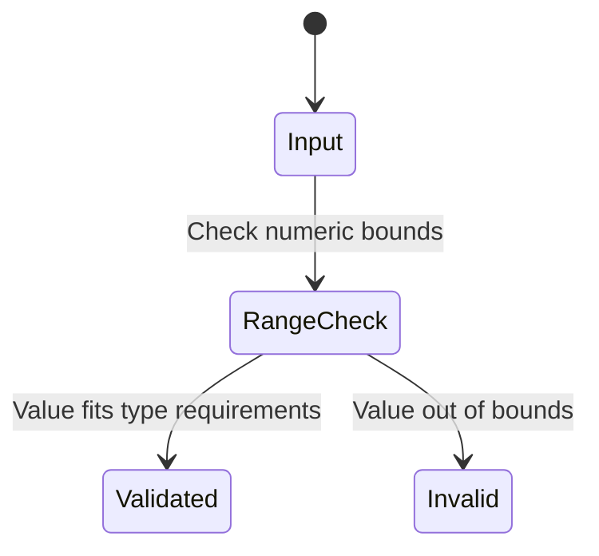

# Feature: Feature 32: IP Protocol Fields and Autonomous Systems

**Parent Epic:** [Epic 8: Common Internet Address YANG Data Types (Issue #88)](https://github.com/gintatkinson/cogctl-ux-09/blob/main/docs/epics/epic-08-internet-types.md)

This feature implements the ranges, enumerations, and validation criteria for core protocol header fields and autonomous system numbers defined in RFC 6021 (`ietf-inet-types`).

## 1. Schema Definitions & Constraints

### Typedefs
- `ip-version`: Enumeration representing version of IP protocol (`unknown` = 0, `ipv4` = 1, `ipv6` = 2).
- `dscp`: Differentiated Services Code Point representing packet markings. Range: `0..63` (uint8).
- `ipv6-flow-label`: Flow identifier in IPv6 header to discriminate traffic. Range: `0..1048575` (uint32).
- `port-number`: Transport layer port (TCP/UDP/SCTP). Range: `0..65535` (uint16). Port 0 is reserved.
- `as-number`: Autonomous System number identifying an AS. Base type: `uint32`.

### Nodes
No container or leaf nodes are defined in this YANG module since it contains only typedefs.

## 2. Logical System Integration & UI Capabilities
- **Logical Data Model:** Maps protocol fields and AS numbers to numeric fields in database tables.
- **Logical Processing Rules:**
  - Range Enforcement: Rejects DSCP outside 0..63 and Flow Labels outside 0..1048575.
  - Port Range bounds: Validates port numbers strictly within uint16 limits.
- **Logical UI Representation:** Dropdowns for IP versions, range-bounded number inputs for DSCP, ports, and AS numbers, displaying warnings for out-of-bound inputs.

## 3. State Machine and Validation Flow

## 4. BDD Given-When-Then Acceptance Criteria
- **Scenario 1: DSCP range verification**
  - **Given** a dscp input field
    **When** the user inputs `64`
    **Then** the validation fails since the maximum allowed value is 63.
- **Scenario 2: Port number validation**
  - **Given** a port-number input field
    **When** the user enters `70000`
    **Then** the validation fails as it exceeds the 16-bit range limit.

## 5. Specification Context (Verbatim)
> The dscp type represents a Differentiated Services Code Point. The port-number type represents a 16-bit port number of an Internet transport-layer protocol. The as-number type represents autonomous system numbers.

## 6. Source References
YANG Schema: [ietf-inet-types.yang](https://github.com/YangModels/yang/blob/main/standard/ietf/RFC/ietf-inet-types%402013-07-15.yang)
Normative Specification: [RFC 6021 Common YANG Data Types](https://datatracker.ietf.org/doc/rfc6021/)
