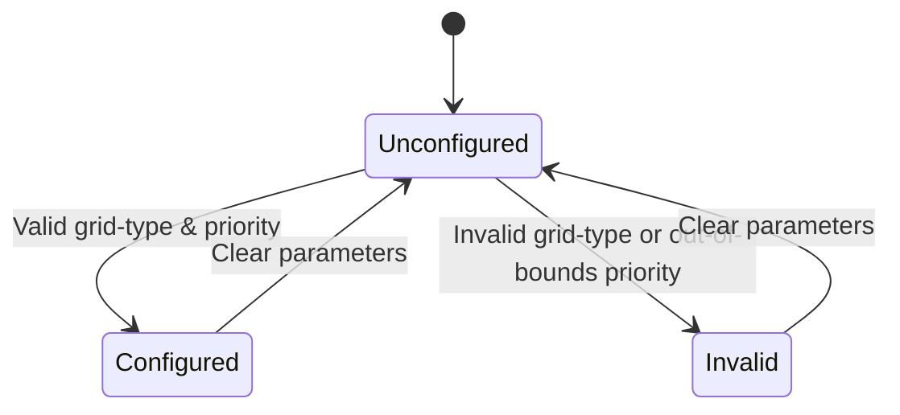

# Feature: Feature 33: Layer 0 Grid Type and Label Range Information (Issue #94)

**Parent Epic:** [Epic 10: Optical Layer 0 Type Definitions (Issue #101)](https://github.com/gintatkinson/cogctl-ux-09/blob/main/docs/epics/epic-10-optical-layer0-types.md)

This feature establishes the base Optical Layer 0 grid identities and common label range metadata utilized by Layer 0 Fixed (CWDM/DWDM) and Flexi-Grid optical networks.

## 1. Schema Definitions & Constraints

### Identities
- `l0-grid-type`: Base identity for all Layer 0 grid types.
- `wson-grid-dwdm`: Identity representing a DWDM grid (inherits from `l0-grid-type`).
- `wson-grid-cwdm`: Identity representing a CWDM grid (inherits from `l0-grid-type`).
- `flexi-grid-dwdm`: Identity representing a Flexi-Grid (inherits from `l0-grid-type`).

### Leaves (from Grouping `l0-label-range-info`)
- `grid-type`: Specifies the Layer 0 grid type.
  - **Type**: `identityref` referencing `l0-grid-type`
- `priority`: Specifies the priority in the Interface Switching Capability Descriptor (ISCD).
  - **Type**: `uint8`

## 2. Logical System Integration & UI Capabilities
- **Logical Data Model**: Grid types map to system-level identifiers referencing standard grid type classes. Priority maps to integer priorities within the switching and routing logic.
- **Logical Processing Rules**:
  - Grid Validation: The `grid-type` attribute must resolve to one of the defined subclasses of `l0-grid-type` (`wson-grid-dwdm`, `wson-grid-cwdm`, or `flexi-grid-dwdm`).
  - Priority Validation: Priority must reside within the 0 to 255 range.
- **Logical UI Representation**:
  - Dropdown interface for selecting grid types populated by standard identity types.
  - Number input box for the priority attribute with values bounded between 0 and 255.

## 3. State Machine and Validation Flow

## 4. BDD Given-When-Then Acceptance Criteria
- **Scenario 1: Valid Layer 0 Grid and Priority Config**
  - **Given** a new Layer 0 link label range is initialized
    **When** the grid type is set to "wson-grid-dwdm" and priority is set to 7
    **Then** the configuration is validated successfully.
- **Scenario 2: Out of Bounds Priority Rejection**
  - **Given** a new Layer 0 link label range configuration
    **When** priority is set to 256
    **Then** the system rejects the value with a boundary error.

## 5. Specification Context (Verbatim)
> identity l0-grid-type {
>   description "Layer 0 grid type";
>   reference "RFC 6163: Framework for GMPLS and PCE Control of WSONs, ITU-T G.694.1: Spectral grids for WDM applications: DWDM frequency grid, ITU-T G.694.2: Spectral grids for WDM applications: CWDM wavelength grid";
> }
>
> grouping l0-label-range-info {
>   description "Information about Layer 0 label range.";
>   leaf grid-type {
>     type identityref {
>       base l0-grid-type;
>     }
>     description "Grid type";
>   }
>   leaf priority {
>     type uint8;
>     description "Priority in Interface Switching Capability Descriptor (ISCD).";
>     reference "RFC 4203: OSPF Extensions in Support of GMPLS";
>   }
> }

## 6. Source References
YANG Schema: [ietf-layer0-types.yang](https://github.com/gintatkinson/cogctl-ux-09/blob/main/yang/ietf-layer0-types.yang)
Normative Specification: [RFC 9093](https://datatracker.ietf.org/doc/rfc9093/)
