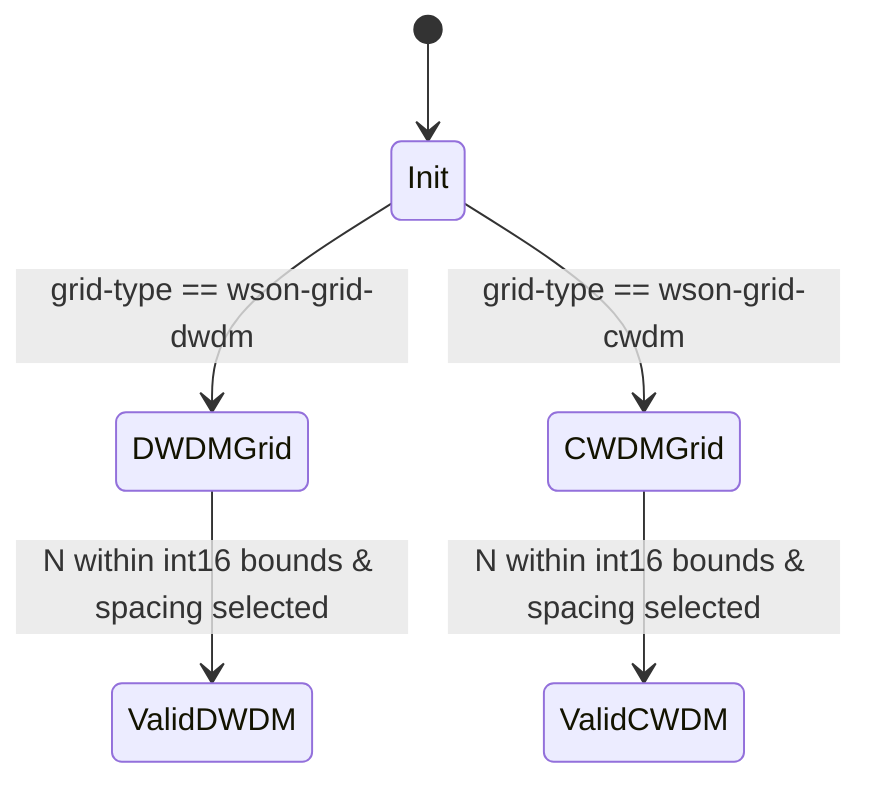

# Feature: Feature 34: WSON Grid Channel and Label Configuration (Issue #95)

**Parent Epic:** [Epic 10: Optical Layer 0 Type Definitions (Issue #101)](https://github.com/gintatkinson/cogctl-ux-09/blob/main/docs/epics/epic-10-optical-layer0-types.md)

This feature implements validation constraints and central frequency/wavelength mathematical formulas for Wavelength Switched Optical Networks (WSON) operating on DWDM or CWDM grids.

## 1. Schema Definitions & Constraints

### Typedefs
- `dwdm-n`: Integer value `N` used to determine the nominal central frequency ($f$) by:
  $$f = 193100.000\text{ GHz} + N \times \text{channel spacing (GHz)}$$
  Where $193100.000\text{ GHz}$ is the ITU-T anchor frequency.
  - **Type**: `int16`
- `cwdm-n`: Integer value `N` used to determine the nominal central wavelength by:
  $$\text{Wavelength} = 1471\text{ nm} + N \times \text{channel spacing (nm)}$$
  Where $1471\text{ nm}$ is the conventional anchor wavelength.
  - **Type**: `int16`

### Identities
- `dwdm-ch-spc-type`: Base identity for DWDM channel-spacing types.
- `dwdm-100ghz`, `dwdm-50ghz`, `dwdm-25ghz`, `dwdm-12p5ghz`: Channel spacing subclasses (100 GHz, 50 GHz, 25 GHz, and 12.5 GHz).
- `cwdm-ch-spc-type`: Base identity for CWDM channel-spacing types.
- `cwdm-20nm`: CWDM channel spacing subclass (20nm).

### Grouping Nodes
- `wson-label-start-end` and `wson-label-hop`:
  - `dwdm` (case) / `dwdm-n` (leaf): Specifies central frequency index `N` for DWDM grid.
  - `subcarrier-dwdm-n` (leaf-list): List of subcarriers for DWDM super channels.
  - `cwdm` (case) / `cwdm-n` (leaf): Specifies central wavelength index `N` for CWDM grid.
- `wson-label-step`:
  - `wson-dwdm-channel-spacing` (leaf): identityref referencing `dwdm-ch-spc-type`.
  - `wson-cwdm-channel-spacing` (leaf): identityref referencing `cwdm-ch-spc-type`.

## 2. Logical System Integration & UI Capabilities
- **Logical Data Model**: Central frequencies and wavelengths are represented by integer indexes `N` mapped to floating-point gigahertz (GHz) or nanometer (nm) values.
- **Logical Processing Rules**:
  - Grid-Type Matching: `dwdm-n` is only valid when grid type is DWDM; `cwdm-n` is only valid when grid type is CWDM.
- **Logical UI Representation**:
  - Graphical slider or spinbox for index `N` showing the calculated final frequency/wavelength based on selected channel spacing.

## 3. State Machine and Validation Flow

## 4. BDD Given-When-Then Acceptance Criteria
- **Scenario 1: Compute DWDM Nominal Central Frequency**
  - **Given** a DWDM channel configuration with spacing "dwdm-50ghz"
    **When** the frequency index `dwdm-n` is set to 2
    **Then** the nominal central frequency computes to exactly 193200.000 GHz ($193100 + 2 \times 50$).
- **Scenario 2: Compute CWDM Nominal Central Wavelength**
  - **Given** a CWDM channel configuration with spacing "cwdm-20nm"
    **When** the wavelength index `cwdm-n` is set to 3
    **Then** the nominal central wavelength computes to exactly 1531 nm ($1471 + 3 \times 20$).

## 5. Specification Context (Verbatim)
> typedef dwdm-n {
>   type int16;
>   description
>     "The given value 'N' is used to determine the nominal central frequency.
>      The nominal central frequency, 'f', is defined by:
>      f = 193100.000 GHz + N x channel spacing (measured in GHz)";
> }
> 
> typedef cwdm-n {
>   type int16;
>   description
>     "The given value 'N' is used to determine the nominal central wavelength.
>      The nominal central wavelength is defined by:
>      Wavelength = 1471 nm + N x channel spacing (measured in nm)";
> }

## 6. Source References
YANG Schema: [ietf-layer0-types.yang](https://github.com/gintatkinson/cogctl-ux-09/blob/main/yang/ietf-layer0-types.yang)
Normative Specification: [RFC 9093](https://datatracker.ietf.org/doc/rfc9093/)
