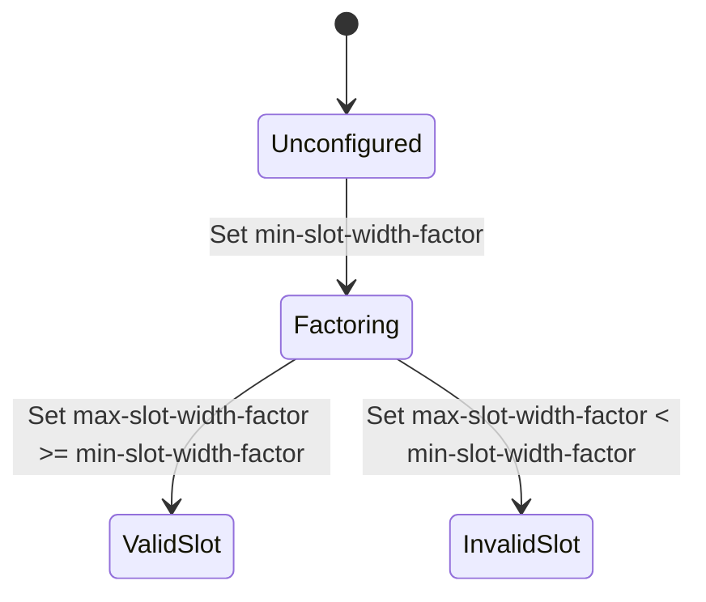

# Feature: Feature 35: Flexi-Grid Channel and Slot Configuration (Issue #96)

**Parent Epic:** [Epic 10: Optical Layer 0 Type Definitions (Issue #101)](https://github.com/gintatkinson/cogctl-ux-09/blob/main/docs/epics/epic-10-optical-layer0-types.md)

This feature implements the validation rules, nominal central frequency calculations, slot width factors, and granularity constraints for Flexi-Grid optical networks.

## 1. Schema Definitions & Constraints

### Typedefs
- `flexi-n`: Integer value `N` used to determine the nominal central frequency ($f$) by:
  $$f = 193100.000\text{ GHz} + N \times 6.25\text{ GHz}$$
  - **Type**: `int16`
- `flexi-m`: Integer value `M` used to determine the slot width by:
  $$\text{Slot Width} = M \times 12.5\text{ GHz}$$
  - **Type**: `uint16`

### Identities
- `flexi-ch-spc-type`: Base identity for Flexi-grid channel spacing.
- `flexi-ch-spc-6p25ghz`: Identity representing 6.25 GHz nominal central frequency granularity.
- `flexi-slot-width-granularity`: Base identity for Flexi-grid slot width granularity.
- `flexi-swg-12p5ghz`: Identity representing 12.5 GHz slot width granularity.

### Container & Leaf Nodes
- `flexi-grid` (container): Definition block for Flexi-Grid parameters.
- `slot-width-granularity`: Identityref referencing `flexi-slot-width-granularity` (default: `flexi-swg-12p5ghz`).
- `min-slot-width-factor`: Multiplier of slot width granularity for minimum slot width supported.
  - **Type**: `uint16` (range: `1..max`, default: 1)
- `max-slot-width-factor`: Multiplier of slot width granularity for maximum slot width supported. Must be $\ge$ `min-slot-width-factor`.
  - **Type**: `uint16` (range: `1..max`)
- `flexi-grid-channel-spacing`: Nominal central frequency granularity (default: `flexi-ch-spc-6p25ghz`).
- `flexi-n-step`: Multiplier for supported values of `N` (e.g., step of 2 means `N` must be even).
  - **Type**: `uint8`

### Choices & Lists
- `single-or-super-channel` (choice): Case `single` uses a single frequency slot; Case `super` uses list `subcarrier-flexi-n` representing subcarriers.

## 2. Logical System Integration & UI Capabilities
- **Logical Processing Rules**:
  - Validation: `max-slot-width-factor` must be greater than or equal to `min-slot-width-factor`.
  - Step check: If `flexi-n-step` is configured as 2, index `flexi-n` must be an even integer.
- **Logical UI Representation**:
  - Boundary input fields enforcing the slot width factor inequality (`max` $\ge$ `min`).
  - Validation messaging displaying calculated GHz slot width alongside factors.

## 3. State Machine and Validation Flow

## 4. BDD Given-When-Then Acceptance Criteria
- **Scenario 1: Enforce Slot Width Factor Boundary Inequality**
  - **Given** a Flexi-Grid configuration with `min-slot-width-factor` set to 4
    **When** the user attempts to set `max-slot-width-factor` to 3
    **Then** the validation fails and raises an error.
- **Scenario 2: Validate Flexi-N step multiplier**
  - **Given** a Flexi-Grid configuration with `flexi-n-step` set to 2
    **When** the nominal central frequency index `flexi-n` is set to 3 (an odd number)
    **Then** the validation fails and rejects the configuration.

## 5. Specification Context (Verbatim)
> leaf max-slot-width-factor {
>   type uint16 {
>     range "1..max";
>   }
>   must '. >= ../min-slot-width-factor' {
>     error-message "Maximum slot width must be greater than or equal to minimum slot width.";
>   }
>   description "A multiplier of the slot width granularity, indicating the maximum slot width supported by an optical port.";
> }

## 6. Source References
YANG Schema: [ietf-layer0-types.yang](https://github.com/gintatkinson/cogctl-ux-09/blob/main/yang/ietf-layer0-types.yang)
Normative Specification: [RFC 9093](https://datatracker.ietf.org/doc/rfc9093/)
