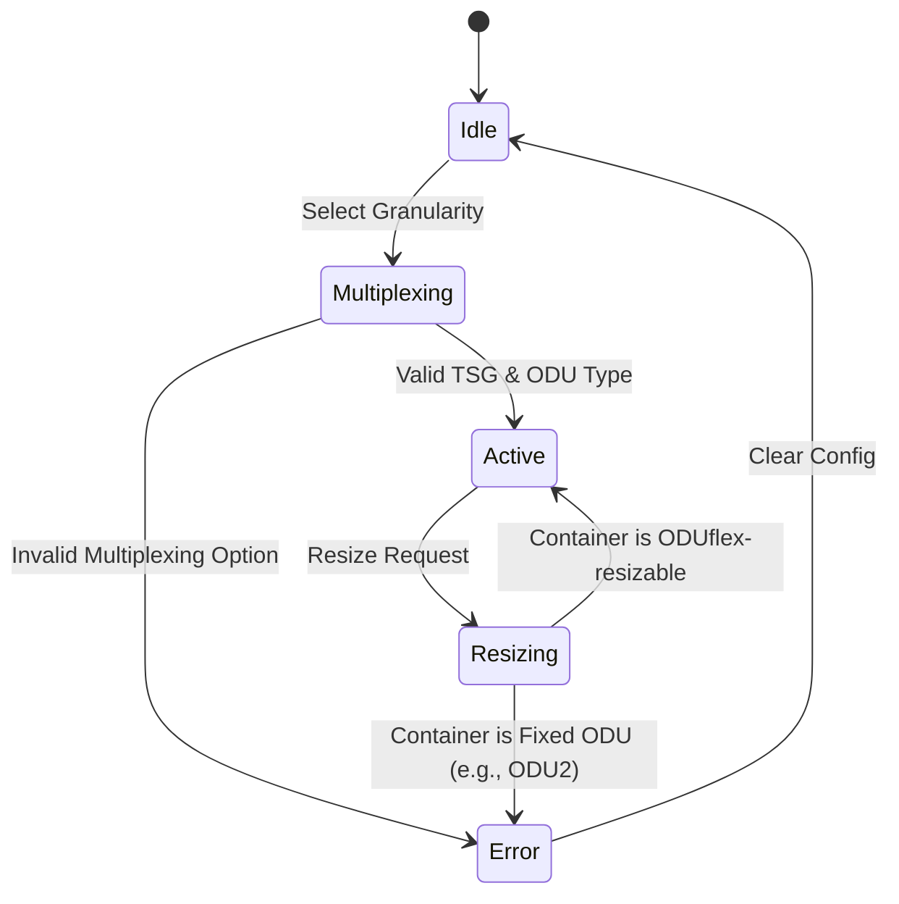

# Feature: Feature 36: Layer 1 ODU Type and Granularity Definitions (Issue #124)

**Parent Epic:** [Epic 11: Optical Layer 1 Type Definitions (Issue #131)](https://github.com/gintatkinson/cogctl-ux-09/blob/main/docs/epics/epic-11-optical-layer1-types.md)

This feature defines the standard Optical Data Unit (ODU) container types and their corresponding Tributary Slot Granularities (TSG) used to partition physical layer bandwidth within the Optical Transport Network (OTN).

## 1. Schema Definitions & Constraints

### Identities
- `tributary-slot-granularity`: Base identity representing the capacity of a single tributary slot in an OTN multiplex structure.
  - `tsg-1.25G`: Represents a slot capacity of 1.25 Gbps. Bounded by ITU-T G.709 v6.0.
  - `tsg-2.5G`: Represents a slot capacity of 2.5 Gbps. Bounded by ITU-T G.709 v6.0.
  - `tsg-5G`: Represents a slot capacity of 5 Gbps. Bounded by ITU-T G.709 v6.0.
- `odu-type`: Base identity representing standard optical data unit containers.
  - `ODU0`: Represents ODU0 containers running at ~1.24 Gbps.
  - `ODU1`: Represents ODU1 containers running at ~2.49 Gbps.
  - `ODU2`: Represents ODU2 containers running at ~10.03 Gbps.
  - `ODU2e`: Represents ODU2e containers running at ~10.39 Gbps (overclocked ODU2 for carrying 10G Ethernet).
  - `ODU3`: Represents ODU3 containers running at ~40.31 Gbps.
  - `ODU4`: Represents ODU4 containers running at ~104.79 Gbps.
  - `ODUflex`: Represents flexible bit rate ODU containers (non-resizable).
  - `ODUflex-resizable`: Represents resizable flexible bit rate ODU containers (supports hitless resizing via G.7044/Y.1347).

## 2. Logical System Integration & UI Capabilities

### Logical Data Model
- ODU types are represented inside the network inventory system as type identifiers referencing subclasses of `odu-type`.
- Tributary slot granularities map to enumeration tokens (`tsg-1.25G`, `tsg-2.5G`, `tsg-5G`) inside port multiplexing configurations.

### Logical Processing Rules
- **Type Compatibility**: Resizing operations are strictly rejected unless the target container type resolves to `ODUflex-resizable`.
- **Granularity Validation**: Link mapping configurations must verify that the requested container type (e.g., ODU2) can be multiplexed into tributary slots of the configured granularity (e.g., ODU2 over ODU4 link using `tsg-1.25G` vs `tsg-2.5G` slots).

### Logical UI Representation
- **Inventory/Config UI**: Displays a read-only or selectable list of ODU types mapped to standard names.
- **Port Multiplexing Panel**: Dropdown menu filtering available slot granularities based on the physical interface capability.
- **Resizing Controls**: Action buttons for adjusting container size are disabled or hidden unless the container is identified as an `ODUflex-resizable` container.

## 3. State Machine and Validation Flow

## 4. BDD Given-When-Then Acceptance Criteria

- **Scenario 1: Valid ODUflex Resizing Activation**
  - **Given** an active optical container of type "ODUflex-resizable"
    **When** a capacity change request is initiated
    **Then** the system transitions the container to the resizing state.
- **Scenario 2: Rejection of Fixed ODU Container Resizing**
  - **Given** an active optical container of type "ODU2"
    **When** a capacity change request is initiated
    **Then** the system rejects the request with an "OperationNotSupported" error.
- **Scenario 3: Valid Slot Granularity Selection**
  - **Given** a multiplexed interface on an ODU4 host link
    **When** the slot granularity is configured as "tsg-1.25G"
    **Then** the interface initializes 80 available tributary slots.

## 5. Specification Context (Verbatim)

>   identity tributary-slot-granularity {
>     description
>       "Tributary Slot Granularity (TSG).";
>     reference
>       "ITU-T G.709 v6.0 (06/2020): Interfaces for the Optical
>        Transport Network (OTN)";
>   }
> 
>     identity tsg-1.25G {
>       base tributary-slot-granularity;
>       description
>         "1.25G tributary slot granularity.";
>     }
> 
>     identity tsg-2.5G {
>       base tributary-slot-granularity;
>       description
>         "2.5G tributary slot granularity.";
>     }
> 
>     identity tsg-5G {
>       base tributary-slot-granularity;
>       description
>         "5G tributary slot granularity.";
>     }
> 
>   identity odu-type {
>     description
>       "Base identity from which specific Optical Data Unit (ODU)
>       type is derived.";
>     reference
>       "RFC7139: GMPLS Signaling Extensions for Control of Evolving
>        G.709 Optical Transport Networks
> 
>        ITU-T G.709 v6.0 (06/2020): Interfaces for the Optical
>        Transport Network (OTN)";
>   }

## 6. Source References
- **YANG Schema:** [ietf-layer1-types.yang](file:///home/parallels/Desktop/cogctl-ux-09/yang/ietf-layer1-types.yang)
- **Normative Document:** [draft-ietf-ccamp-layer1-types](https://datatracker.ietf.org/doc/draft-ietf-ccamp-layer1-types/)
