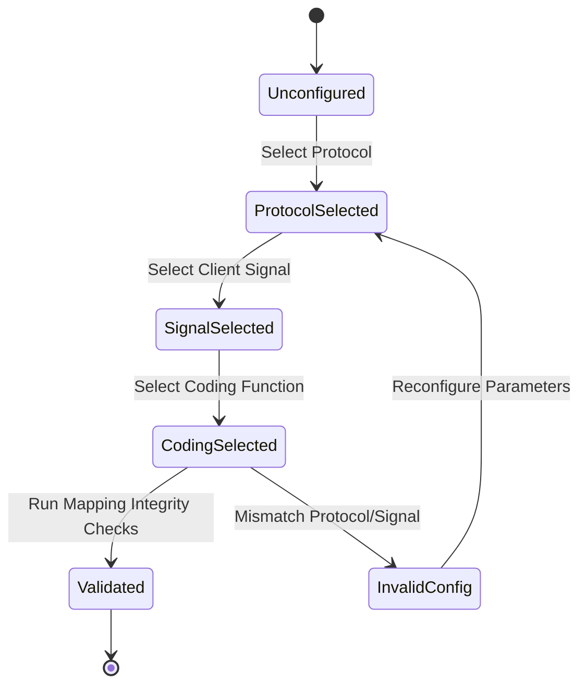

# Feature: Feature 37: Layer 1 Client Protocol and Coding Identities (Issue #125)

**Parent Epic:** [Epic 11: Optical Layer 1 Type Definitions (Issue #131)](https://github.com/gintatkinson/cogctl-ux-09/blob/main/docs/epics/epic-11-optical-layer1-types.md)

This feature defines standard base protocols, physical layer client signals, and physical line coding functions (PCS/WIS configurations) that are encapsulated and transported across Layer 1 optical networks.

## 1. Schema Definitions & Constraints

### Identities
- `protocol`: Base identity representing the general network protocols.
  - `Ethernet`, `Fibre-Channel`, `SDH`, `SONET`: Standard protocol type definitions inheriting from `protocol`.
- `client-signal`: Base identity for client traffic rates before line coding.
  - Ethernet client signals: `ETH-1Gb`, `ETH-10Gb-LAN`, `ETH-10Gb-WAN`, `ETH-40Gb`, `ETH-100Gb`.
  - SDH client signals: `STM-1`, `STM-4`, `STM-16`, `STM-64`, `STM-256`.
  - SONET client signals: `OC-3`, `OC-12`, `OC-48`, `OC-192`, `OC-768`.
  - Fibre-Channel client signals: `FC-100`, `FC-200`, `FC-400`, `FC-800`, `FC-1200`, `FC-1600`, `FC-3200`.
- `coding-func`: Base identity representing standard line coding and physical coding sublayer (PCS) functions.
  - Shared SDH/SONET mappings: STM/OC structures inherit both `client-signal` and `coding-func`.
  - PCS line coding: `ETH-1000X` (1000BASE-X PCS), `ETH-10GW` (10GBASE-W WAN PHY WIS), `ETH-10GR` (10GBASE-R LAN PHY PCS), `ETH-40GR` (40GBASE-R PCS), `ETH-100GR` (100GBASE-R PCS).

## 2. Logical System Integration & UI Capabilities

### Logical Data Model
- Client ports are configured with a `protocol` and a matching `client-signal` and `coding-func` mapping.
- Each protocol rate determines the physical framing characteristics.

### Logical Processing Rules
- **Cross-Identity Consistency**: A client signal identity must align with its base protocol. For instance, setting `protocol` to `Ethernet` but configuring a client signal of `STM-16` will trigger a validation failure.
- **Line Coding Rules**: 10G interfaces must resolve line coding to `ETH-10GR` (LAN PHY) or `ETH-10GW` (WAN PHY) based on network framing requirements.

### Logical UI Representation
- **Port Provisioning Page**: Dropdown menu for selecting the client protocol. Choosing a protocol updates the filtered list of available Client Signals and Coding Functions.
- **Line Coding Dropdown**: Filters valid options based on selected signal (e.g. 10G Ethernet displays LAN/WAN PHY, while 1G Ethernet displays 1000BASE-X).

## 3. State Machine and Validation Flow

## 4. BDD Given-When-Then Acceptance Criteria

- **Scenario 1: Valid Ethernet LAN PHY Configuration**
  - **Given** a 10G client port is selected for configuration
    **When** the protocol is set to "Ethernet", client signal is set to "ETH-10Gb-LAN", and coding function is set to "ETH-10GR"
    **Then** the configuration validates successfully.
- **Scenario 2: Invalid Protocol-Signal Mismatch Rejection**
  - **Given** a client port is being configured
    **When** the protocol is set to "Fibre-Channel" and the client signal is set to "ETH-100Gb"
    **Then** the system rejects the configuration with a validation error indicating a protocol mismatch.
- **Scenario 3: Valid SDH Client Signal Mapping**
  - **Given** an SDH interface configuration
    **When** the client signal is set to "STM-16"
    **Then** the system automatically applies the STM-16 coding function.

## 5. Specification Context (Verbatim)

>   identity protocol {
>     description
>       "Base identity from which specific protocol is derived.";
>     reference
>       "MEF63: Subscriber Layer 1 Service Attributes";
>   }
> 
>     identity Ethernet {
>       base protocol;
>       description
>         "Ethernet protocol.";
>       reference
>         "MEF63: Subscriber Layer 1 Service Attributes";
>     }
> 
>   identity client-signal {
>     description
>       "Base identity from which specific Constant Bit Rate (CBR)
>       client signal is derived";
>   }
> 
>   identity coding-func {
>     description
>       "Base identity from which specific coding function
>        is derived.";
>     reference
>       "MEF63: Subscriber Layer 1 Service Attributes";
>   }
> 
>     identity ETH-10Gb-LAN {
>       base client-signal;
>       description
>         "Client signal type of ETH-10Gb-LAN (10.3 Gb/s).";
>       reference
>         "IEEE 802.3-2018, Clause 49: IEEE Standard for Ethernet
> 
>         RFC7139: GMPLS Signaling Extensions for Control of Evolving
>         G.709 Optical Transport Networks
> 
>         ITU-T G.709 v6.0 (06/2020): Interfaces for the Optical
>         Transport Network (OTN)";
>     }
> 
>     identity ETH-10GR {
>       base coding-func;
>       description
>         "10GBASE-R (LAN PHY) PCS clause 49 coding function.";
>       reference
>         "IEEE 802.3-2018, Clause 49: IEEE Standard for Ethernet
> 
>         MEF63: Subscriber Layer 1 Service Attributes";
>     }

## 6. Source References
- **YANG Schema:** [ietf-layer1-types.yang](file:///home/parallels/Desktop/cogctl-ux-09/yang/ietf-layer1-types.yang)
- **Normative Document:** [draft-ietf-ccamp-layer1-types](https://datatracker.ietf.org/doc/draft-ietf-ccamp-layer1-types/)
