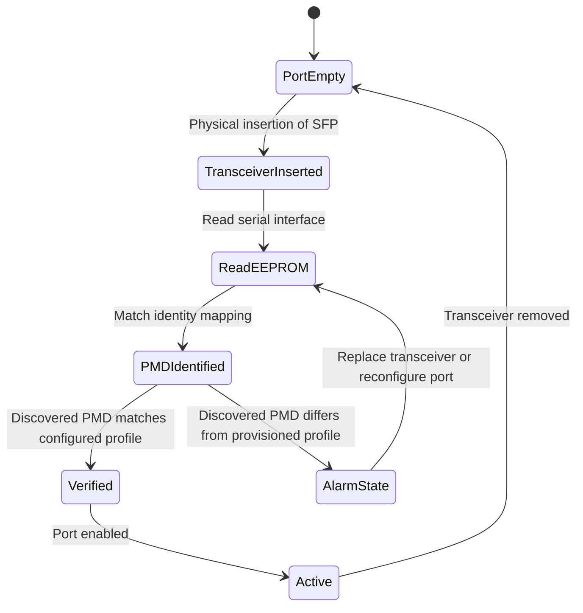

# Feature: Feature 38: Layer 1 Optical Interface and PMD Functions (Issue #126)

**Parent Epic:** [Epic 11: Optical Layer 1 Type Definitions (Issue #131)](https://github.com/gintatkinson/cogctl-ux-09/blob/main/docs/epics/epic-11-optical-layer1-types.md)

This feature defines physical medium dependent (PMD) functions and optical interface types used to characterize optical transceiver modules (SFPs, QSFPs) and physical link properties.

## 1. Schema Definitions & Constraints

### Identities
- `optical-interface-func`: Base identity representing physical layer optical interfaces.
  - 1G Ethernet PMDs:
    - `SX-PMD-1000`: Short wavelength PMD (850nm multi-mode fiber).
    - `LX-PMD-1000`: Long wavelength PMD (1310nm single-mode or multi-mode fiber).
    - `LX10-PMD-1000`: 10km single-mode fiber PMD.
    - `BX10-PMD-1000`: Bi-directional single-mode fiber PMD (downstream 1490nm, upstream 1310nm).
  - 10G Ethernet PMDs:
    - `LW-PMD-10G`: 10G WAN PHY short-reach PMD.
    - `EW-PMD-10G`: 10G WAN PHY extended-reach PMD.
    - `LR-PMD-10G`: 10G LAN PHY long-reach PMD.
    - `ER-PMD-10G`: 10G LAN PHY extended-reach PMD.
  - 40G Ethernet PMDs:
    - `LR4-PMD-40G`: 40G long-reach PMD using 4 wavelengths.
    - `ER4-PMD-40G`: 40G extended-reach PMD using 4 wavelengths.
    - `FR-PMD-40G`: 40G single-mode fiber PMD.
  - 100G Ethernet PMDs:
    - `LR4-PMD-100G`: 100G long-reach PMD using 4 wavelengths.
    - `ER4-PMD-100G`: 100G extended-reach PMD using 4 wavelengths.

## 2. Logical System Integration & UI Capabilities

### Logical Data Model
- PMD capabilities are mapped to optical port profiles in the device model.
- Each transceiver type is identified using the `optical-interface-func` subclass.

### Logical Processing Rules
- **Compatibility Audits**: Transceiver parameters must align with PMD class guidelines. For example, selecting a single-fiber single-wavelength link profile is invalid for standard `LR4-PMD-100G` transceivers (which require a 4-wavelength multiplexed fiber pair).
- **Auto-Discovery Reconciliation**: The optical control system queries the SFP EEPROM, extracts the PMD class, and maps it directly to a YANG identityref. Mismatching values between discovered PMD and provisioned port settings raise a hardware configuration alarm.

### Logical UI Representation
- **Hardware Dashboard**: Displays the transceiver slots with a visual indication of the discovered PMD identity (e.g. "LR4-PMD-100G" with an icon representing 100G SMF 10km link).
- **Alarm Console**: Generates clear warning messages if there is a transceiver type mismatch (e.g., "Expected ER-PMD-10G SFP+, but detected LR-PMD-10G").

## 3. State Machine and Validation Flow

## 4. BDD Given-When-Then Acceptance Criteria

- **Scenario 1: Successful PMD Matching**
  - **Given** an optical transceiver with identifier "LR4-PMD-100G" is inserted into port 1
    **When** the provisioned port profile specifies "LR4-PMD-100G"
    **Then** the port transitions to verified state without raising alarms.
- **Scenario 2: Hardware Mismatch Alarm Activation**
  - **Given** an optical transceiver with identifier "LR-PMD-10G" is inserted into port 2
    **When** the provisioned port profile specifies "ER-PMD-10G"
    **Then** the system transitions the port to the alarm state with error "PMDTypeMismatch".
- **Scenario 3: Single-Wavelength Config Validation**
  - **Given** a port profile is configured with single-mode single-fiber PMD BX10-PMD-1000
    **When** the physical tx/rx properties are validated
    **Then** the system ensures single-fiber duplex separation is configured.

## 5. Specification Context (Verbatim)

>   identity optical-interface-func {
>     description
>       "Base identity from which optical-interface-function
>        is derived.";
>     reference
>       "MEF63: Subscriber Layer 1 Service Attributes";
>   }
> 
>     identity SX-PMD-1000 {
>       base optical-interface-func;
>       description
>         "SX-PMD-clause-38 Optical Interface function for
>         1000BASE-X PCS-36.";
>       reference
>         "IEEE 802.3-2018, Clause 38: IEEE Standard for Ethernet
> 
>         MEF63: Subscriber Layer 1 Service Attributes";
>     }
> 
>     identity LR4-PMD-100G {
>       base optical-interface-func;
>       description
>         "LR4-PMD-clause-88 Optical Interface function for
>         1000GBASE-R PCS-82.";
>       reference
>         "IEEE 802.3-2018, Clause 88: IEEE Standard for Ethernet
> 
>         MEF63: Subscriber Layer 1 Service Attributes";
>     }

## 6. Source References
- **YANG Schema:** [ietf-layer1-types.yang](file:///home/parallels/Desktop/cogctl-ux-09/yang/ietf-layer1-types.yang)
- **Normative Document:** [draft-ietf-ccamp-layer1-types](https://datatracker.ietf.org/doc/draft-ietf-ccamp-layer1-types/)
