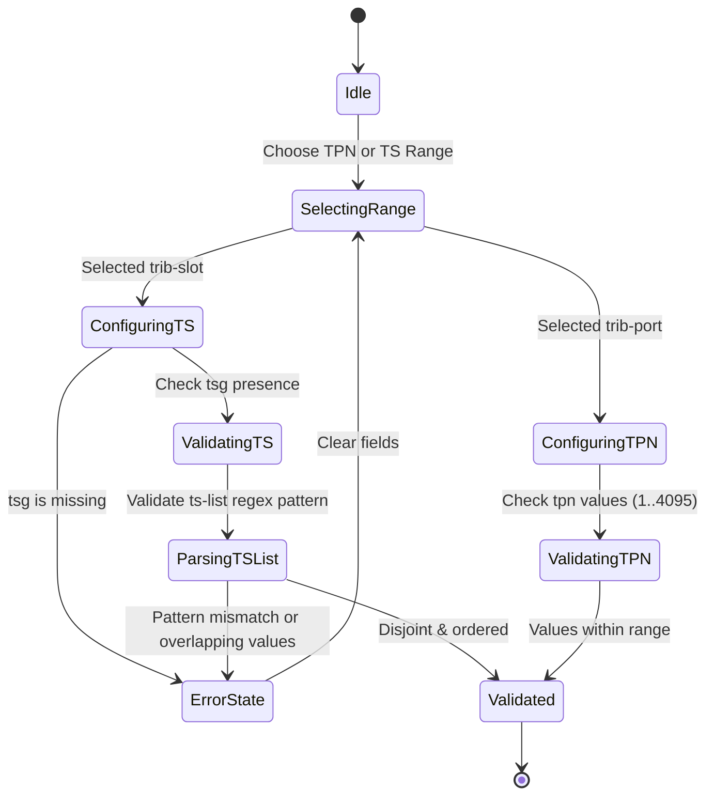

# Feature: Feature 39: OTN Tributary Slot and Label Structure (Issue #127)

**Parent Epic:** [Epic 11: Optical Layer 1 Type Definitions (Issue #131)](https://github.com/gintatkinson/cogctl-ux-09/blob/main/docs/epics/epic-11-optical-layer1-types.md)

This feature establishes the logical representations of OTN tributary slots (TS) and tributary port numbers (TPN) used to configure label switching paths (LSPs) and label restriction parameters across Generalized Multi-Protocol Label Switching (GMPLS) control planes.

## 1. Schema Definitions & Constraints

### Typedefs
- `otn-tpn`: Tributary Port Number type.
  - **Type**: `uint16` with range `1..4095`. Bounded by RFC 7139.
- `otn-ts`: Tributary Slot index type.
  - **Type**: `uint16` with range `1..4095`. Bounded by RFC 7139.
- `otn-label-range-type`: Defines whether a range specification filters tributary slots (`trib-slot`) or tributary port numbers (`trib-port`).
  - **Type**: `enumeration` (`trib-slot`, `trib-port`).

### Leaves & Containers (from Groupings)
- `otn-label-range`: Container detailing a specific label range constraint.
  - `range-type`: Leaf of type `otn-label-range-type`.
  - `tsg`: Reference to `tributary-slot-granularity`. Must be present when `range-type` is `trib-slot`.
  - `odu-type-list`: Leaf-list of type `identityref` referencing `odu-type`. Lists target containers; empty means all supported types.
  - `priority`: OSPF priority index (`0..7`) in the ISCD descriptor.
- `otn-label`: Container representing a single hop label.
  - `tpn`: TPN of type `otn-tpn`. Valid when `range-type` matches `trib-port`.
  - `ts`: TS of type `otn-ts`. Valid when `range-type` matches `trib-slot`.
  - `ts-list`: A comma-separated string formatting disjoint TS ranges (e.g. `1-20,25,50-100`).
- `otn-label-step`: Container detailing the increment values for slot/port label step calculation.
  - `tpn`: Increment size for TPN.
  - `ts`: Increment size for TS.

## 2. Logical System Integration & UI Capabilities

### Logical Data Model
- OTN links maintain lists of available slots represented by individual `otn-ts` records.
- GMPLS tunnels store their assigned labels in `otn-label` structures using `tpn` and `ts-list`.

### Logical Processing Rules
- **Conditional Presence**: The `tsg` leaf is mandatory when configuring a slot-range (`range-type == trib-slot`). If omitted, validation fails.
- **Pattern Integrity**: The `ts-list` string must strictly match the regex pattern `([1-9][0-9]{0,3}(-[1-9][0-9]{0,3})?(,[1-9][0-9]{0,3}(-[1-9][0-9]{0,3})?)*)`. Any invalid format triggers immediate validation failure.
- **Disjoint & Ordered Slots**: All values in `ts-list` must be disjoint and in ascending order.

### Logical UI Representation
- **Label Provisioning Wizard**: Radio buttons for selecting range type (Tributary Port or Tributary Slot). Switching types toggles visibility of the `tsg` dropdown.
- **TS List Input Field**: Text input with real-time regex validator showing feedback (e.g. green checkmark for `1-10,12` and red boundary warning for `10-1,22`).

## 3. State Machine and Validation Flow

## 4. BDD Given-When-Then Acceptance Criteria

- **Scenario 1: Valid TS Label Range with TSG**
  - **Given** a label range editor is initialized
    **When** the range type is set to "trib-slot" and TSG is set to "tsg-1.25G"
    **Then** the configuration validates successfully.
- **Scenario 2: Rejection of trib-slot without TSG**
  - **Given** a label range configuration
    **When** the range type is set to "trib-slot" and TSG is omitted
    **Then** the configuration fails validation with error "TSGRequirementMissing".
- **Scenario 3: TS List Pattern Verification**
  - **Given** a GMPLS hop label configuration
    **When** the TS list is entered as "1-10,12-15"
    **Then** the regex parser accepts the format.
- **Scenario 4: Out of Range TPN Rejection**
  - **Given** a hop label configuration
    **When** the TPN is set to 4096
    **Then** the system rejects the configuration due to range boundaries (1..4095).

## 5. Specification Context (Verbatim)

>   typedef otn-tpn {
>     type uint16 {
>       range "1..4095";
>     }
>     description
>       "Tributary Port Number (TPN) for OTN.";
>     reference
>       "RFC7139: GMPLS Signaling Extensions for Control of Evolving
>        G.709 Optical Transport Networks.";
>   }
> 
>   typedef otn-ts {
>     type uint16 {
>       range "1..4095";
>     }
>     description
>       "Tributary Slot (TS) for OTN.";
>     reference
>       "RFC7139: GMPLS Signaling Extensions for Control of Evolving
>        G.709 Optical Transport Networks.";
>   }
> 
>   grouping otn-label-range-info {
>     description
>       "Label range information for OTN.
> 
>        This grouping SHOULD be used together with the
>        otn-label-start-end and otn-label-step groupings to provide
>        OTN technology-specific label information to the models which
>        use the label-restriction-info grouping defined in the module
>        ietf-te-types.";
>     container otn-label-range {
>       description
>         "Label range information for OTN.";
>       leaf range-type {
>         type otn-label-range-type;
>         description "The type of range (e.g., TPN or TS)
>           to which the label range applies";
>       }
>       leaf tsg {
>         type identityref {
>           base tributary-slot-granularity;
>         }
>         description
>           "Tributary slot granularity (TSG) to which the label range
>           applies.
> 
>           This leaf MUST be present when the range-type is TS.
> 
>           This leaf MAY be omitted when mapping an ODUk over an OTUk
>           Link. In this case the range-type is tpn, with only one
>           entry (ODUk), and the tpn range has only one value (1).";
>         reference
>           "ITU-T G.709 v6.0 (06/2020): Interfaces for the Optical
>           Transport Network (OTN)";
>       }
>     }
>   }

## 6. Source References
- **YANG Schema:** [ietf-layer1-types.yang](file:///home/parallels/Desktop/cogctl-ux-09/yang/ietf-layer1-types.yang)
- **Normative Document:** [draft-ietf-ccamp-layer1-types](https://datatracker.ietf.org/doc/draft-ietf-ccamp-layer1-types/)
