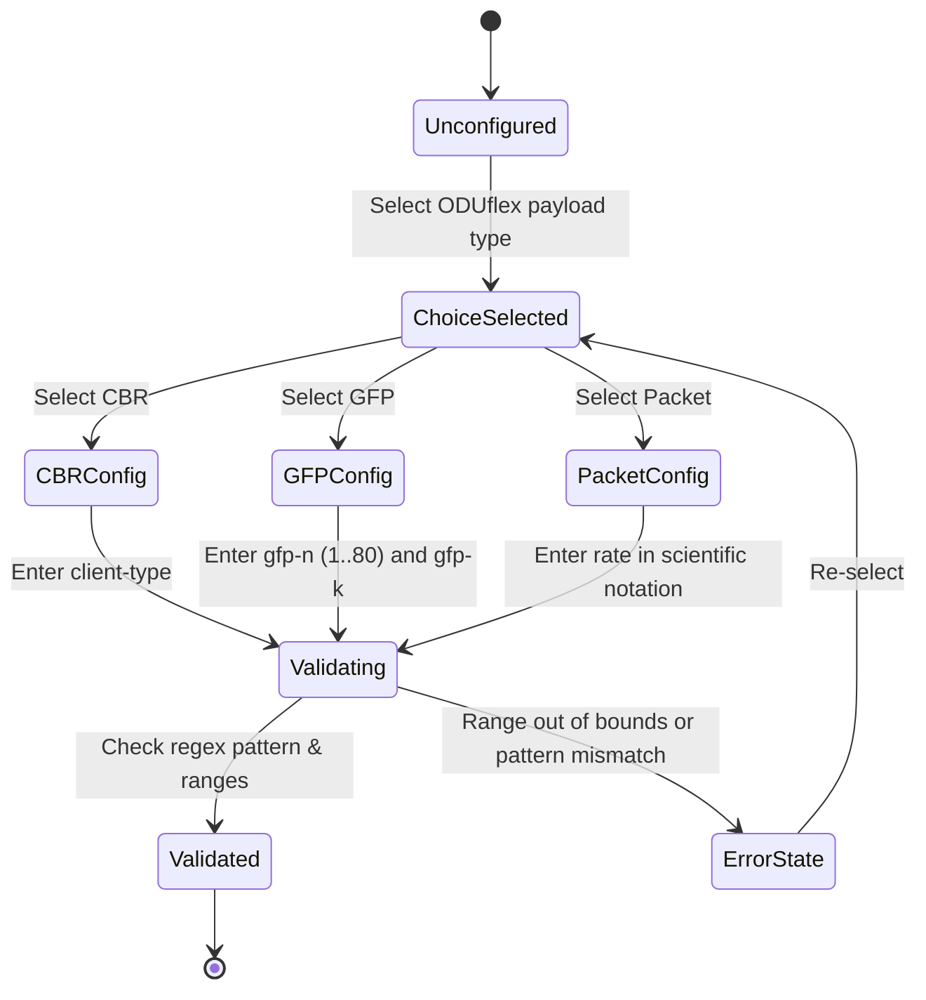

# Feature: Feature 40: OTN Bandwidth and GFP Payload Capabilities (Issue #128)

**Parent Epic:** [Epic 11: Optical Layer 1 Type Definitions (Issue #131)](https://github.com/gintatkinson/cogctl-ux-09/blob/main/docs/epics/epic-11-optical-layer1-types.md)

This feature defines bandwidth profiles, science-notation formats, GFP (Generic Framing Procedure) payload mappings, and FlexE client capacities for Optical Transport Network (OTN) routing and traffic engineering links.

## 1. Schema Definitions & Constraints

### Typedefs
- `bandwidth-scientific-notation`: Represents link/path bandwidth values in bps using IEEE 754 decimal floating-point format. Must conform to regex pattern: `0(\.0?)?([eE](\+)?0?)?|[1-9](\.[0-9]{0,6})?[eE](\+)?(9[0-6]|[1-8][0-9]|0?[0-9])?`.
- `gfp-k`: Defines ODUk tributary slot capacity (`2`, `3`, or `4`) used to compute the nominal bit rate of `ODUflex(GFP,n,k)`.
- `flexe-client-rate`: Defines FlexE client rate; either a number or an enumeration (`10G` or `40G`).
- `odtu-flex-type`: Identifies the Optical Data Tributary Unit type (`2`, `3`, `4`, or `Cn`) used in tributary slot calculations.

### Containers & Leaves (from Groupings)
- `otn-bandwidth`: Grouping root container containing:
  - `odulist`: List of ODU types active on the link. Key: `odu-type`.
    - `odu-type`: Type of container (refers to `odu-type`).
    - `number`: Quantified container count.
    - `ts-number`: Available tributary slot count (present when `odu-type` is `ODUflex` or `ODUflex-resizable`).
- `oduflex-type`: A choice parameter indicating the ODUflex payload type:
  - `generic`: Includes leaf `nominal-bit-rate`.
  - `cbr`: Constant Bit Rate client. Includes leaf `client-type`.
  - `gfp-n-k`: GFP mapping. Includes leaves `gfp-n` (range `1..80`) and `gfp-k`.
  - `flexe-client`: Includes leaf `flexe-client`.
  - `flexe-aware`: Includes leaf `flexe-aware-n`.
  - `packet`: Includes leaf `opuflex-payload-rate`.
- `max-ts-number`: Leaf of type `uint16` with range `1..4095` specifying maximum allowed tributary slots for a resizable ODUflex LSP.
- `odu-type-list`: Leaf-list containing a list of target `odu-type` references.

## 2. Logical System Integration & UI Capabilities

### Logical Data Model
- Links maintain available bandwidth states in scientific notation.
- Paths map payload rate demands to one of the `oduflex-type` choice structures (e.g. `gfp-n-k` or `cbr` or `packet`).

### Logical Processing Rules
- **Scientific Notation Matching**: String inputs representing bit rates must match the specified floating-point pattern. Format conversions (e.g. from human-readable `10 Gbps` to `1e10`) are handled by parser logic.
- **Conditional Visibility**: The `ts-number` field is locked out unless `odu-type` matches `ODUflex` or `ODUflex-resizable`.
- **GFP Calculation bounds**: In `gfp-n-k` calculations, if `gfp-k` is omitted, the system defaults it according to Table 7-8 of G.709 based on the configured `gfp-n` value.

### Logical UI Representation
- **Path Bandwidth Editor**: A selector changes the payload type (CBR, GFP-F, Packet, FlexE-Client). Switching types dynamically displays the correct fields (e.g., `gfp-n` range slider for GFP, dropdown selectors for FlexE Client rate, or a free text input with scientific notation validator for Packet payload).

## 3. State Machine and Validation Flow

## 4. BDD Given-When-Then Acceptance Criteria

- **Scenario 1: Valid CBR Configuration**
  - **Given** an ODUflex path configuration is initialized
    **When** the payload choice is set to "cbr" and client type is set to "ETH-10Gb-LAN"
    **Then** the configuration validates successfully.
- **Scenario 2: Valid GFP Rate Slider Bounds**
  - **Given** a GFP payload configuration
    **When** the gfp-n value is set to 80
    **Then** the configuration is validated successfully.
- **Scenario 3: Rejecting GFP Out of Bounds**
  - **Given** a GFP payload configuration
    **When** the gfp-n value is set to 81
    **Then** the system rejects the value with a boundary error.
- **Scenario 4: Scientific Notation Format Verification**
  - **Given** a packet payload rate configuration
    **When** the rate is set to "9.953e9"
    **Then** the regex validator accepts the string.

## 5. Specification Context (Verbatim)

>   typedef bandwidth-scientific-notation {
>     type string {
>       pattern
>         '0(\.0?)?([eE](\+)?0?)?|'
>       + '[1-9](\.[0-9]{0,6})?[eE](\+)?(9[0-6]|[1-8][0-9]|0?[0-9])?';
>     }
>     units "bps";
>     description
>       "Bandwidth values, expressed using the scientific notation
>       in bits per second.";
>   }
> 
>   typedef gfp-k {
>     type enumeration {
>       enum 2 {
>         description
>           "The ODU2.ts rate (1,249,177.230 kbit/s) is used
>            to compute the rate of an ODUflex(GFP,n,2).";
>       }
>       enum 3 {
>         description
>           "The ODU3.ts rate (1,254,470.354 kbit/s) is used
>            to compute the rate of an ODUflex(GFP,n,3).";
>       }
>       enum 4 {
>         description
>           "The ODU4.ts rate (1,301,467.133 kbit/s) is used
>            to compute the rate of an ODUflex(GFP,n,4).";
>       }
>     }
>   }
> 
>   grouping otn-path-bandwidth {
>     description
>       "Bandwidth attributes for OTN paths.";
>     container otn-bandwidth {
>       description
>         "Bandwidth attributes for OTN paths.";
>       leaf odu-type {
>         type identityref {
>           base odu-type;
>         }
>         description "ODU type";
>       }
>       choice oduflex-type {
>         when 'derived-from-or-self(./odu-type,"ODUflex") or
>               derived-from-or-self(./odu-type,
>               "ODUflex-resizable")' {
>           description
>             "Applicable when odu-type is ODUflex or
>              ODUflex-resizable.";
>         }
>         description
>           "Types of ODUflex used to compute the ODUflex
>            nominal bit rate.";
>       }
>     }
>   }

## 6. Source References
- **YANG Schema:** [ietf-layer1-types.yang](file:///home/parallels/Desktop/cogctl-ux-09/yang/ietf-layer1-types.yang)
- **Normative Document:** [draft-ietf-ccamp-layer1-types](https://datatracker.ietf.org/doc/draft-ietf-ccamp-layer1-types/)
