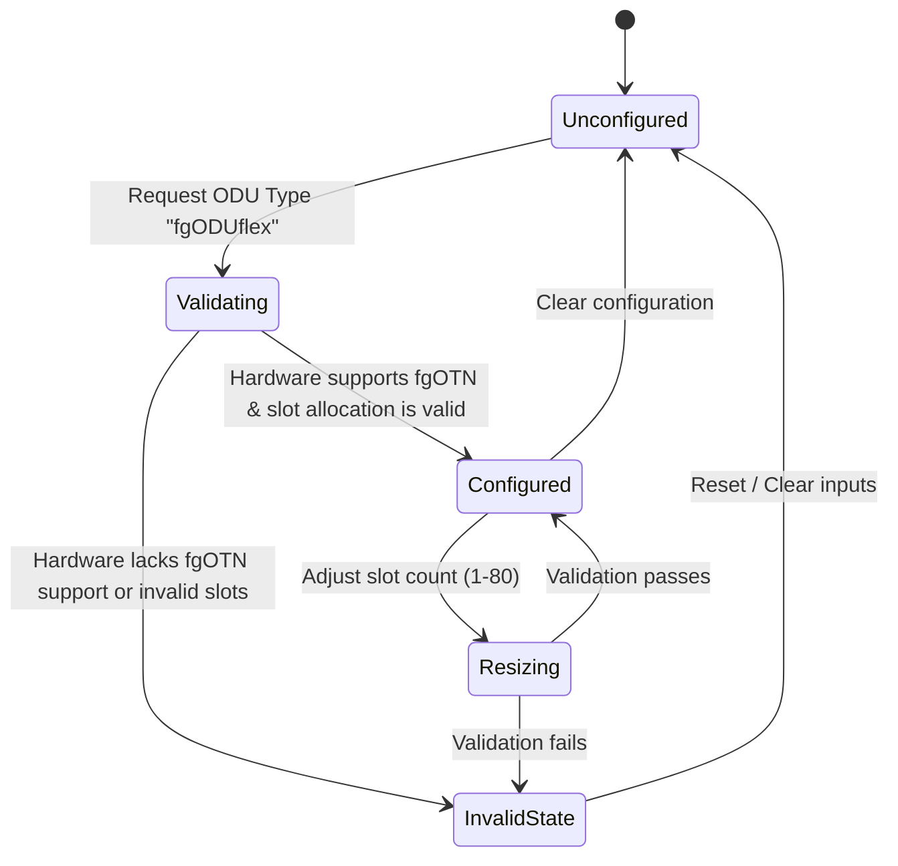

# Feature: Feature 41: Fine-Grain ODUflex Type Definition (Issue #132)

This feature introduces the Fine-Grain Optical Data Unit flexible (`fgODUflex`) identity which extends the baseline Layer 1 `odu-type` identity defined in `ietf-layer1-types.yang`. It enables representing and validating fine-grain flexible bit rate, resizable interfaces in Optical Transport Networks.

## 1. Schema Definitions & Constraints

### Identities
- `fgODUflex`:
  - **Base Type**: `l1-types:odu-type`
  - **Description**: fgODUflex type (fine grain flexible bit rate, resizable) to support sub-1Gbit/s client signal container configuration.

## 2. Logical System Integration & UI Capabilities

- **Logical Data Model**:
  - The domain object attribute `odu-type` is assigned the value `fgODUflex` (represented as `urn:ietf:params:xml:ns:yang:ietf-fgotn-types:fgODUflex`).
- **Logical Processing Rules**:
  - When the ODU interface is configured as `fgODUflex`, the system validates that the tributary slots allocated have a granularity matching fine-grain OTN (e.g., 10 Mbps per fine-grain slot in ITU-T G.709.20).
  - Normalization: Ensure that bandwidth is parsed in decimal/scientific notation conforming to fgOTN capabilities (1 to 80 slots).
- **Logical UI Representation**:
  - Dropdown interface for ODU type selection dynamically includes the "fgODUflex" option when the physical hardware port indicates support for fine-grain sub-1G client mappings.
  - Display warning messages if the user attempts to provision non-fgOTN mapping options on an fgODUflex container.

## 3. State Machine and Validation Flow

## 4. BDD Given-When-Then Acceptance Criteria

- **Scenario 1: Configure valid fgODUflex interface on supporting hardware**
  - **Given** a physical port interface that supports fgOTN capabilities is selected
  - **When** the network provisioning engineer sets the interface ODU type to `fgODUflex` and configures it with 5 fine-grain tributary slots
  - **Then** the validation engine successfully provisions the container with 50 Mbps capacity and marks the state as configured.

- **Scenario 2: Reject fgODUflex configuration on legacy hardware**
  - **Given** a legacy physical port interface without fgOTN hardware capabilities is selected
  - **When** the provisioning engineer attempts to set the interface ODU type to `fgODUflex`
  - **Then** the validation engine rejects the request, throws a validation error "Interface hardware does not support fine-grain OTN", and leaves the configuration unmodified.

## 5. Specification Context (Verbatim)

> fgODUflex type (fine grain flexible bit rate, resizable).
> This module contains a collection of YANG data types considered generally useful for fine grain Optical Transport Network (fgOTN) networks.

## 6. Source References

YANG Schema: [ietf-fgotn-types.yang](https://github.com/gintatkinson/cogctl-ux-09/blob/feat/16-rack-contained-chassis-electricity/yang/ietf-fgotn-types.yang)
Normative Specification: [draft-tan-ccamp-fgotn-yang](https://datatracker.ietf.org/doc/draft-tan-ccamp-fgotn-yang/)
