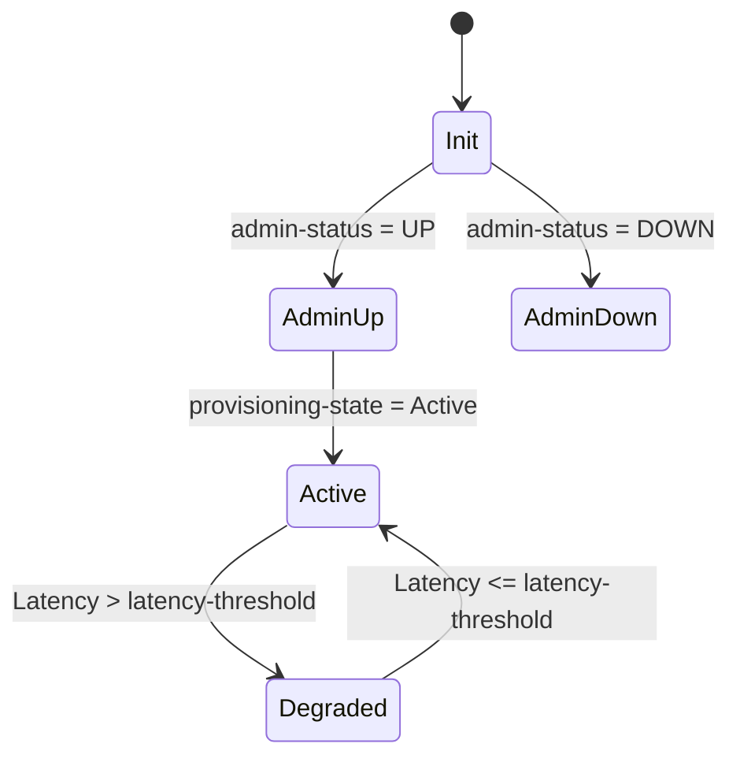

# Feature: Feature 41: Transport Client Service Core Attributes (Issue #108)

**Parent Epic:** [Epic 15: Transport Client Service (Issue #121)](https://github.com/gintatkinson/cogctl-ux-09/blob/main/docs/epics/epic-15-trans-client-service.md)

This feature establishes the core administrative configuration, performance alarm thresholds, resilience placeholders, metadata, and lifecycle states for Point-to-Point (P2P) Transport Client Services.

## 1. Schema Definitions & Constraints
The following nodes are defined under this feature:

* **`client-svc`**: The root container for all logical transport client service instances.
* **`client-svc-instances`**: List containing P2P transport client signal service instance definitions.
* **`client-svc-name`**: The primary key leaf identifying the client signal service instance.
* **`client-svc-title`**: A human-readable identifier name for the client service.
* **`user-label`**: An operational alias/user label for the service instance.
* **`client-svc-descr`**: A detailed description of the configured client service.
* **`client-svc-customer`**: Customer identification string associated with the client service.
* **`resilience`**: A structural placeholder container for configuring service resilience parameters.
* **`admin-status`**: Administrative state state indicating if the service is up or down.
* **`direction`**: Indicates the directionality (Uni-directional or Bi-directional) of the client signal path.
* **`alarm-threshold`**: Performance monitoring alarm thresholds container.
  * **`latency-threshold`**: Latency threshold in microseconds. Exceeding this triggers an alarm.
* **`operational-state`**: Read-only leaf reflecting the actual operational state (up/down/testing).
* **`provisioning-state`**: Read-only leaf indicating the active LSP provisioning status.
* **`creation-time`**: Timestamp showing when the instance was created.
* **`last-updated-time`**: Timestamp indicating the latest modification time.
* **`created-by`**: Identity string of the staff/system that created the service.
* **`last-updated-by`**: Identity string of the staff/system that last modified the service.
* **`owned-by`**: Ownership reference string (e.g. tenant or system ID).

## 2. Logical System Integration & UI Capabilities

### Logical Data Model
* Core attributes map directly to database fields of the logical transport network service entities.
* State indicators (`admin-status`, `operational-state`, `provisioning-state`) coordinate with the underlay network management system.

### Logical Processing Rules
* **Validation**: The administrative state `admin-status` must be validated before activating the service instance.
* **Performance Monitoring**: Latency values are continuously compared against `latency-threshold` to detect threshold crossing alerts (TCA).

### Logical UI Representation
* **Service Detail View**: Displays all core attributes including `client-svc-name`, `client-svc-title`, `client-svc-descr`, `client-svc-customer`, `user-label`, and metadata fields like `created-by`, `creation-time`, `last-updated-by`, `last-updated-time`, and `owned-by`.
* **Administrative State Controls**: Switch toggle for `admin-status` (UP/DOWN) and field editing for `latency-threshold`.

## 3. State Machine and Validation Flow

## 4. BDD Given-When-Then Acceptance Criteria

- **Scenario 1: Successful Core Attributes Initialization**
  - **Given** the service container `client-svc` is initialized
    **When** the administrator configures `client-svc-name` as "Client-Svc-100G-A" and `admin-status` as UP
    **Then** the instance is created inside `client-svc-instances` and is marked operational.
- **Scenario 2: Latency Alarm Threshold Triggering**
  - **Given** an active instance with a `latency-threshold` of 5000 microseconds
    **When** the monitored latency rises to 5200 microseconds
    **Then** an alarm is raised, and the service state indicates degraded performance.

## 5. Specification Context (Verbatim)
>   container client-svc {
>     description
>       "Transport client services.";
> 
>     list client-svc-instances {
>       key client-svc-name;
>       description
>         "The list of p2p transport client service instances";
>       uses client-svc-instance-config;
>       uses client-svc-instance-state;
>     }
>   }

## 6. Source References
- **YANG Schema:** [ietf-trans-client-service.yang](https://github.com/gintatkinson/cogctl-ux-09/blob/main/yang/ietf-trans-client-service.yang)
- **Normative Document:** [draft-ietf-ccamp-otn-topo-yang](https://datatracker.ietf.org/doc/draft-ietf-ccamp-otn-topo-yang/)
