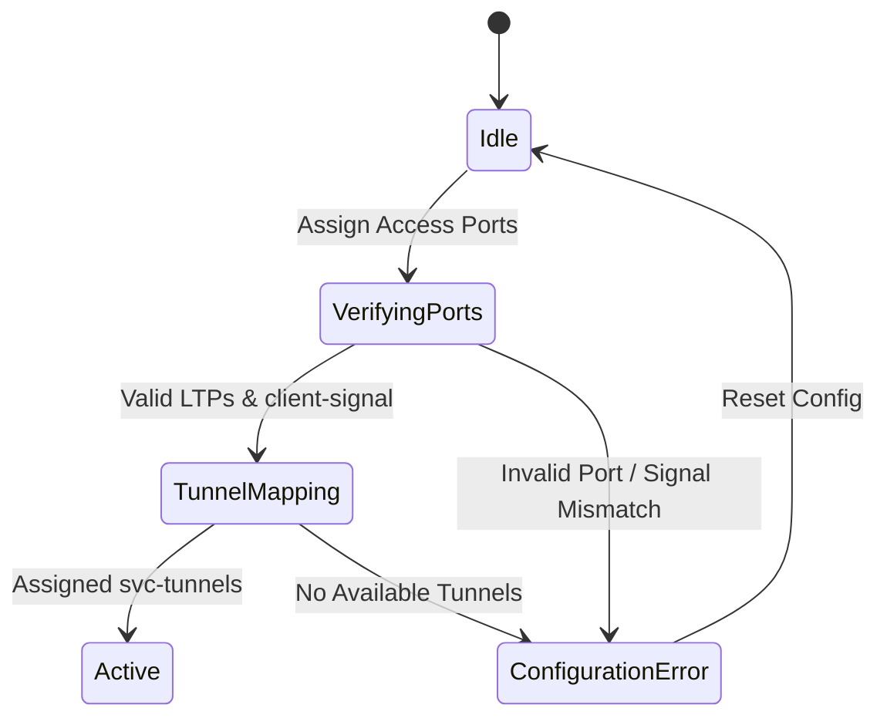

# Feature: Feature 42: Transport Client Service Port Mapping and Tunnels (Issue #109)

**Parent Epic:** [Epic 15: Transport Client Service (Issue #121)](https://github.com/gintatkinson/cogctl-ux-09/blob/feat/16-rack-contained-chassis-electricity/docs/epics/epic-15-trans-client-service.md)

This feature establishes the logical port mapping, access termination points, service tunnel assignments, and error/performance diagnostics for Point-to-Point (P2P) Transport Client Services.

## 1. Schema Definitions & Constraints
The following nodes are defined under this feature:

* **`src-access-ports`**: Container holding the source access port parameters of a client signal.
* **`dst-access-ports`**: Container holding the destination access port parameters of a client signal.
* **`access-node-id`**: TE topology access node identifier.
* **`access-node-uri`**: General network topology access node identifier.
* **`access-ltp-id`**: TE topology Link Termination Point (LTP) identifier.
* **`access-ltp-uri`**: General network topology Link Termination Point (LTP) identifier.
* **`client-signal`**: Type identity indicating the rate/protocol of the client signal associated with the port.
* **`svc-tunnels`**: List of underlying Traffic Engineering (TE) tunnels that support this client service.
  * **`tunnel-name`**: The unique identifier key representing the assigned TE tunnel name.
* **`pm-state`**: Container for read-only Performance Monitoring data.
* **`error-info`**: Container representing error messages resulting from configuration commands.
  * **`error-code`**: The specific error status code.
  * **`error-description`**: A descriptive error message detailing the configuration failure reason.
  * **`error-timestamp`**: The timestamp indicating when the error occurred.

## 2. Logical System Integration & UI Capabilities

### Logical Data Model
* Source and destination access ports map physical transceivers and logical interface configurations to logical service endpoints.
* Underlay TE tunnels must align with the service bandwidth requirements and client signal type.

### Logical Processing Rules
* **Compatibility Check**: The selected `client-signal` type (e.g. `l1-types:ETH-100Gb-LAN`) must be compatible with the physical access ports' PMD capabilities.
* **Diagnostics**: Configuration failures trigger population of `error-info` nodes (`error-code`, `error-description`, `error-timestamp`).

### Logical UI Representation
* **LTP Mapping Selector**: Interface allowing operators to map logical client service endpoints to physical nodes using `access-node-id`, `access-node-uri`, `access-ltp-id`, and `access-ltp-uri`.
* **Underlay Tunnel Assignment**: Panel listing available service tunnels (`svc-tunnels`) with details on the assigned `tunnel-name`.
* **Diagnostics Display**: Error message box displaying information from `error-info` and read-only metrics inside `pm-state`.

## 3. State Machine and Validation Flow

## 4. BDD Given-When-Then Acceptance Criteria

- **Scenario 1: Successful Access Ports Mapping**
  - **Given** access ports are being configured under `src-access-ports` and `dst-access-ports`
    **When** `access-node-id` and `access-ltp-id` are mapped to valid TE topology endpoints
    **Then** the validation rule passes, and the service LTP status updates.
- **Scenario 2: Port Signal Type Mismatch Rejection**
  - **Given** the access port transceiver is physical Ethernet-only
    **When** the administrator attempts to configure the `client-signal` type as OTU4
    **Then** the system rejects the operation, writes to `error-description` with a compatibility violation, and sets the `error-code`.

## 5. Specification Context (Verbatim)
>   grouping client-svc-access-parameters {
>     description
>       "Transport network client signals access parameters";
> 
>     leaf access-node-id {
>       type te-types:te-node-id;
>       description
>         "The identifier of the access node in the TE topology.";
>     }
>     leaf access-node-uri {
>       type nw:node-id;
>       description
>         "The identifier of the access node in the network.";
>     }
>     leaf access-ltp-id {
>       type te-types:te-tp-id;
>       description
>         "The TE link termination point identifier in TE topology, 
>         used together with access-node-id to identify the access
>         Link Termination Point (LTP).";
>     }
>     leaf access-ltp-uri {
>       type nt:tp-id;
>       description
>         "The link termination point identifier in network topology,
>         used together with access-node-uri to identify the access
>         LTP";
>     }
>     leaf client-signal {
>       type identityref {
>         base l1-types:client-signal;
>       }
>       description
>         "Identify the client signal type associated with this port";
>     }
>   }

## 6. Source References
- **YANG Schema:** [ietf-trans-client-service.yang](https://github.com/gintatkinson/cogctl-ux-09/blob/feat/16-rack-contained-chassis-electricity/yang/ietf-trans-client-service.yang)
- **Normative Document:** [draft-ietf-ccamp-otn-topo-yang](https://datatracker.ietf.org/doc/draft-ietf-ccamp-otn-topo-yang/)
