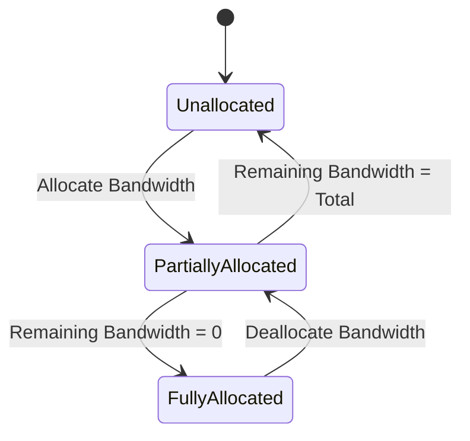

# Feature: Feature 43: fg-OTN Network Topology and Bandwidth Allocation (Issue #110)

**Parent Epic:** [Epic 13: OTN and fg-OTN Network Topology (Issue #122)](https://github.com/gintatkinson/cogctl-ux-09/blob/main/docs/epics/epic-13-otn-topology.md)

This feature establishes the resource representation, timeslot availability, and bandwidth allocations specifically for fine-grain OTN (fg-OTN) networks, extending Traffic Engineering (TE) link attributes to represent fgODUflex granularities.

## 1. Schema Definitions & Constraints

### Typedefs
- `ts-list`: A list of Tributary Slots (TS) ranging from 1 to 4095. Values/ranges must be disjoint and in ascending order (e.g. `1-20,25,50-1000`).
  - **Type**: `string` conforming to the specified pattern.

### Leaves & Containers
* **`fgotn-bandwidth`**: A leaf indicating the allocated or unreserved bandwidth for fg-OTN usage in Megabits per second. It is conditionally active when the underlying `odu-type` is `fgotn-types:fgODUflex`.
* **`fgotnlist`**: A list structure representing the unreserved bandwidth of fg-OTN in the server ODUk channel.
* **`odu-type`**: Identifies the granularity of the server ODUk channel (base `l1-types:odu-type`).
* **`odu-ts-number`**: A `ts-list` leaf indicating the index of the server ODUk channel.
* **`fgts-range`**: A list structure mapping the availability of fg-OTN timeslots within the server ODUk.
* **`fgts-reserved`**: A `ts-list` leaf specifying the reserved fg-OTN timeslots in the server ODUk channel.
* **`fgts-unreserved`**: A `ts-list` leaf specifying the unreserved fg-OTN timeslots in the server ODUk channel.

## 2. Logical System Integration & UI Capabilities

### Logical Data Model
* Bandwidth and timeslot structures augment standard Traffic Engineering link attributes (`/nw:networks/nw:network/nt:link/tet:te/tet:te-link-attributes`).
* Validation constraints verify timeslot ranges are disjoint and in strict ascending order.

### Logical Processing Rules
* **fgODUflex Conditioning**: The leaf `fgotn-bandwidth` is only processed when the corresponding `odu-type` resolves to `fgotn-types:fgODUflex`.
* **Disjoint Range Checks**: Stored `ts-list` parameters are parsed to ensure ranges do not overlap.

### Logical UI Representation
* **Bandwidth Resource Visualizer**: Displays a list of server ODUk granularities alongside their unreserved fg-OTN bandwidth values.
* **Timeslot Grid View**: Interactively renders reserved vs. unreserved timeslots based on the lists in `fgts-reserved` and `fgts-unreserved`.

## 3. State Machine and Validation Flow

## 4. BDD Given-When-Then Acceptance Criteria

- **Scenario 1: Validate Tributary Slot List Format**
  - **Given** an administrator is configuring a timeslot list `odu-ts-number`
    **When** the administrator inputs a value of `1-10,12,15-20`
    **Then** the pattern validation passes because the ranges are ascending and disjoint.
- **Scenario 2: Reject Overlapping Tributary Slot Ranges**
  - **Given** an administrator is configuring a timeslot list `odu-ts-number`
    **When** the administrator inputs a value of `1-10,8-15`
    **Then** the validation fails because the ranges overlap.

## 5. Specification Context (Verbatim)
>   typedef ts-list {
>     type string {
>       pattern '([1-9][0-9]{0,3}(-[1-9][0-9]{0,3})?'
>             + '(,[1-9][0-9]{0,3}(-[1-9][0-9]{0,3})?)*)?';
>     }
>     description
>       "A list of Tributary Slots (TS) ranging between 1 and 4095.
> 
>        If multiple values or ranges are given, they all MUST be
>        disjoint and MUST be in ascending order.
> 
>        For example 1-20,25,50-1000.";
>   }
>
>   augment "/nw:networks/nw:network/nt:link/tet:te"
>         + "/tet:te-link-attributes/tet:max-link-bandwidth"
>         + "/tet:te-bandwidth/otnt:otn-bandwidth/otnt:odulist" {
>     leaf fgotn-bandwidth {
>       when 'derived-from-or-self(../otnt:odu-type,'
>          + '"fgotn-types:fgODUflex")';
>       type uint16;
>     }
>   }
>
>   list fgotnlist {
>     key "odu-type odu-ts-number";
>     leaf odu-type { type identityref { base l1-types:odu-type; } }
>     leaf odu-ts-number { type fgotnt:ts-list; }
>     leaf fgotn-bandwidth { type uint16; }
>   }
>
>   list fgts-range {
>     key "odu-type odu-ts-number";
>     leaf odu-type { type identityref { base l1-types:odu-type; } }
>     leaf odu-ts-number { type fgotnt:ts-list; }
>     leaf fgts-reserved { type fgotnt:ts-list; }
>     leaf fgts-unreserved { type fgotnt:ts-list; }
>   }

## 6. Source References
- **YANG Schema:** [ietf-fgotn-topology.yang](https://github.com/gintatkinson/cogctl-ux-09/blob/main/yang/ietf-fgotn-topology.yang)
- **Normative Document:** [draft-ietf-ccamp-otn-topo-yang](https://datatracker.ietf.org/doc/draft-ietf-ccamp-otn-topo-yang/)
