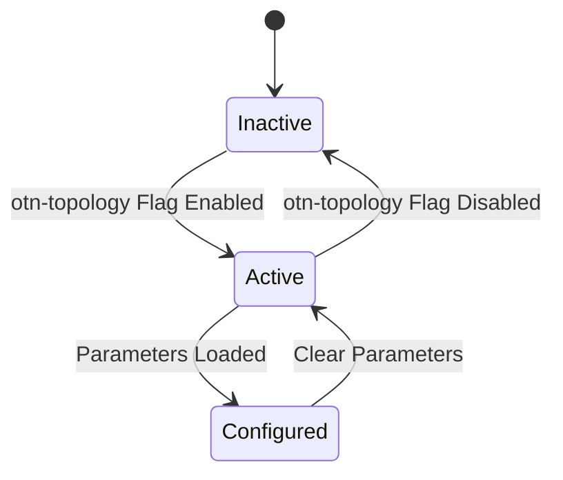

# Feature: Feature 44: OTN Topology Node and Link Attributes (Issue #111)

**Parent Epic:** [Epic 13: OTN and fg-OTN Network Topology (Issue #122)](https://github.com/gintatkinson/cogctl-ux-09/blob/main/docs/epics/epic-13-otn-topology.md)

This feature implements the node, link, and termination point attributes for Optical Transport Network (OTN) topologies, providing logical mapping of physical distances, tributary slot groups, and client signal capabilities.

## 1. Schema Definitions & Constraints
The following nodes are defined under this feature:

* **`otn-topology`**: Network type indicating this network represents an OTN topology.
* **`otn-node`**: Presence container augmenting `/nw:networks/nw:network/nw:node` to store OTN node-specific parameters.
* **`otn-link`**: Presence container augmenting `/nw:networks/nw:network/nt:link` to store OTN link-specific parameters.
* **`otn-link-tp`**: Presence container augmenting `/nw:networks/nw:network/nw:node/nt:termination-point` to store OTN termination point-specific parameters.
* **`client-svc`**: Container listing the client service instances supported on the port/termination point.
* **`distance`**: Leaf indicating the physical distance of the link in kilometers.
* **`odtu-flex-type`**: Leaf specifying the ODTU (Optical Channel Data Tributary Unit) type for flexible grid allocation.
* **`otn`**: Nested configuration grouping containing core OTN attributes.
* **`supported-client-signal`**: List of client signal types supported by the termination point/port.
* **`tsg`**: Leaf specifying the Tributary Slot Group (TSG) granularity (e.g. 1.25G, 2.5G).

## 2. Logical System Integration & UI Capabilities

### Logical Data Model
* OTN attributes are augmented under the standard RFC 8345 topology containers for nodes, links, and termination points.
* Port mapping logic references the physical fiber distance and supported client rates.

### Logical Processing Rules
* **Topology Filtering**: Only networks identified with the `otn-topology` network type can contain the `otn-node`, `otn-link`, and `otn-link-tp` attributes.

### Logical UI Representation
* **Topology Map**: Renders nodes with the `otn-node` container and color-codes links according to their physical `distance`.
* **Port Attributes Sheet**: Shows `supported-client-signal` list and the configured `tsg` value when a termination point is selected.

## 3. State Machine and Validation Flow

## 4. BDD Given-When-Then Acceptance Criteria

- **Scenario 1: Detect OTN Topology Type**
  - **Given** a new topology instance is loaded in the datastore
    **When** the `otn-topology` presence indicator is set
    **Then** the topology is recognized as an Optical Transport Network and the OTN parser is enabled.
- **Scenario 2: Set TSG and Supported Client Signals**
  - **Given** an OTN termination point `otn-link-tp` is selected
    **When** the user configures `tsg` as 1.25G and adds "10GbE" to the `supported-client-signal` list
    **Then** the port is validated and marked available for 10GbE client service mapping.

## 5. Specification Context (Verbatim)
>   container otn-topology {
>     presence "Indicates that this is an OTN topology.";
>     description "Presence container for OTN topology network type.";
>   }
>
>   container otn-node {
>     description "OTN node configuration.";
>   }
>
>   container otn-link {
>     description "OTN link configuration.";
>     leaf distance {
>       type uint32;
>       units "kilometers";
>     }
>   }
>
>   container otn-link-tp {
>     description "OTN termination point parameters.";
>     leaf tsg {
>       type identityref {
>         base otnt:tributary-slot-granularity;
>       }
>     }
>     list supported-client-signal {
>       key "client-signal";
>       leaf client-signal {
>         type identityref {
>           base l1-types:client-signal;
>         }
>       }
>     }
>   }

## 6. Source References
- **YANG Schema:** [ietf-otn-topology.yang](https://github.com/gintatkinson/cogctl-ux-09/blob/main/yang/ietf-otn-topology.yang)
- **Normative Document:** [draft-ietf-ccamp-otn-topo-yang](https://datatracker.ietf.org/doc/draft-ietf-ccamp-otn-topo-yang/)
