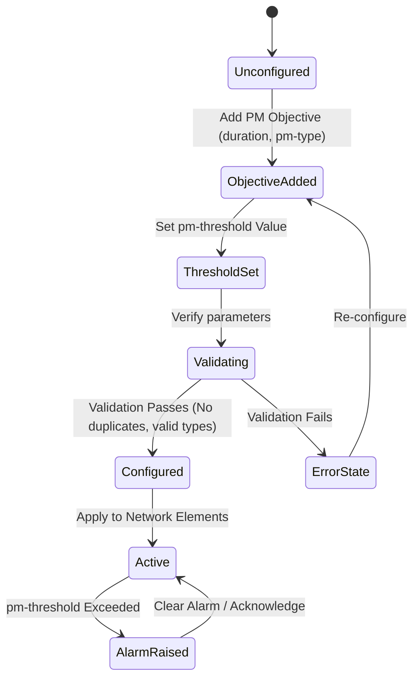

# Feature: Feature 45: OTN Network Slice Performance Monitoring (Issue #112)

**Parent Epic:** [Epic 14: OTN Network Slice (Issue #123)](https://github.com/gintatkinson/cogctl-ux-09/blob/main/docs/epics/epic-14-otn-slice.md)

This feature introduces the capability to configure and monitor ODU-level performance requirements and SLO policies for OTN network slices.

## 1. Schema Definitions & Constraints

### Performance Monitoring Identities
- `bit-error-rate`:
  - **Type**: identity
  - **Base**: `ietf-nss:service-slo-metric-type`
  - **Description**: ODU bit error rate metric.
- `odu-tca-threshold-type`:
  - **Type**: identity
  - **Description**: Base identity for ODU Performance Monitoring (PM) threshold types.
- `odu-bbe`:
  - **Type**: identity (derived from `odu-tca-threshold-type`)
  - **Description**: Background Block Error (BBE) threshold indicator.
- `odu-es`:
  - **Type**: identity (derived from `odu-tca-threshold-type`)
  - **Description**: Errored Seconds (ES) threshold indicator.
- `odu-ses`:
  - **Type**: identity (derived from `odu-tca-threshold-type`)
  - **Description**: Severely Errored Seconds (SES) threshold indicator.
- `odu-uas`:
  - **Type**: identity (derived from `odu-tca-threshold-type`)
  - **Description**: Unavailable Seconds (UAS) threshold indicator.
- `odu-ber`:
  - **Type**: identity (derived from `odu-tca-threshold-type`)
  - **Description**: Bit Error Rate (BER) threshold indicator.
- `pm-duration`:
  - **Type**: identity
  - **Description**: Base identity for ODU performance monitoring interval.
- `pm-15m`:
  - **Type**: identity (derived from `pm-duration`)
  - **Description**: 15 minutes performance monitoring duration.
- `pm-24h`:
  - **Type**: identity (derived from `pm-duration`)
  - **Description**: 24 hours performance monitoring duration.

### Grouping and Containers
- `otn`:
  - **Type**: container
  - **Description**: Technology-specific SLO/SLE policy container.
- `odu-signal-quality`:
  - **Type**: container
  - **Description**: Container for ODU signal quality performance monitoring configuration.
- `odu-pm-objective`:
  - **Type**: list
  - **Keys**: `duration`, `pm-type`
  - **Description**: List of performance objective requirements mapping duration intervals to threshold counters.

### Leaves
- `duration`:
  - **Type**: leaf (identityref pointing to base `pm-duration`)
  - **Description**: Interval of the performance monitoring block.
- `pm-type`:
  - **Type**: leaf (identityref pointing to base `odu-tca-threshold-type`)
  - **Description**: Metric type being audited for threshold violation.
- `pm-threshold`:
  - **Type**: leaf (uint64)
  - **Description**: Maximum allowable count/value before triggering a threshold-crossing alarm (TCA).

## 2. Logical System Integration & UI Capabilities

- **Logical Data Model**:
  - The SLA/SLO template includes an optional technology-specific `otn` profile.
  - The profile allows a tenant to specify ODU-level performance objectives for signal quality.
- **Logical Processing Rules**:
  - Performance monitoring objectives are validated to ensure no duplicate entries exist for the same `duration` and `pm-type` combination.
  - Alarms are raised dynamically by comparing collected physical PM counts against configured `pm-threshold` limits.
- **Logical UI Representation**:
  - A "Performance Monitoring & SLO" configuration tab is rendered when editing an OTN Network Slice Service.
  - The UI presents a grid where users can configure target threshold values for BBE, ES, SES, UAS, and BER across 15-minute and 24-hour durations.

## 3. State Machine and Validation Flow

## 4. BDD Given-When-Then Acceptance Criteria

- **Scenario 1: Set valid PM objective on SLO template**
  - **Given** an OTN slice configuration interface is open
  - **When** the operator adds a PM objective with `duration` set to `pm-15m`, `pm-type` set to `odu-ses`, and `pm-threshold` set to `10`
  - **Then** the validation rule succeeds and the objective is saved.

- **Scenario 2: Reject duplicate PM objectives**
  - **Given** a PM objective for `duration` `pm-24h` and `pm-type` `odu-ber` is already configured
  - **When** the operator attempts to add another PM objective with the same `duration` `pm-24h` and `pm-type` `odu-ber`
  - **Then** the system rejects the configuration because the key combination `(duration, pm-type)` is not unique.

## 5. Specification Context (Verbatim)

> This module defines a YANG data model for configuring technology-specific network slices in optical transport networks, e.g., Optical Transport Network (OTN).
> It provides ODU-level signal quality performance metrics and thresholds to define SLO/SLE templates.

## 6. Source References

YANG Schema: [ietf-otn-slice.yang](https://github.com/YangModels/yang/blob/954277fad0534e9b0b495774255b0c4ce854f8b2/experimental/ietf-extracted-YANG-modules/ietf-otn-slice%402025-07-03.yang)
Normative Specification: [draft-ietf-ccamp-otn-topo-yang](https://datatracker.ietf.org/doc/draft-ietf-ccamp-otn-topo-yang/)
