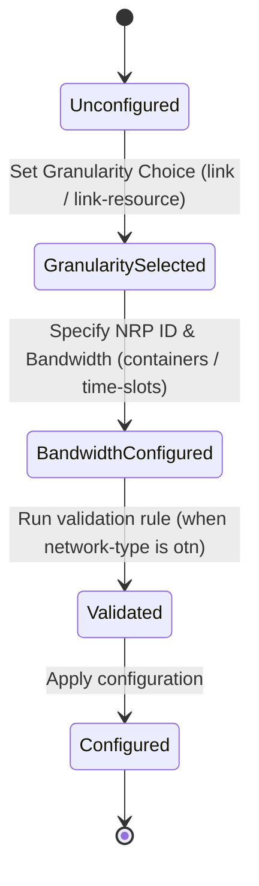

# Feature: Feature 46: OTN Network Resource Partition MPI Mapping (Issue #113)

**Parent Epic:** [Epic 14: OTN Network Slice (Issue #123)](https://github.com/gintatkinson/cogctl-ux-09/blob/main/docs/epics/epic-14-otn-slice.md)

This feature introduces the capability to map OTN Network Resource Partitions (NRPs) onto physical and logical links over the Multi-Point Interface (MPI), augmenting the Traffic Engineering (TE) link attributes.

## 1. Schema Definitions & Constraints

### Choices and Mutually Exclusive Allocations
- `otn-nrp-granularity`:
  - **Type**: choice
  - **Description**: Defines the granularity of the partition. It represents a choice where exactly one case (`link` or `link-resource`) must be selected. This mutual exclusivity ensures the partition is either applied as a whole link or subdivided into specific resources.
- `technology`:
  - **Type**: choice
  - **Description**: Data plane technology types, which currently supports the `otn` case. Exactly one technology option must be active.
- `nrp-bandwidth`:
  - **Type**: choice
  - **Description**: The bandwidth specification for the OTN partition, which represents a choice between standard `containers` or dedicated `time-slots`.

### Cases and Lists
- `link`:
  - **Type**: case
  - **Description**: Slicing granularity representing the entire physical/logical link.
- `link-resource`:
  - **Type**: case
  - **Description**: Slicing granularity representing a subset of link resources.
- `nrps`:
  - **Type**: list
  - **Description**: Keyed by `nrp-id`, this represents the collection of Network Resource Partitions mapped to link resources.
- `otn`:
  - **Type**: case
  - **Description**: Represents the Optical Transport Network technology case within the technology choice.
- `containers`:
  - **Type**: case
  - **Description**: Represents the container-based bandwidth mapping option.
- `time-slots`:
  - **Type**: case
  - **Description**: Represents the tributary slot-based bandwidth mapping option.

### Leaves
- `nrp-id`:
  - **Type**: leaf (uint32)
  - **Description**: Unique identifier for the Network Resource Partition.
- `otn-ts-num`:
  - **Type**: leaf (uint32)
  - **Description**: The number of tributary slots allocated to the partition.

### Conditional Constraints & Co-dependencies
- **Augmentation Condition**: The augmentation of `/nw:networks/nw:network/nt:link/tet:te/tet:te-link-attributes` is conditional. It applies **when** the target network has an OTN topology type (`otnt:otn-topology`). This is a co-dependency constraint enforced during schema validation.

## 2. Logical System Integration & UI Capabilities

- **Logical Data Model**:
  - The link configuration domain model includes an optional `otn-nrp-profile` object.
- **Logical Processing Rules**:
  - When the user selects `link-resource` mode, the system enforces the presence of the `nrps` list.
  - When configuring the bandwidth, the choice between `containers` and `time-slots` must be resolved exclusively.
- **Logical UI Representation**:
  - A dedicated "NRP Partitioning" panel is rendered on the TE Link configuration view when the network type is OTN.
  - The UI dynamically toggles input fields based on the active `otn-nrp-granularity` choice.

## 3. State Machine and Validation Flow

## 4. BDD Given-When-Then Acceptance Criteria

- **Scenario 1: Configure partition with time-slot granularity**
  - **Given** a TE link on an OTN topology network is selected
  - **When** the operator sets the granularity to `link-resource` and configures an NRP entry with `nrp-id` as 101 and selects the `time-slots` choice with `otn-ts-num` set to 8
  - **Then** the validation rule succeeds and the partition is successfully mapped on the MPI.

- **Scenario 2: Reject configuration when topology is not OTN**
  - **Given** a TE link on a non-OTN topology network is selected
  - **When** the operator attempts to configure an NRP profile
  - **Then** the validation rule fails because the `when` condition constraint is not satisfied, and the system rejects the configuration.

## 5. Specification Context (Verbatim)

> Profile of an OTN link Network Resource Partition (NRP).
> Augment OTN TE link attributes with NRP profile.

## 6. Source References

YANG Schema: [ietf-otn-slice-mpi.yang](https://github.com/YangModels/yang/blob/954277fad0534e9b0b495774255b0c4ce854f8b2/experimental/ietf-extracted-YANG-modules/ietf-otn-slice-mpi%402025-07-03.yang)
Normative Specification: [draft-ietf-ccamp-otn-topo-yang](https://datatracker.ietf.org/doc/draft-ietf-ccamp-otn-topo-yang/)
