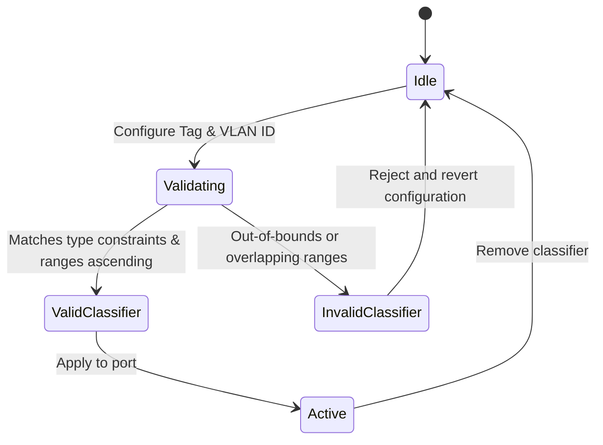

# Feature: Feature 47: IEEE 802.1Q Bridge Port VLAN Tag and Type Definitions (Issue #139)

This feature introduces standard VLAN tag type identities (C-VLAN and S-VLAN), index types, and classification criteria used to represent and validate VLAN classification configurations on Bridge ports.

## 1. Schema Definitions & Constraints

### Typedefs
- `name-type`:
  - **Type**: `string`
  - **Constraints**: Length `0..32` characters.
- `port-number-type`:
  - **Type**: `uint32`
  - **Constraints**: Range `1..4095`.
- `vid-range-type`:
  - **Type**: `string`
  - **Constraints**: Pattern matching ascending, non-overlapping VLAN ID lists/ranges (e.g. `1,10-100,250,500-1000`). Regex pattern: `([1-9][0-9]{0,3}(-[1-9][0-9]{0,3})?(,[1-9][0-9]{0,3}(-[1-9][0-9]{0,3})?)*)`.
- `vlanid`:
  - **Type**: `uint16`
  - **Constraints**: Range `1..4094`.
- `vlan-index-type`:
  - **Type**: `uint32`
  - **Constraints**: Range `1..4094 | 4096..4294967295`.
- `mstid-type`:
  - **Type**: `uint32`
  - **Constraints**: Range `1..4094`.
- `ethertype-type`:
  - **Type**: `string`
  - **Constraints**: Pattern `[0-9a-fA-F]{2}-[0-9a-fA-F]{2}`.
- `dot1q-tag-type`:
  - **Type**: `identityref`
  - **Base**: `dot1q-vlan-type`.

### Identities
- `dot1q-vlan-type`: Base identity for all VLAN tag types.
- `c-vlan`: Base identity representing an 802.1Q Customer VLAN (EtherType `81-00`).
- `s-vlan`: Base identity representing an 802.1Q Service VLAN (EtherType `88-A8`).

### Groupings & Nodes
- `dot1q-tag-classifier-grouping`:
  - `tag-type` (`dot1q-tag-type`): Mandatory VLAN tag type.
  - `vlan-id` (`vlanid`): Mandatory VLAN ID.
- `dot1q-tag-or-any-classifier-grouping`:
  - `tag-type` (`dot1q-tag-type`): Mandatory VLAN tag type.
  - `vlan-id` (`union`): Mandatory union of `vlanid` or enumeration `any` (value `4095`).
- `dot1q-tag-ranges-classifier-grouping`:
  - `tag-type` (`dot1q-tag-type`): Mandatory VLAN tag type.
  - `vlan-ids` (`vid-range-type`): Mandatory list of ranges.
- `dot1q-tag-ranges-or-any-classifier-grouping`:
  - `tag-type` (`dot1q-tag-type`): Mandatory VLAN tag type.
  - `vlan-id` (`union`): Mandatory union of `vid-range-type` or enumeration `any` (value `4095`).

## 2. Logical System Integration & UI Capabilities

- **Logical Data Model**:
  - The database records the classification mapping for ingress ports containing `tag-type` and a single ID, list of ranges, or the wildcard `any`.
- **Logical Processing Rules**:
  - Validates that the input value for `vlan-ids` is in ascending order and has no overlapping ranges.
  - Wildcard `any` matches any VLAN in the range `1..4094` that is not matched by a more specific classifier on that port.
- **Logical UI Representation**:
  - Inputs for VLAN IDs must validate ranges dynamically and show visual feedback on invalid strings (e.g. if descending order or overlapping IDs are present).

## 3. State Machine and Validation Flow

## 4. BDD Given-When-Then Acceptance Criteria

- **Scenario 1: Configure valid ascending VLAN range list**
  - **Given** a port classifier is selected
  - **When** the operator configures the VLAN range list as `10,20-30,50-100` and sets `tag-type` to `c-vlan`
  - **Then** the validation engine accepts the format, resolves it to the correct set of Customer VLANs, and configures the port.

- **Scenario 2: Reject overlapping or descending VLAN range list**
  - **Given** a port classifier is selected
  - **When** the operator attempts to configure the VLAN range list as `30-20,10` (descending) or `10-20,15-30` (overlapping)
  - **Then** the validation engine rejects the input, returns a syntax error, and keeps the original state.

## 5. Specification Context (Verbatim)

> A C-VLAN component comprises a VLAN Bridge component with the EISS on all Ports supported by the use of a C-VLAN tag (C-TAG) (6.8, 9.5).
> An S-VLAN component comprises a VLAN Bridge component with the EISS on all Ports supported by the use of an S-TAG (6.8, 9.5).

## 6. Source References
- **YANG Schema:** [ieee802-dot1q-types.yang](https://github.com/gintatkinson/cogctl-ux-09/blob/main/yang/ieee802-dot1q-types.yang)
- **Normative Specification:** [IEEE Std 802.1Q-2014](../std/802.1Q-2014.pdf), Clauses 5.5 and 5.6.
