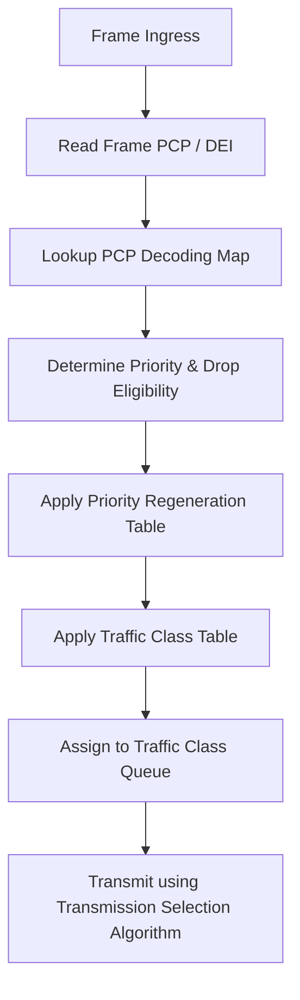

# Feature: Feature 48: IEEE 802.1Q Priority and Traffic Class Mapping (Issue #TBD)

This feature implements the priority regeneration tables, priority code point (PCP) decoding and encoding maps, traffic class tables, and transmission selection algorithm mappings used to determine access priorities and assign outbound traffic classes on Bridge ports.

## 1. Schema Definitions & Constraints

### Identities
- `transmission-selection-algorithm`: Base identity for transmission selection.
- `strict-priority`: Identity representing strict priority transmission selection.
- `credit-based-shaper`: Identity representing credit-based shaper transmission selection.
- `enhanced-transmission-selection`: Identity representing enhanced transmission selection (ETS).
- `asynchronous-traffic-shaping`: Identity representing asynchronous traffic shaping.
- `vendor-specific`: Identity representing vendor-specific transmission selection.

### Typedefs
- `priority-type`: Range `0..7`.
- `pcp-selection-type`: Range `0..7 | 8` (8 represents "use frame PCP").
- `traffic-class-type`: Range `0..7`.

### Groupings & Nodes
- `priority-regeneration-table-grouping`: Maps received priority to regenerated priority for each of the eight priorities (`priority0` through `priority7`).
- `pcp-decoding-table-grouping`: PCP decoding table containing `pcp-decoding-map` list with keys `pcp` (range `0..7`) and `priority-map` mapping to `priority` (range `0..7`) and `drop-eligible` boolean.
- `pcp-encoding-table-grouping`: PCP encoding table containing `pcp-encoding-map` list with keys `pcp-selection-type` and `priority-map` mapping to `pcp` (range `0..7`) and `dei` boolean.
- `service-access-priority-table-grouping`: Maps incoming priority to regenerated service priority (`priority0` through `priority7`).
- `traffic-class-table-grouping`: Maps incoming priority to traffic class containing `traffic-class-map` list (key `priority`, leaf `traffic-class`) and `num-traffic-class` (default 8).
- `transmission-selection-table-grouping`: Maps traffic class to transmission selection algorithm containing `transmission-selection-algorithm-map` list (key `traffic-class`, leaf `transmission-selection-algorithm`).

## 2. Logical System Integration & UI Capabilities

- **Logical Data Model**:
  - Store priority regeneration vectors and mapping tables persistently in the bridge port configuration databases.
- **Logical Processing Rules**:
  - Ingress priority is mapped to a regenerated priority value using the Port's `priority-regeneration-table`.
  - Regenerated priority is converted to an outbound traffic class queue using the Port's `traffic-class-table`.
  - Frames are selected for transmission based on the assigned transmission selection algorithm mapped to the traffic class queue.
- **Logical UI Representation**:
  - Displays a grid/table showing the mapping from 8 received priorities to 8 regenerated priorities, and 8 regenerated priorities to traffic classes.

## 3. State Machine and Validation Flow

## 4. BDD Given-When-Then Acceptance Criteria

- **Scenario 1: Regenerate priority and assign traffic class queue**
  - **Given** a port is configured with a default Priority Regeneration Table mapping all received priorities 0-7 to themselves, and a Traffic Class Table mapping priority 7 to traffic class 7
  - **When** an ingress frame arrives with PCP 7
  - **Then** the priority is regenerated as 7, mapped to traffic class 7, and queued in traffic class queue 7.

- **Scenario 2: Select transmission using strict-priority algorithm**
  - **Given** traffic class 7 is mapped to the `strict-priority` transmission selection algorithm
  - **When** frames are queued on traffic class 7
  - **Then** they are transmitted before any frames queued in lower traffic classes.

## 5. Specification Context (Verbatim)

> For each reception Port, the Priority Regeneration Table has eight entries, corresponding to the eight possible values of priority (0 through 7). Each entry specifies, for the given value of received priority, the corresponding regenerated value.
> The Forwarding Process provides one or more queues for a given Bridge Port, each corresponding to a distinct traffic class. Each frame is mapped to a traffic class using the Traffic Class Table for the Port and the frame's priority.

## 6. Source References
- **YANG Schema:** [ieee802-dot1q-types.yang](https://github.com/gintatkinson/cogctl-ux-09/blob/main/yang/ieee802-dot1q-types.yang)
- **Normative Specification:** IEEE Std 802.1Q-2014, Clauses 6.9.4 and 8.6.6.
