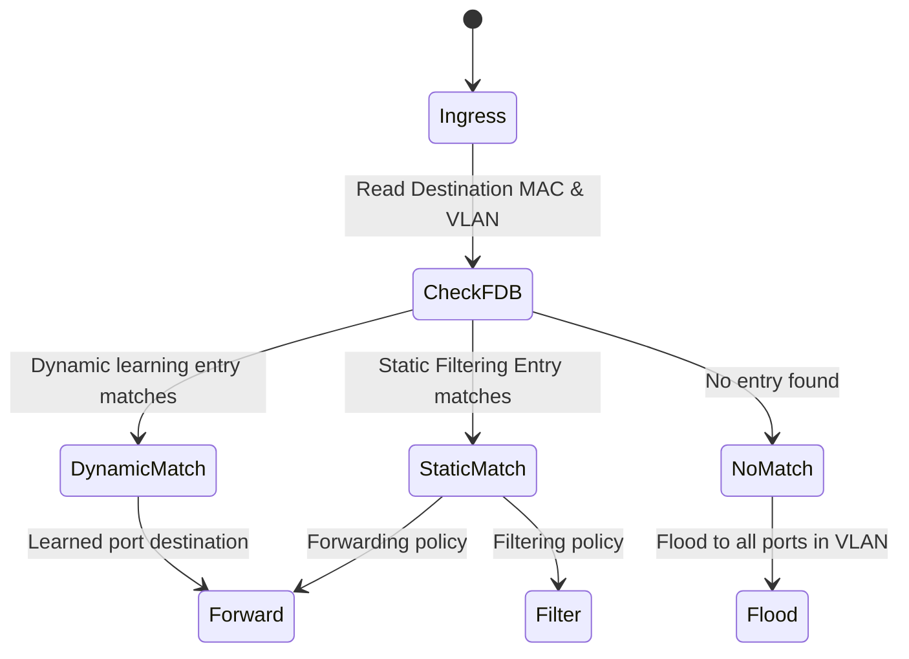

# Feature: Feature 49: IEEE 802.1Q Port Maps and Forwarding Filtering Policies (Issue #TBD)

This feature implements the port mapping, protocol frame format definitions, static/dynamic forwarding database (FDB) filtering entries, and registrar administration policies used to filter and forward frames on Bridge ports.

## 1. Schema Definitions & Constraints

### Typedefs
- `protocol-frame-format-type`:
  - **Type**: `enumeration`
  - **Values**: `ethernet` (value 1), `rfc1042` (value 2), `snap8021H` (value 3), `snapOther` (value 4), `llcOther` (value 5).

### Groupings & Nodes
- `port-map-grouping`:
  - `port-ref` (`port-number-type`): Mandatory Bridge port reference.
  - `map-type` (`choice`): Includes:
    - Container `static-filtering-entries`: For MAC address based filtering policies containing `control-element` and `connection-identifier` leaves.
    - Container `static-vlan-registration-entries`: For static VLAN membership registration containing `registrar-admin-control` and `vlan-transmitted` leaves.
    - Container `mac-address-registration-entries`: For registered MAC addresses.
    - Container `dynamic-vlan-registration-entries`: For dynamic VLAN registrations.
    - Container `dynamic-reservation-entries`: For reservation protocols.
    - Container `dynamic-filtering-entries`: For dynamic FDB learning.

## 2. Logical System Integration & UI Capabilities

- **Logical Data Model**:
  - The Bridge Port Map tracks physical/logical port mappings, static filtering databases, and registrar administration parameters.
- **Logical Processing Rules**:
  - The forwarding process determines whether to forward or filter a frame by comparing the frame's destination MAC address and VLAN ID against static filtering entries and dynamic learning entries.
- **Logical UI Representation**:
  - Displays filtering entries for MAC addresses, highlighting whether an entry is statically configured or dynamically learned.

## 3. State Machine and Validation Flow

## 4. BDD Given-When-Then Acceptance Criteria

- **Scenario 1: Forward unicast frame based on static filtering entry**
  - **Given** a port map static filtering entry is configured to forward destination MAC `00-11-22-33-44-55` on VLAN 10 to Port 2
  - **When** a frame with destination MAC `00-11-22-33-44-55` and VLAN ID 10 arrives on the bridge
  - **Then** the bridge forwards the frame exclusively to Port 2.

- **Scenario 2: Filter frame based on static filtering entry**
  - **Given** a port map static filtering entry is configured to filter destination MAC `00-11-22-33-44-55` on VLAN 10 (discard policy)
  - **When** a frame with destination MAC `00-11-22-33-44-55` and VLAN ID 10 arrives on the bridge
  - **Then** the bridge filters and discards the frame.

## 5. Specification Context (Verbatim)

> Static Filtering Entries in the Filtering Database configure static filtering information for unicast and multicast MAC addresses.
> Static VLAN Registration Entries configure static VLAN membership registration information, defining which ports transmit frames for a given VLAN.

## 6. Source References
- **YANG Schema:** [ieee802-dot1q-types.yang](https://github.com/gintatkinson/cogctl-ux-09/blob/main/yang/ieee802-dot1q-types.yang)
- **Normative Specification:** IEEE Std 802.1Q-2014, Clauses 8.8.1 and 8.8.2.
