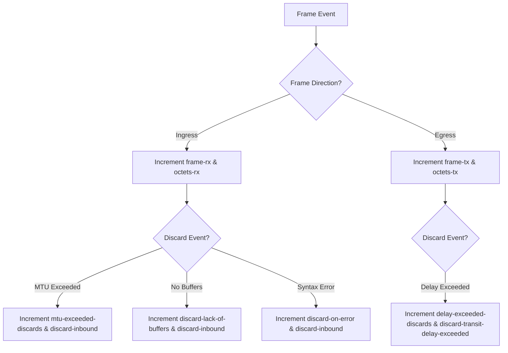

# Feature: Feature 50: IEEE 802.1Q Bridge Port Performance and Error Statistics (Issue #142)

This feature implements the performance and error statistic counters used to track, monitor, and report ingress/egress frame processing states, MTU violations, transit delays, and buffer discards on Bridge ports.

## 1. Schema Definitions & Constraints

### Groupings & Nodes
- `bridge-port-statistics-grouping`: Contains the following 64-bit counter leaves:
  - `delay-exceeded-discards` (`yang:counter64`): Frames discarded due to excessive transit delay.
  - `mtu-exceeded-discards` (`yang:counter64`): Frames discarded because size exceeded the maximum MTU.
  - `frame-rx` (`yang:counter64`): Successfully received frames.
  - `octets-rx` (`yang:counter64`): Total octets received.
  - `frame-tx` (`yang:counter64`): Successfully transmitted frames.
  - `octets-tx` (`yang:counter64`): Total octets transmitted.
  - `discard-inbound` (`yang:counter64`): Discarded inbound frames (filtering/error).
  - `forward-outbound` (`yang:counter64`): Successfully forwarded outbound frames.
  - `discard-lack-of-buffers` (`yang:counter64`): Inbound frames discarded due to lack of buffer space.
  - `discard-transit-delay-exceeded` (`yang:counter64`): Outbound frames discarded due to excessive transit delay.
  - `discard-on-error` (`yang:counter64`): Frames discarded due to syntax or validation errors.

## 2. Logical System Integration & UI Capabilities

- **Logical Data Model**:
  - The counter values are read-only metrics stored in physical interface registers or virtual port counters.
- **Logical Processing Rules**:
  - Validates that counters are monotonically increasing, unless explicitly cleared by management commands.
- **Logical UI Representation**:
  - Displays real-time statistics counters on a dashboard, updating periodically. High error/discard counts should trigger UI warnings.

## 3. State Machine and Validation Flow

## 4. BDD Given-When-Then Acceptance Criteria

- **Scenario 1: Accumulate received frame and octet counts**
  - **Given** a port is active and stats counters are initialized to 0
  - **When** a frame of 1000 octets is successfully received on the port
  - **Then** the `frame-rx` counter increments to 1, and the `octets-rx` counter increments to 1000.

- **Scenario 2: Log discard due to MTU violation**
  - **Given** the port maximum MTU is configured to 1500 bytes
  - **When** an ingress frame of 1600 bytes is received
  - **Then** the bridge discards the frame, increments `mtu-exceeded-discards` by 1, and increments `discard-inbound` by 1.

## 5. Specification Context (Verbatim)

> Bridge Port Statistics track the operational performance and discard states of each bridge port. Counters include successfully processed traffic as well as packets discarded due to errors, lack of buffer resources, or transit delay exceedance.

## 6. Source References
- **YANG Schema:** [ieee802-dot1q-types.yang](https://github.com/gintatkinson/cogctl-ux-09/blob/main/yang/ieee802-dot1q-types.yang)
- **Normative Specification:** [IEEE Std 802.1Q-2014](../std/802.1Q-2014.pdf), Clause 12.6.1.1.3.
