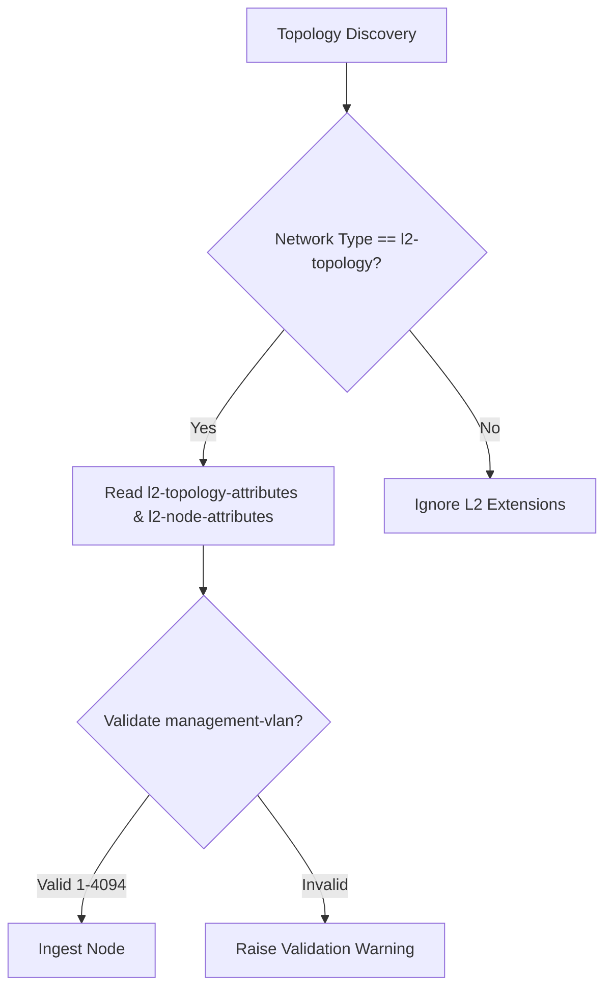

# Feature: Feature 51: IETF Layer 2 Network Topology and Node Attributes (Issue #151)

This feature implements the core Layer 2 network topology representations and node attributes. It enables topology discovery, identification of bridging entities, and node-level management configurations (such as MAC addresses, management VLANs, and IP management addresses).

## 1. Schema Definitions & Constraints

### Groupings & Nodes
- `l2-topology` (`container`): Ingests Layer 2 network topology identifiers.
- `l2-topology-attributes` (`container`): Holds the topology-wide parameters:
  - `name` (`string`): User-friendly descriptive name of the Layer 2 network topology.
  - `flags` (`leaf-list` of `l2-flag-type`): Network-wide topology flags.
- `l2-node-attributes` (`container`): Holds Layer 2 node attributes:
  - `name` (`string`): Node name.
  - `flags` (`leaf-list` of `node-flag-type`): Node-specific status flags.
  - `bridge-id` (`leaf-list` of `string`): IEEE 802.1Q Bridge Identifiers associated with the node.
  - `management-address` (`leaf-list` of `inet:ip-address`): IP addresses used to manage the node.
  - `management-mac` (`yang:mac-address`): Primary MAC address used for device management.
  - `management-vlan` (`uint16` / `vlan-id`): The VLAN ID designated for out-of-band or in-band management traffic.
- `event-type` (`leaf` under notifications): Specifies the type of event in the topology.

### Identities
- `flag-identity`: Base identity for Layer 2 network flags.

### Typedefs
- `l2-flag-type`: Typeref referencing `identityref` derived from `flag-identity`.
- `node-flag-type`: Typeref referencing `identityref` derived from `flag-identity`.
- `l2-network-event-type`: Enumeration defining L2 network topology change events:
  - `add`: Node/Link/TP added.
  - `remove`: Node/Link/TP removed.
  - `update`: Node/Link/TP updated.

## 2. Logical System Integration & UI Capabilities

- **Logical Data Model**:
  - Validates that Layer 2 topologies are augmented correctly when the top-level network type is `l2-topology`.
- **Logical Processing Rules**:
  - Validation rule: Check that `management-mac` matches standard IEEE 802 MAC-48 patterns.
  - Validation rule: Ensure `management-vlan` is within the valid range of 1 to 4094.
- **Logical UI Representation**:
  - Displays Layer 2 nodes in a topological layout, showing their Bridge ID, Management MAC, and Management IP.

## 3. State Machine and Validation Flow

## 4. BDD Given-When-Then Acceptance Criteria

- **Scenario 1: Validate discovered node attributes**
  - **Given** a network topology type of `l2-topology` is discovered
  - **When** a node is parsed with `bridge-id` `00:11:22:33:44:55` and `management-vlan` `100`
  - **Then** the system successfully ingests the node and stores its management VLAN parameter.

- **Scenario 2: Reject invalid management VLAN ID**
  - **Given** a discovered node is parsed with `management-vlan` `5000`
  - **When** the constraint checks are executed
  - **Then** the validation fails because the VLAN ID exceeds the maximum valid boundary of 4094.

## 5. Specification Context (Verbatim)

> This module defines a YANG data model for Layer 2 network topologies.
> The node attributes describe physical or logical bridges within the Layer 2 network segment, including management parameters such as Bridge IDs, IP addresses, MAC addresses, and management VLAN IDs.

## 6. Source References
- **YANG Schema:** [ietf-l2-topology.yang](https://github.com/gintatkinson/cogctl-ux-09/blob/main/yang/ietf-l2-topology.yang)
- **Normative Specification:** [RFC 8944](https://datatracker.ietf.org/doc/rfc8944/), Section 5.1 (Topology and Node Attributes).
