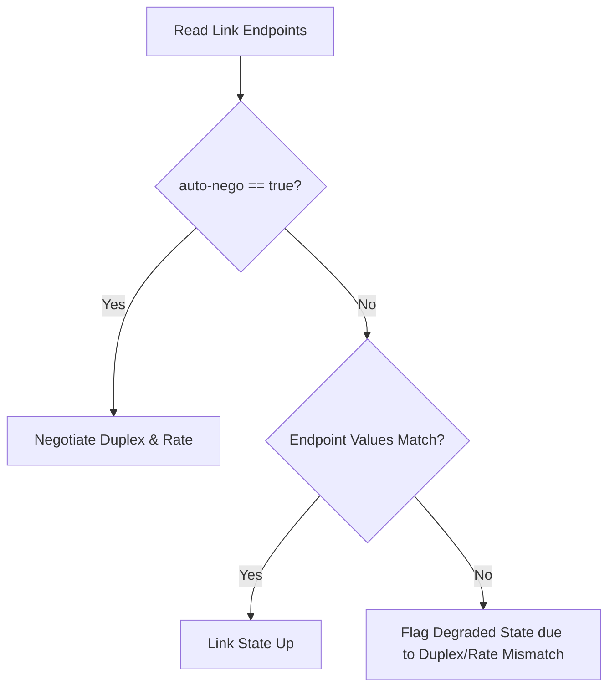

# Feature: Feature 52: IETF Layer 2 Link Attributes (Issue #152)

This feature implements Layer 2 link characteristics, allowing configuration and operational state reporting of link transmission speed, propagation delay, auto-negotiation status, and duplex modes.

## 1. Schema Definitions & Constraints

### Groupings & Nodes
- `l2-link-attributes` (`container`): Holds Layer 2 link parameters:
  - `rate` (`decimal64`): Link transmission speed/bandwidth expressed in Gbps.
  - `delay` (`uint32`): Link transmission delay/propagation latency in microseconds.
  - `auto-nego` (`boolean`): Flag indicating if speed and duplex mode auto-negotiation is active.
  - `duplex` (`duplex-mode`): Link duplex mode.
  - `flags` (`leaf-list` of `link-flag-type`): Link-specific status flags.

### Typedefs
- `link-flag-type`: Typeref referencing `identityref` derived from `flag-identity`.
- `duplex-mode`: Enumeration defining the duplex state of the link:
  - `full`: Full-duplex communication mode.
  - `half`: Half-duplex communication mode.

## 2. Logical System Integration & UI Capabilities

- **Logical Data Model**:
  - Augments the network topology links when network-type is `l2-topology`.
- **Logical Processing Rules**:
  - Validation rule: Rate and delay values must be positive numbers.
  - Mismatch condition: Flag link status as degraded if `duplex` or `rate` values mismatch between local and remote endpoints when `auto-nego` is disabled.
- **Logical UI Representation**:
  - Shows links in a network view with color-coding indicating transmission speed/latency and warnings for duplex mismatches.

## 3. State Machine and Validation Flow

## 4. BDD Given-When-Then Acceptance Criteria

- **Scenario 1: Detect duplex mismatch**
  - **Given** two endpoints of a link are configured with auto-negotiation disabled
  - **When** the local endpoint is set to `full` duplex and the remote endpoint is set to `half` duplex
  - **Then** the validation rule raises a mismatch condition, and the link state changes to degraded.

- **Scenario 2: Read link propagation delay**
  - **Given** a Layer 2 link with propagation delay configured to `50` microseconds
  - **When** link latency metrics are requested
  - **Then** the system returns `50` as the delay value.

## 5. Specification Context (Verbatim)

> Link attributes describe Layer 2 connection properties, such as transmission rate (speed), delay, auto-negotiation capabilities, and duplex modes. These properties can be dynamically negotiated or statically provisioned.

## 6. Source References
- **YANG Schema:** [ietf-l2-topology.yang](https://github.com/gintatkinson/cogctl-ux-09/blob/main/yang/ietf-l2-topology.yang)
- **Normative Specification:** [RFC 8944](https://datatracker.ietf.org/doc/rfc8944/), Section 5.2 (Link Attributes).
