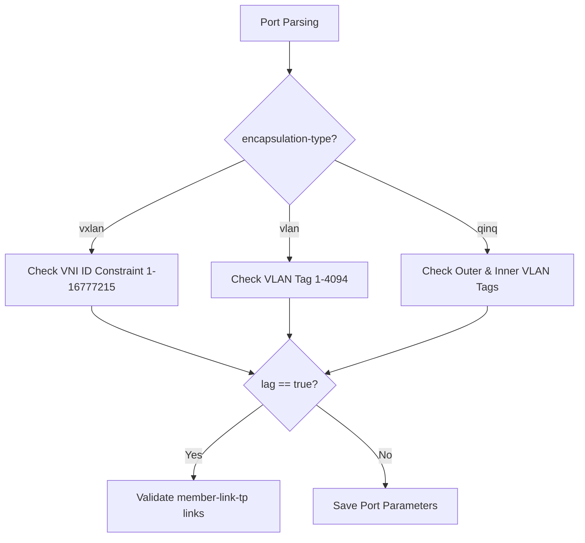

# Feature: Feature 53: IETF Layer 2 Termination Point Encapsulation and Virtualization (Issue #153)

This feature implements the encapsulation types, tag classifications, and virtual port mappings associated with Layer 2 termination points. It provides support for physical Ethernet ports, VLAN/QinQ tagging, virtual overlay networks (such as VXLAN), and Link Aggregation Groups (LAG).

## 1. Schema Definitions & Constraints

### Groupings & Nodes
- `l2-termination-point-attributes` (`container`): Holds L2 port properties:
  - `interface-name` (`string`): Name of the underlying physical or logical interface.
  - `mac-address` (`yang:mac-address`): Interface hardware MAC address.
  - `port-number` (`leaf-list` of `uint32`): Logical port numbers.
  - `unnumbered-id` (`leaf-list` of `uint32`): Unnumbered interface IDs.
  - `encapsulation-type` (`identityref` derived from `eth-encapsulation-type`): Encapsulation mode.
  - `outer-tag` (`uint16` / `vlan-id`): Outer VLAN tag.
  - `outer-tpid` (`uint16` / `ethertype-type`): Outer TPID ethertype.
  - `inner-tag` (`uint16` / `vlan-id`): Inner VLAN tag.
  - `inner-tpid` (`uint16` / `ethertype-type`): Inner TPID ethertype.
  - `lag` (`boolean`): Set to true when Link Aggregation is active on this interface.
  - `member-link-tp` (`leaf-list` of `leafref`): References to the constituent termination points when `lag` is active.
  - `vxlan` (`container`): VXLAN attributes container:
    - `vni-id` (`vni`): VXLAN Network Identifier (VNI) value.

### Identities
- `eth-encapsulation-type`: Base identity for Ethernet encapsulation types.
- `ethernet`: Standard raw Ethernet.
- `vlan`: Virtual LAN tag encapsulation.
- `qinq`: Double VLAN (provider bridge) tag encapsulation.
- `pbb`: Provider Backbone Bridges.
- `trill`: Transparent Interconnection of Lots of Links.
- `vpls`: Virtual Private LAN Service.
- `vxlan`: Virtual Extensible LAN.

### Typedefs
- `vni`: 24-bit VXLAN Network Identifier (range 1..16777215).

## 2. Logical System Integration & UI Capabilities

- **Logical Data Model**:
  - Validates that port attributes correspond to the parent node's Layer 2 characteristics.
- **Conditional Constraints & Co-dependencies**:
  - Validation rule: The `member-link-tp` list is only applicable and evaluated when the conditional clause `lag` is set to `true`.
  - Validation rule: The `vxlan` container and its constituent `vni-id` only apply when the condition `derived-from-or-self(encapsulation-type, 'l2t:vxlan')` is satisfied.
- **Logical UI Representation**:
  - Displays logical ports on a bridge node, highlighting encapsulation types (e.g. `VLAN`, `QinQ`, `VXLAN`) and LAG member interfaces.

## 3. State Machine and Validation Flow

## 4. BDD Given-When-Then Acceptance Criteria

- **Scenario 1: Validate VXLAN VNI value range**
  - **Given** a termination point with encapsulation type set to `vxlan`
  - **When** the VNI ID is configured to `5000`
  - **Then** the validation rule checks the condition and successfully registers the `vni-id` within the 24-bit range.

- **Scenario 2: Reject invalid double tag range in QinQ**
  - **Given** a termination point with encapsulation type set to `qinq`
  - **When** `outer-tag` is set to `100` and `inner-tag` is set to `4096`
  - **Then** the validation constraint fails because the inner tag exceeds the maximum valid VLAN ID boundary of 4094.

## 5. Specification Context (Verbatim)

> Termination point attributes describe the interface-level properties of bridge ports, including MAC addresses, encapsulation styles (VLAN, QinQ, VXLAN, TRILL, PBB, VPLS), outer/inner tagging rules, and link aggregation states.

## 6. Source References
- **YANG Schema:** [ietf-l2-topology.yang](https://github.com/gintatkinson/cogctl-ux-09/blob/main/yang/ietf-l2-topology.yang)
- **Normative Specification:** [RFC 8944](https://datatracker.ietf.org/doc/rfc8944/), Section 5.3 (Termination Point Attributes).
