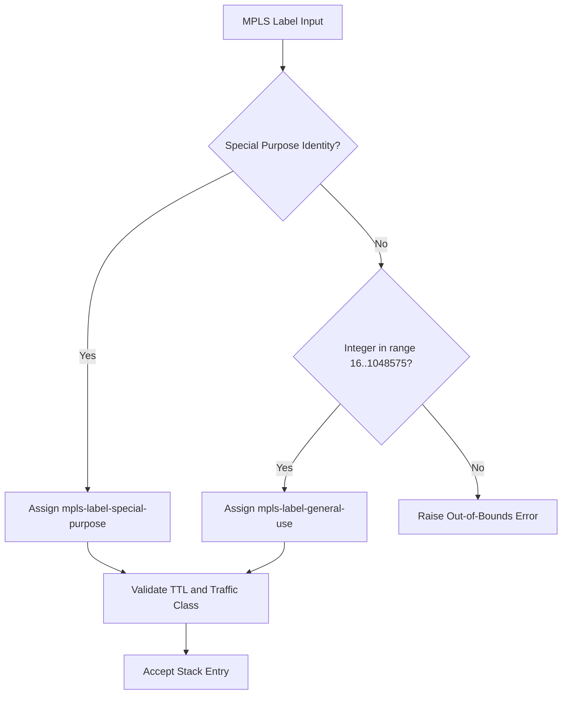

# Feature: Feature 54: IETF Routing Type Identities and MPLS Labels (Issue #160)

This feature implements the common Multiprotocol Label Switching (MPLS) label types, special-purpose identities, and label stack groupings. It enables validation, provisioning, and formatting of MPLS headers, special-purpose labels (such as explicit NULL, implicit NULL, and router alert), and general-use labels.

## 1. Schema Definitions & Constraints

### Groupings & Nodes
- `mpls-label-stack` (`grouping`): Specifies an MPLS label stack:
  - `entry` (`list`): List of MPLS label stack entries.
  - `id` (`leaf` / `uint8`): Key identifying the entry's relative ordering in the stack.
  - `label` (`leaf` / `rt-types:mpls-label`): The label value.
  - `ttl` (`leaf` / `uint8`): Time to Live (TTL) value.
  - `traffic-class` (`leaf` / `uint8` range `0..7`): Traffic Class (TC) bits (formerly EXP).

### Identities
- `mpls-label-special-purpose-value`: Base identity for special-purpose MPLS labels.
- `ipv4-explicit-null-label`: Base null label for IPv4 (value 0).
- `router-alert-label`: Router alert label (value 1).
- `ipv6-explicit-null-label`: Base null label for IPv6 (value 2).
- `implicit-null-label`: Implicit null label (value 3).
- `entropy-label-indicator`: Entropy label indicator (value 7).
- `gal-label`: Generic Associated Channel (G-ACh) Label (GAL) (value 13).
- `oam-alert-label`: OAM alert label (value 14).
- `extension-label`: Extension label (value 15).

### Typedefs
- `mpls-label-special-purpose` (`identityref`): Typeref referencing `identityref` derived from `mpls-label-special-purpose-value`.
- `mpls-label-general-use` (`uint32`): Unsigned 32-bit integer restricted to range `16..1048575`.
- `mpls-label` (`union`): Union of `mpls-label-special-purpose` and `mpls-label-general-use`.
- `generalized-label` (`binary`): Binary type representing a generalized label.

## 2. Logical System Integration & UI Capabilities

- **Logical Data Model**:
  - Encapsulates MPLS label values and validates that labels either map to registered special-purpose identities or general-use integers between 16 and 1048575.
- **Logical Processing Rules**:
  - Validation rule: Ensure that `traffic-class` is between `0` and `7` inclusive.
  - Validation rule: Verify that a general-use `mpls-label` is strictly inside the bounds `[16..1048575]`.
- **Logical UI Representation**:
  - Displays MPLS label stacks as ordered tables, showing each label, its type (special-purpose vs general-use), TTL, and Traffic Class.

## 3. State Machine and Validation Flow

## 4. BDD Given-When-Then Acceptance Criteria

- **Scenario 1: Validate a general-use MPLS label**
  - **Given** an MPLS label configuration input
  - **When** a general-use label of `5001` is parsed
  - **Then** the system validates it successfully as it falls within the `16..1048575` range.

- **Scenario 2: Reject out-of-bounds general-use label**
  - **Given** an MPLS label configuration input
  - **When** a general-use label of `12` is parsed
  - **Then** the validation fails since it is less than the minimum general-use threshold of 16.

- **Scenario 3: Validate special-purpose identity label**
  - **Given** an MPLS label configuration input
  - **When** the identity `ipv4-explicit-null-label` is specified
  - **Then** the system accepts it as a valid special-purpose MPLS label.

## 5. Specification Context (Verbatim)

> This module contains a collection of YANG data types considered generally useful for routing protocols.
> The identities represent special-purpose label values, and the typedefs represent general-use label spaces and label stack entries.

## 6. Source References
- **YANG Schema:** [ietf-routing-types.yang](https://github.com/gintatkinson/cogctl-ux-09/blob/main/yang/ietf-routing-types.yang)
- **Normative Specification:** [RFC 8294](https://datatracker.ietf.org/doc/rfc8294/), Section 3.
