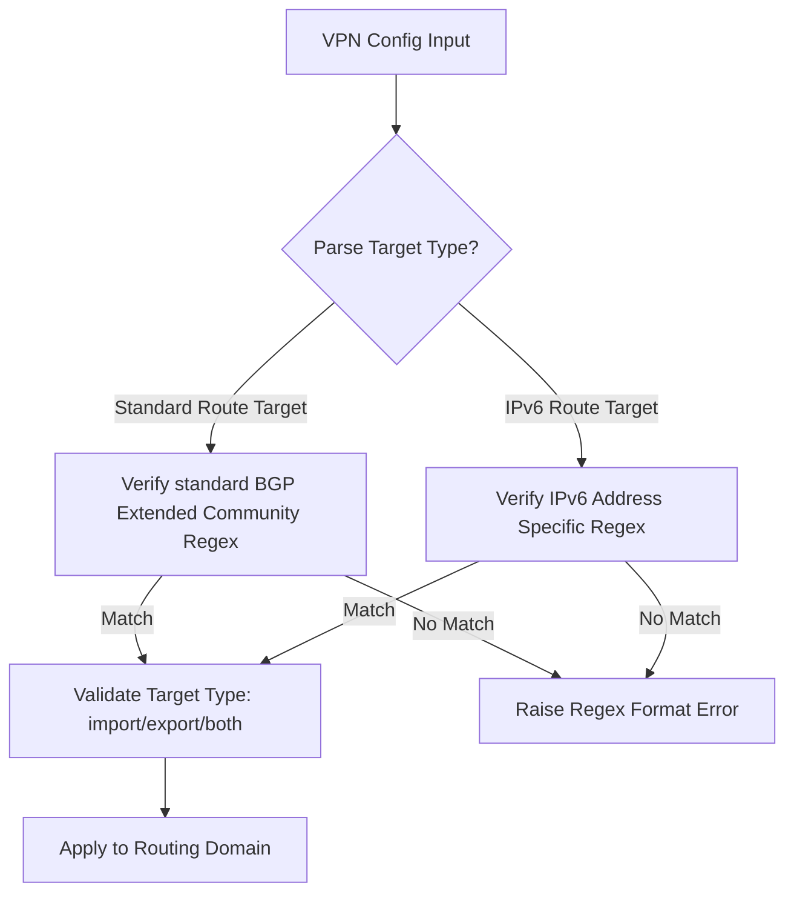

# Feature: Feature 55: IETF Routing VPN Route Targets and Distinguishers (Issue #161)

This feature implements the core Virtual Private Network (VPN) routing attributes. It enables BGP extended community representation, validation, and parsing of Route Distinguishers (RDs), Route Targets (RTs), Route Origins, and IPv6 specific Route Targets/Origins.

## 1. Schema Definitions & Constraints

### Groupings & Nodes
- `vpn-route-targets` (`grouping`): Specifies Route Target rules used in BGP VPNs:
  - `vpn-target` (`list`): List of Route Targets.
  - `route-target` (`leaf` / `rt-types:route-target`): The Route Target value.
  - `route-target-type` (`leaf` / `rt-types:route-target-type`): The import/export role.

### Typedefs
- `route-target` (`string`): An 8-octet BGP extended community formatted according to types 0, 1, 2, or 6 (e.g., `0:2-octet-asn:4-octet-number`, `1:4-octet-ipv4addr:2-octet-number`, `2:4-octet-asn:2-octet-number`, `6:6-octet-mac-address`).
- `ipv6-route-target` (`string`): A 20-octet BGP IPv6 Address Specific Extended Community (format `<ipv6-address:2-octet-number>`).
- `route-target-type` (`enumeration`): Enumeration defining import/export filtering roles:
  - `import`: The Route Target applies to route import.
  - `export`: The Route Target applies to route export.
  - `both`: The Route Target applies to both import and export.
- `route-distinguisher` (`string`): An 8-octet value used to distinguish routes from different BGP VPNs, formatted identically to a Route Target.
- `route-origin` (`string`): An 8-octet BGP extended community identifying where the BGP route originated.
- `ipv6-route-origin` (`string`): A 20-octet BGP IPv6 Address Specific Extended Community identifying route origin.

## 2. Logical System Integration & UI Capabilities

- **Logical Data Model**:
  - Validates BGP extended communities and ensures that RDs, RTs, and Route Origins conform to standard regular expression patterns.
- **Logical Processing Rules**:
  - Validation rule: Match `route-target`, `route-distinguisher`, and `route-origin` against standard formats (types 0, 1, 2, and 6).
  - Validation rule: Match `ipv6-route-target` and `ipv6-route-origin` against IPv6-address-specific formats.
- **Logical UI Representation**:
  - Displays VPN Route Targets and Route Distinguishers inside configuration views, allowing users to select import/export roles from a dropdown (Import, Export, Both).

## 3. State Machine and Validation Flow

## 4. BDD Given-When-Then Acceptance Criteria

- **Scenario 1: Validate a Type 0 Route Target**
  - **Given** a standard VPN Route Target configuration input
  - **When** a route target of `0:100:100` is parsed
  - **Then** the system successfully validates the format.

- **Scenario 2: Reject invalid Route Target format**
  - **Given** a standard VPN Route Target configuration input
  - **When** a route target of `invalid:rt:format` is parsed
  - **Then** the validation fails due to regular expression pattern mismatch.

- **Scenario 3: Validate IPv6 Route Target**
  - **Given** an IPv6 specific Route Target configuration input
  - **When** a route target of `2001:db8::1:6544` is parsed
  - **Then** the system validates it successfully.

## 5. Specification Context (Verbatim)

> A Route Target is an 8-octet BGP extended community initially identifying a set of sites in a BGP VPN.
> A Route Distinguisher is an 8-octet value used to distinguish routes from different BGP VPNs.
> The formats are defined precisely using strict regular expression patterns for Type 0, 1, 2, and 6 encodings.

## 6. Source References
- **YANG Schema:** [ietf-routing-types.yang](https://github.com/gintatkinson/cogctl-ux-09/blob/main/yang/ietf-routing-types.yang)
- **Normative Specification:** [RFC 8294](https://datatracker.ietf.org/doc/rfc8294/), Section 3 (Collection of types related to VPNs).
