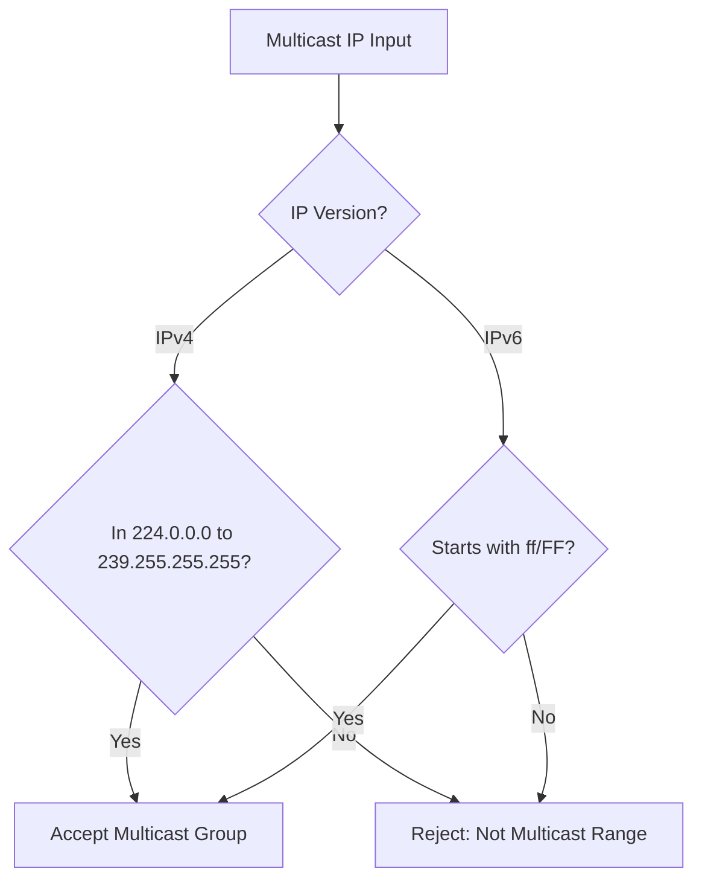

# Feature: Feature 56: IETF Routing Multicast and Protocol Common Types (Issue #162)

This feature implements the general-purpose types common to routing protocols, including Router IDs, IP multicast group addresses, bandwidth configurations (IEEE 754 float32), link access types, percentage metrics, and various protocol timer structures.

## 1. Schema Definitions & Constraints

### Groupings & Nodes
No standalone groupings are defined for these basic types. They are defined as common typedefs that are referenced throughout routing schemas.

### Typedefs
- `router-id` (`yang:dotted-quad`): A 32-bit number in dotted-quad format uniquely identifying a router within an Autonomous System.
- `ipv4-multicast-group-address` (`inet:ipv4-address`): An IPv4 address restricted to the multicast range of `224.0.0.0` to `239.255.255.255`.
- `ipv6-multicast-group-address` (`inet:ipv6-address`): An IPv6 address restricted to the multicast range `ff00::/8`.
- `ip-multicast-group-address` (`union`): Version-neutral IP multicast group address union of `ipv4-multicast-group-address` and `ipv6-multicast-group-address`.
- `ipv4-multicast-source-address` (`union`): IPv4 address or wildcard asterisk string (`*`) representing any source.
- `ipv6-multicast-source-address` (`union`): IPv6 address or wildcard asterisk string (`*`) representing any source.
- `bandwidth-ieee-float32` (`string`): Bandwidth in octets per second, formatted as a normalized, non-negative, non-fractional IEEE 754 float32 hex sequence (e.g., `0x1.hhhhhhp{+}d` or `0x0p0`).
- `link-access-type` (`enumeration`): Enumeration defining link access topologies:
  - `broadcast`
  - `non-broadcast-multiaccess`
  - `point-to-multipoint`
  - `point-to-point`
- `timer-multiplier` (`uint8`): Number of timer intervals to interpret as a failure.
- `timer-value-seconds16` (`union`): 16-bit range seconds timer, or enums `infinity` or `not-set`.
- `timer-value-seconds32` (`union`): 32-bit range seconds timer, or enums `infinity` or `not-set`.
- `timer-value-milliseconds` (`union`): Milliseconds timer, or enums `infinity` or `not-set`.
- `percentage` (`uint8` range `0..100`): Integer indicating percentage.
- `timeticks64` (`uint64`): 64-bit timeticks representing hundredths of a second between two epochs.
- `uint24` (`uint32` range `0..16777215`): 24-bit unsigned integer.

## 2. Logical System Integration & UI Capabilities

- **Logical Data Model**:
  - Models routing timers and protocol access types, enforcing constraints such as checking if multicast group IPs reside within designated ranges (`224.0.0.0/4` and `ff00::/8`).
- **Logical Processing Rules**:
  - Validation rule: Ensure `percentage` is between 0 and 100.
  - Validation rule: Parse and validate `bandwidth-ieee-float32` to ensure it conforms to the IEEE 754 normalized hexadecimal floating-point notation.
- **Logical UI Representation**:
  - Configures router interfaces, presenting link access type selectors (Broadcast, NBMA, P2MP, P2P) and timer entries with units.

## 3. State Machine and Validation Flow

## 4. BDD Given-When-Then Acceptance Criteria

- **Scenario 1: Validate a valid IPv4 multicast group address**
  - **Given** an IP multicast group address configuration input
  - **When** the address `224.1.2.3` is parsed
  - **Then** the validation succeeds because it is in the range `224.0.0.0` to `239.255.255.255`.

- **Scenario 2: Reject non-multicast IPv4 address**
  - **Given** an IP multicast group address configuration input
  - **When** the address `192.168.1.1` is parsed
  - **Then** the validation fails since it is outside the multicast range.

- **Scenario 3: Validate bandwidth float32 format**
  - **Given** a bandwidth configuration input
  - **When** the value `0x1.abcde2p+20` is parsed
  - **Then** the system accepts the input as a valid IEEE float32 string.

## 5. Specification Context (Verbatim)

> This module contains a collection of YANG data types considered generally useful for routing protocols.
> The multicast group types restrict the IP address space to the valid multicast ranges, and the bandwidth/timer types model protocol metrics.

## 6. Source References
- **YANG Schema:** [ietf-routing-types.yang](https://github.com/gintatkinson/cogctl-ux-09/blob/main/yang/ietf-routing-types.yang)
- **Normative Specification:** [RFC 8294](https://datatracker.ietf.org/doc/rfc8294/), Section 3 (Collection of types related to routing, multicast, and protocols).
