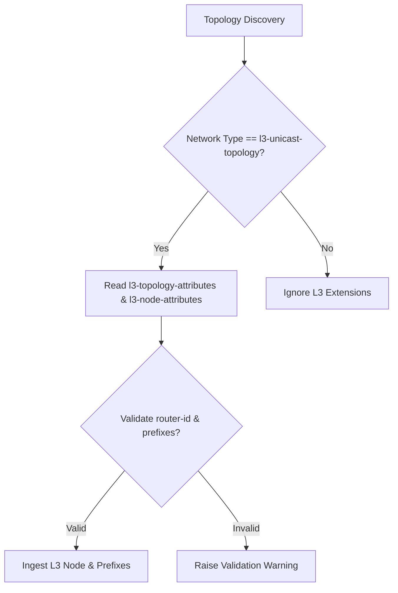

# Feature: Feature 57: IETF Layer 3 Unicast Network and Node Attributes (Issue #169)

This feature implements the core Layer 3 unicast network topology representations and node attributes. It enables Layer 3 topology discovery, identification of routing nodes, and prefix-level management configurations (such as IP prefixes, metrics, and routing flags).

## 1. Schema Definitions & Constraints

### Groupings & Nodes
- `l3-unicast-topology` (`container`): Identifies the topology type as Layer 3 Unicast topology.
- `l3-topology-attributes` (`container`): Holds the topology-wide parameters:
  - `name` (`string`): User-friendly descriptive name of the Layer 3 network topology.
  - `flag` (`leaf-list` of `l3-flag-type`): Network-wide topology flags.
- `l3-node-attributes` (`container`): Holds Layer 3 node attributes:
  - `name` (`domain-name`): User-friendly DNS domain name for the node.
  - `flag` (`leaf-list` of `node-flag-type`): Node-specific status flags.
  - `router-id` (`leaf-list` of `rt-types:router-id`): IPv4/IPv6 address representing the router identifier.
  - `prefix` (`list`): List of Layer 3 IP prefixes advertised by the node:
    - `prefix` (`inet:ip-prefix`): The IP prefix value (IPv4 or IPv6 prefix).
    - `metric` (`uint32`): Metric associated with the prefix advertisement.
    - `flag` (`leaf-list` of `prefix-flag-type`): Prefix-specific routing flags.
- `l3-event-type` (`leaf` under notifications): Specifies the type of event in L3 topology events.

### Identities
- `flag-identity`: Base identity for Layer 3 network, node, link, and prefix flags.

### Typedefs
- `prefix-flag-type`: Typeref referencing `identityref` derived from `flag-identity`.
- `node-flag-type`: Typeref referencing `identityref` derived from `flag-identity`.
- `l3-flag-type`: Typeref referencing `identityref` derived from `flag-identity`.
- `l3-event-type`: Enumeration defining L3 network topology change events:
  - `add`: Node/Link/Prefix/TP added.
  - `remove`: Node/Link/Prefix/TP removed.
  - `update`: Node/Link/Prefix/TP updated.

## 2. Logical System Integration & UI Capabilities

- **Logical Data Model**:
  - Validates that Layer 3 topologies are augmented correctly when the top-level network type contains `l3-unicast-topology`.
- **Logical Processing Rules**:
  - Validation rule: Ensure that `router-id` conforms to either IPv4 router-id notation (dotted-quad) or IPv6 router-id notation.
  - Validation rule: Validate that routing prefix values are syntactically valid IPv4 or IPv6 network prefixes.
- **Logical UI Representation**:
  - Displays Layer 3 routing nodes in a topology map, displaying their Router ID, Domain Name, and the list of advertised prefixes with their metrics.

## 3. State Machine and Validation Flow

## 4. BDD Given-When-Then Acceptance Criteria

- **Scenario 1: Validate discovered L3 node attributes**
  - **Given** a network topology type of `l3-unicast-topology` is discovered
  - **When** a node is parsed with `router-id` `192.0.2.1` and name `router1.example.com`
  - **Then** the system successfully ingests the node and stores its L3 topology parameters.

- **Scenario 2: Validate L3 routing prefixes and metrics**
  - **Given** an ingested Layer 3 topology node
  - **When** the node advertises a prefix `10.0.0.0/24` with metric `10`
  - **Then** the system stores the prefix and uses the metric for path selection calculations.

## 5. Specification Context (Verbatim)

> This module defines a YANG data model for Layer 3 Unicast topologies.
> The node attributes describe routing entities within the Layer 3 network segment, including management parameters such as Router IDs, Domain Names, and associated IP prefix advertisements.

## 6. Source References
- **YANG Schema:** [ietf-l3-unicast-topology.yang](https://github.com/gintatkinson/cogctl-ux-09/blob/main/yang/ietf-l3-unicast-topology.yang)
- **Normative Specification:** [RFC 8346](https://datatracker.ietf.org/doc/rfc8346/), Section 5.1 (Topology and Node Attributes).
