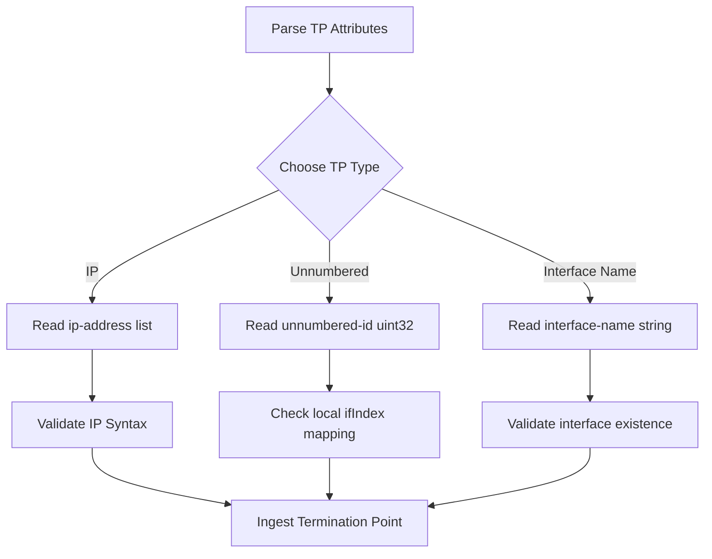

# Feature: Feature 58: IETF Layer 3 Unicast Links and Termination Points (Issue #170)

This feature implements Layer 3 link attributes and termination point properties for unicast network topologies. It enables modeling of link-level routing metrics, physical or logical interface names, unnumbered link identifiers, and IP addresses assigned to termination points.

## 1. Schema Definitions & Constraints

### Groupings & Nodes
- `l3-link-attributes` (`container`): Holds attributes specific to Layer 3 links:
  - `name` (`string`): Description or name of the link.
  - `flag` (`leaf-list` of `link-flag-type`): Link-specific flags.
  - `metric1` (`uint64`): Primary routing cost or metric associated with the link.
  - `metric2` (`uint64`): Secondary routing cost or metric associated with the link.
- `l3-termination-point-attributes` (`container`): Holds attributes of Layer 3 termination points:
  - `termination-point-type` (`choice`): Distinguishes the interface addressing scheme:
    - `ip` (`case`): Assigns one or more IP addresses.
      - `ip-address` (`leaf-list` of `inet:ip-address`): IPv4 or IPv6 addresses assigned to the interface.
    - `unnumbered` (`case`): Models unnumbered link endpoints.
      - `unnumbered-id` (`uint32`): Interface index identifier matching RFC 2863 `ifIndex`.
    - `interface-name` (`case`): Models named interfaces.
      - `interface-name` (`string`): The name of the interface on the node.

### Typedefs
- `link-flag-type`: Typeref referencing `identityref` derived from `flag-identity`.

## 2. Logical System Integration & UI Capabilities

- **Logical Data Model**:
  - Augments the base `ietf-network-topology` link list and termination point list with Layer 3 unicast specific containers when the topology is flagged as `l3-unicast-topology`.
- **Logical Processing Rules**:
  - Validation rule: Link metric values `metric1` and `metric2` must be non-negative integers.
  - Validation rule: An unnumbered identifier must be a valid 32-bit unsigned integer matching the device's local SNMP interface table index.
- **Logical UI Representation**:
  - Visualizes Layer 3 links, displaying their primary and secondary metrics, alongside termination point addresses (IPs, interface names, or unnumbered IDs).

## 3. State Machine and Validation Flow

## 4. BDD Given-When-Then Acceptance Criteria

- **Scenario 1: Validate Link Metric Assignment**
  - **Given** a Layer 3 topology link
  - **When** the link is configured with `metric1` `100` and `metric2` `200`
  - **Then** the routing engine successfully parses and registers the metrics.

- **Scenario 2: Configure IP-based Termination Point**
  - **Given** an active termination point
  - **When** the network manager assigns `ip-address` `192.0.2.10`
  - **Then** the address is accepted and mapped to the Layer 3 topology model.

- **Scenario 3: Configure Unnumbered Interface ID**
  - **Given** a point-to-point link termination point
  - **When** configured with `unnumbered-id` `1024`
  - **Then** the interface is registered as unnumbered, referencing the corresponding index.

## 5. Specification Context (Verbatim)

> This module defines a YANG data model for Layer 3 Unicast topologies.
> The link and termination point attributes describe the Layer 3 routing connections, link metrics, and IP-level endpoints including interface names and unnumbered interface indices.

## 6. Source References
- **YANG Schema:** [ietf-l3-unicast-topology.yang](https://github.com/gintatkinson/cogctl-ux-09/blob/main/yang/ietf-l3-unicast-topology.yang)
- **Normative Specification:** [RFC 8346](https://datatracker.ietf.org/doc/rfc8346/), Section 5.2 (Link and Termination Point Attributes).
