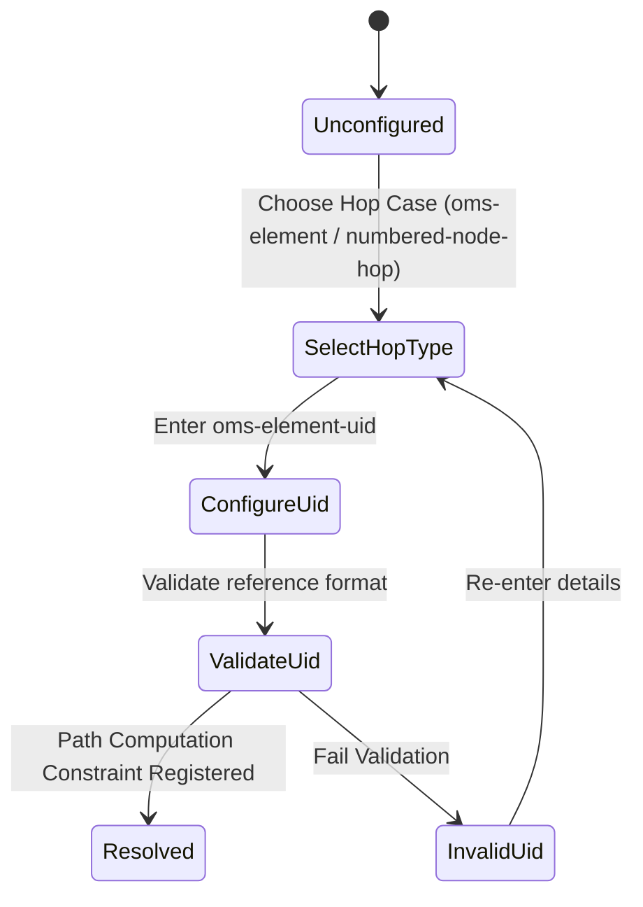

# Feature: Feature 60: WDM Path Computation Objects (Issue #180)

**Parent Epic:** [Epic 21: WDM Path Computation (Issue #183)](https://github.com/gintatkinson/cogctl-ux-09/blob/main/docs/epics/epic-21-wdm-path-computation.md)

This feature introduces the capability to specify WDM-specific objects and constraints for explicit route inclusion, exclusion, and technology labels in path computation requests.

## 1. Schema Definitions & Constraints

### Choices and Mutually Exclusive Allocations
- `oms-element`:
  - **Type**: case
  - **Description**: Represents the Optical Multiplex Section (OMS) route hop type case within the route-object type choice.
- `wdm`:
  - **Type**: case
  - **Description**: Represents the Wavelength-Division Multiplexing (WDM) technology case within the label technology choice.

### Leaves
- `oms-element-uid`:
  - **Type**: leaf (string)
  - **Description**: The unique identifier of the OMS element.

### Conditional Constraints & Co-dependencies
- **Augmentation Targets**:
  - The `oms-element` case is augmented into the explicit route exclude/include objects, route-object-exclude-always, route-object-include-exclude, synchronized excludes, and computed path route object type choices.
  - The `wdm` case is augmented into the technology choices of route-object label hops, label range starts, label range ends, and label range steps.
- **Reference Imports**:
  - Leverages groupings from `ietf-layer0-types` (`wdm-label-hop`, `wdm-label-start-end`, `wdm-label-step`) and `ietf-wdm-tunnel` (`wdm-constraint`, `path-transceiver-config`) to enforce layer-0 constraints.

## 2. Logical System Integration & UI Capabilities

- **Logical Data Model**:
  - The path computation query object exposes WDM-specific filter cases.
- **Logical Processing Rules**:
  - If the technology choice is set to `wdm`, label ranges and restrictions are validated using WDM label format parameters.
  - When excluding or including route elements, the `oms-element-uid` must be a valid reference string matching an active OMS element in the physical topology.
- **Logical UI Representation**:
  - The route builder interface displays an option to include or exclude specific WDM-level "OMS Elements" by entering their Unique IDs.
  - A wavelength allocation constraint panel allows the user to define label boundaries and steps specific to WDM DWDM or flexi-grid technologies.

## 3. State Machine and Validation Flow

## 4. BDD Given-When-Then Acceptance Criteria

- **Scenario 1: Successfully exclude an OMS element from path computation**
  - **Given** the path computation input editor is open
  - **When** the operator adds a route exclusion object of type `oms-element` with `oms-element-uid` set to `OMS-LINK-A-B-12`
  - **Then** the validation rule succeeds and the constraint is registered in the computation request.

- **Scenario 2: Select WDM label technology constraint**
  - **Given** the label restriction interface for a path request is active
  - **When** the operator selects the `wdm` technology case and specifies label ranges
  - **Then** the system registers the WDM label boundaries using Layer 0 spectral parameters.

## 5. Specification Context (Verbatim)

> This module defines a model for requesting WDM Path Computation.
> Augment the route hop for the explicit route objects included or excluded by the path computation of the requested path.

## 6. Source References

YANG Schema: [ietf-wdm-path-computation.yang](https://github.com/YangModels/yang/blob/954277fad0534e9b0b495774255b0c4ce854f8b2/experimental/ietf-extracted-YANG-modules/ietf-wdm-path-computation%402026-02-27.yang)
Normative Specification: [draft-ietf-ccamp-optical-path-computation-yang](https://datatracker.ietf.org/doc/draft-ietf-ccamp-optical-path-computation-yang/)
