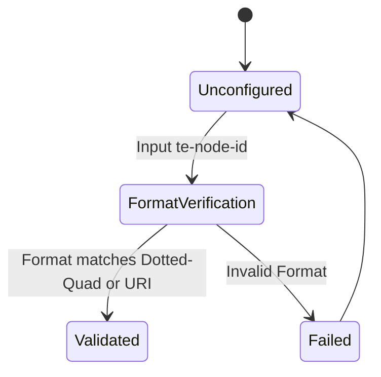

# Feature: Feature 61: Common Traffic Engineering Base Types (Issue #184)

**Parent Epic:** [Epic 22: Traffic Engineering Common Data Types (Issue #189)](https://github.com/gintatkinson/cogctl-ux-09/blob/main/docs/epics/epic-22-te-types.md)

This feature introduces the common baseline types, administrative groups, naming structures, and identifier groupings utilized across the Traffic Engineering YANG module.

## 1. Schema Definitions & Constraints
- Identifiers: `te-node-id`, `te-topology-id`, `te-global-id`, `te-tp-id`, `node-id`, `link-tp-id`.
- Naming & Affinities: `affinity-name`, `path-affinity-name`, `te-template-name`.
- Protocol Origin & Actions: `protocol-origin-type`, `te-action-result`, `te-admin-status`, `te-common-status`, `te-oper-status`.
- Data Formats: `range-bitmap`, `weight`, `value`, `values`.

### Typedefs
- **te-admin-status**: Represents the administrative status of a TE link or tunnel.
- **te-common-status**: Represents common operational status values.
- **te-ds-class**: Represents a Differentiated Services class.
- **te-global-id**: Global TE identifier representing provider or AS.
- **te-label-direction**: Direction of a TE label (forward, reverse, bidirectional).
- **te-link-access-type**: Represents link access permission styles.
- **te-link-direction**: Directionality of a TE link (point-to-point, multipoint).
- **te-node-id**: TE node identifier formatted as dotted-quad or URI.
- **te-oper-status**: Operational state of a TE entity.
- **te-template-name**: Administrative string for TE tunnel/link templates.
- **te-tp-id**: TE termination point identifier.

### Choices
- **algorithm**: Selection of metric computation algorithms (mutually exclusive choice selection).
- **technology**: Multi-technology selections (OTN, WDM, packet) (mutually exclusive choice selection).
- **type**: Generic choice identifier discriminator (mutually exclusive choice selection).

## 2. Logical System Integration & UI Capabilities
- The network UI supports selecting admin groups by name or index.
- Validation checks ensure that `te-node-id` is formatted as a dotted-quad or URI string conforming to IETF guidelines.

## 3. State Machine and Validation Flow

## 4. BDD Given-When-Then Acceptance Criteria
- **Scenario 1: Validate te-node-id format**
  - **Given** an operator enters a new Traffic Engineering node identifier
  - **When** the identifier matches `10.0.0.1` or `urn:ietf:params:xml:ns:yang:te-id`
  - **Then** the validation rule succeeds.

## 5. Specification Context
> This module defines common base types and identity hierarchies for Traffic Engineering.

## 6. Source References
YANG Schema: [ietf-te-types.yang](https://github.com/YangModels/yang/blob/954277fad0534e9b0b495774255b0c4ce854f8b2/experimental/ietf-extracted-YANG-modules/ietf-te-types%402026-05-08.yang)
Normative Specification: [draft-ietf-teas-rfc8776-update](https://datatracker.ietf.org/doc/draft-ietf-teas-rfc8776-update/)
