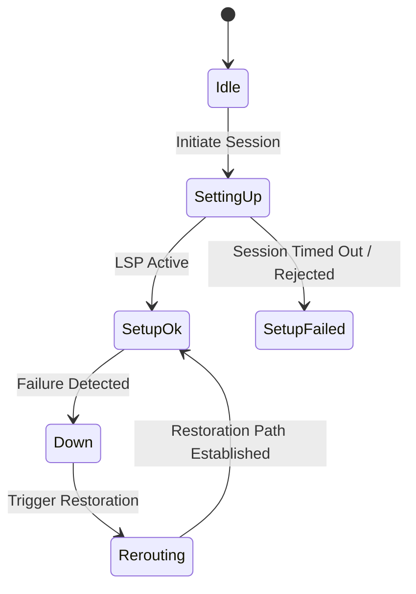

# Feature: Feature 62: Traffic Engineering LSP and Tunnel Properties (Issue #185)

**Parent Epic:** [Epic 22: Traffic Engineering Common Data Types (Issue #189)](https://github.com/gintatkinson/cogctl-ux-09/blob/main/docs/epics/epic-22-te-types.md)

This feature introduces the properties and state variables for LSP (Label Switched Path) establishment, tunnel types, local protection mechanisms, switching capabilities, and optical encoding schemes.

## 1. Schema Definitions & Constraints
- Tunnel Properties: `te-tunnel-type`, `te-tunnel-p2p`, `te-tunnel-p2mp`, `tunnel-state-type`, `tunnel-admin-state-type`.
- LSP States & Types: `lsp-state-type`, `lsp-protection-type`, `lsp-restoration-type`, `lsp-encoding-types`.
- Local Protection Flags: `session-attributes-flags`, `se-style-desired`, `local-protection-desired`, `bandwidth-protection-desired`, `node-protection-desired`.
- Switching & Encoding: `switching-type`, `switching-capabilities`, `switching-otn`, `switching-lsc`.

### Typedefs
- **admin-group**: Standard 32-bit administrative group / affinity bitmask.
- **admin-groups**: Array/collection of administrative groups.
- **extended-admin-group**: Infinite-length or extended administrative group representation.
- **te-recovery-status**: Local protection recovery state (active, inactive).

## 2. Logical System Integration & UI Capabilities
- The tunnel configuration panel allows selecting protection types (e.g., 1+1, 1:N) and protection/restoration triggers.
- The system handles state changes dynamically when LSPs go through setting-up, setup-ok, setup-failed, or down transitions.

## 3. State Machine and Validation Flow

## 4. BDD Given-When-Then Acceptance Criteria
- **Scenario 1: Set local protection preferences**
  - **Given** an operator configures an RSVP-TE session attributes
  - **When** the operator checks `local-protection-desired` and `node-protection-desired`
  - **Then** the control plane requests fast reroute capability from downstream routers.

## 5. Specification Context
> This feature defines encoding types, switching capabilities, protection schemes, and restoration types.

## 6. Source References
YANG Schema: [ietf-te-types.yang](https://github.com/YangModels/yang/blob/954277fad0534e9b0b495774255b0c4ce854f8b2/experimental/ietf-extracted-YANG-modules/ietf-te-types%402026-05-08.yang)
Normative Specification: [draft-ietf-teas-rfc8776-update](https://datatracker.ietf.org/doc/draft-ietf-teas-rfc8776-update/)
