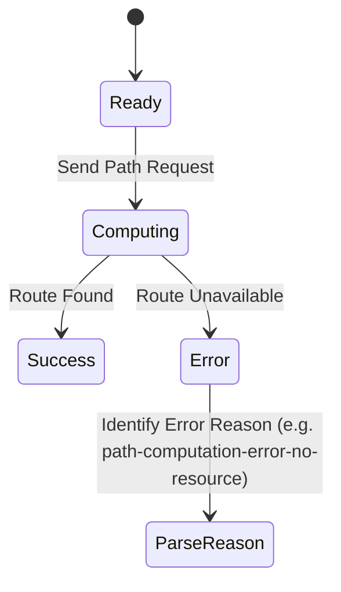

# Feature: Feature 63: Traffic Engineering Path Computation and Metrics (Issue #186)

**Parent Epic:** [Epic 22: Traffic Engineering Common Data Types (Issue #189)](https://github.com/gintatkinson/cogctl-ux-09/blob/main/docs/epics/epic-22-te-types.md)

This feature introduces path computation constraints, synchronization vector (SVEC) properties, path optimization metrics, and explicit path calculation errors.

## 1. Schema Definitions & Constraints
- Path Constraints: `path-constraints`, `path-metric-bound`, `path-metric-bounds`, `path-route-objects`.
- Optimization Metrics: `path-metric-type`, `link-metric-type`, `objective-function-type`, `of-minimize-cost-path`.
- SVEC Metrics: `svec-metric-type`, `svec-objective-function-type`.
- Computation Errors: `path-computation-error-reason`, `path-computation-error-no-resource`, `path-computation-error-path-not-found`.

### Typedefs
- **path-attribute-flags**: Flags detailing path setup capabilities and constraints.
- **path-type**: Type of computed path (dynamic, explicit, etc.).
- **performance-metrics-normality**: Indication of performance metrics normality index.
- **srlg**: Shared Risk Link Group identifier.
- **te-bandwidth**: Traffic engineering bandwidth capability definition.
- **te-hop-type**: Hop inclusion type (loose, strict).
- **te-metric**: TE path computation metric.
- **te-path-disjointness**: Level of disjointness for path computation.
- **te-topology-event-type**: Event notification type for topology updates.
- **te-topology-id**: Topology instance identifier.

## 2. Logical System Integration & UI Capabilities
- Designers can specify metric bounds (e.g. max delay or hop limit) during explicit route object configuration.
- The path request validator returns clear error reasons when PCE path computation fails.

## 3. State Machine and Validation Flow

## 4. BDD Given-When-Then Acceptance Criteria
- **Scenario 1: Detect path computation failure reason**
  - **Given** a PCE receives a path computation request
  - **When** there is no topology match for the destination
  - **Then** the PCE returns `path-computation-error-destination-unknown`.

## 5. Specification Context
> This feature defines synchronization vector options and metric parameters for path computation.

## 6. Source References
YANG Schema: [ietf-te-types.yang](https://github.com/YangModels/yang/blob/954277fad0534e9b0b495774255b0c4ce854f8b2/experimental/ietf-extracted-YANG-modules/ietf-te-types%402026-05-08.yang)
Normative Specification: [draft-ietf-teas-rfc8776-update](https://datatracker.ietf.org/doc/draft-ietf-teas-rfc8776-update/)
