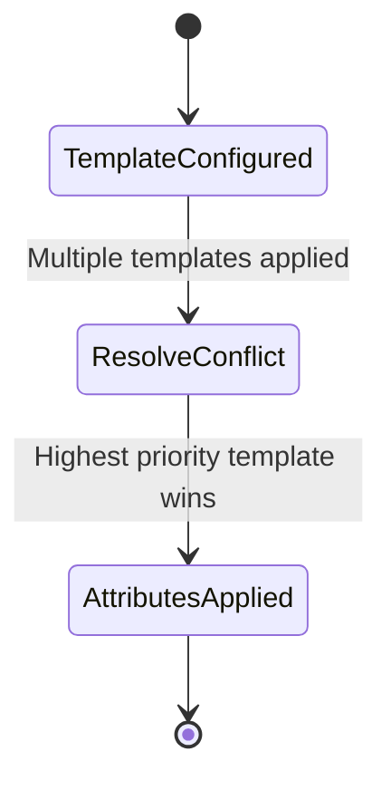

# Feature: Feature 64: Traffic Engineering Topologies Core (Issue #190)

**Parent Epic:** [Epic 23: Traffic Engineering Topologies Model (Issue #195)](https://github.com/gintatkinson/cogctl-ux-09/blob/main/docs/epics/epic-23-te-topology.md)

This feature introduces the core Traffic Engineering (TE) topology elements, node configurations, link configurations, template definitions, and risk groups.

## 1. Schema Definitions & Constraints
- Identifiers and Templates: `te-topology`, `te-node-id`, `te-node-template`, `te-link-template`, `templates`, `node-template`, `link-template`.
- Node Attributes: `te-node-attributes`, `is-abstract`, `domain-id`, `signaling-address`.
- Link Attributes: `te-link-attributes`, `access-type`, `admin-status`, `external-domain`, `remote-te-node-id`, `remote-te-link-tp-id`, `te-default-metric`, `te-delay-metric`, `te-igp-metric`, `link-index`, `link-protection-type`, `administrative-group`.
- Risk Groups & Disjointness: `nsrlg`, `disjointness`, `te-nsrlgs`, `te-srlgs`, `value`, `id`.
- Template Priorities & Policies: `priority`, `reference-change-policy`.

### Typedefs
- **geographic-coordinate-degree**: Represents a coordinate in decimal degrees.

### Choices
- None defined in this feature.

## 2. Logical System Integration & UI Capabilities
- Operators can configure node and link templates to reuse common parameters across topologies.
- Conflict resolution uses `priority` to choose values when multiple templates define the same parameter.

## 3. State Machine and Validation Flow

## 4. BDD Given-When-Then Acceptance Criteria
- **Scenario 1: Resolve template configuration conflict**
  - **Given** a TE link is configured with Template A (priority 10) and Template B (priority 5)
  - **When** both templates configure the administrative group parameter
  - **Then** the parameter value from Template B is applied (lower number indicates higher priority).

## 5. Specification Context
> This feature covers the basic TE topologies, node attributes, link attributes, NSRLG configurations, and templates.

## 6. Source References
YANG Schema: [ietf-te-topology.yang](https://github.com/YangModels/yang/blob/954277fad0534e9b0b495774255b0c4ce854f8b2/standard/ietf/RFC/ietf-te-topology%402020-08-06.yang)
Normative Specification: [RFC 8795](https://datatracker.ietf.org/doc/rfc8795/)
