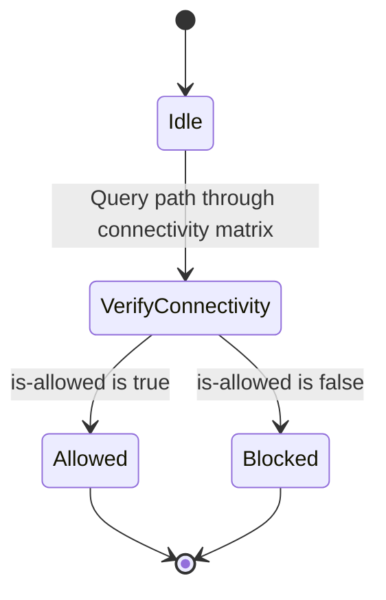

# Feature: Feature 65: Traffic Engineering Topologies Connectivity and Capabilities (Issue #191)

**Parent Epic:** [Epic 23: Traffic Engineering Topologies Model (Issue #195)](https://github.com/gintatkinson/cogctl-ux-09/blob/main/docs/epics/epic-23-te-topology.md)

This feature introduces the capabilities and connectivity matrices at the node, link, and termination point levels, covering bundled/component links and interface switching capabilities.

## 1. Schema Definitions & Constraints
- Connectivity Matrices: `connectivity-matrices`, `connectivity-matrix`, `connectivity-matrix-entry`, `number-of-entries`, `from`, `to`, `tp-ref`, `is-allowed`.
- Local Link Connectivities: `local-link-connectivities`, `local-link-connectivity`, `link-tp-ref`.
- TTPs and Termination Points: `te-tp-id`, `tunnel-tp-id`, `supporting-tunnel-termination-point`, `node-ref`, `tunnel-tp-ref`, `inter-domain-plug-id`, `inter-layer-lock-id`, `tunnel-termination-point`.
- Interface Switching Capabilities: `interface-switching-capability`, `switching-capability`, `encoding`, `max-lsp-bandwidth`, `client-layer-adaptation`.
- Bundled and Component Links: `bundle-stack-level`, `bundle`, `bundled-links`, `bundled-link`, `sequence`, `src-tp-ref`, `des-tp-ref`, `component`, `component-links`, `component-link`, `src-interface-ref`, `des-interface-ref`.

### Typedefs
- None defined in this feature.

### Choices
- **bundle-stack-level**: Specifies whether a TE link is a bundle link, component link, or part of a stack.

## 2. Logical System Integration & UI Capabilities
- Supports modeling node switching capabilities and link bundling in the optical or packet layer.
- Displays node connectivity restrictions (what ports can connect to what other ports) via the connectivity matrix.

## 3. State Machine and Validation Flow

## 4. BDD Given-When-Then Acceptance Criteria
- **Scenario 1: Validate node internal connectivity matrix**
  - **Given** a TE node has a connectivity matrix entry from port 1 to port 2
  - **When** the entry's `is-allowed` flag is configured as `false`
  - **Then** path computation must reject any paths that attempt to switch internally from port 1 to port 2.

## 5. Specification Context
> This feature covers switching capabilities, connectivity matrices, bundled links, and tunnel termination points.

## 6. Source References
YANG Schema: [ietf-te-topology.yang](https://github.com/YangModels/yang/blob/954277fad0534e9b0b495774255b0c4ce854f8b2/standard/ietf/RFC/ietf-te-topology%402020-08-06.yang)
Normative Specification: [RFC 8795](https://datatracker.ietf.org/doc/rfc8795/)
