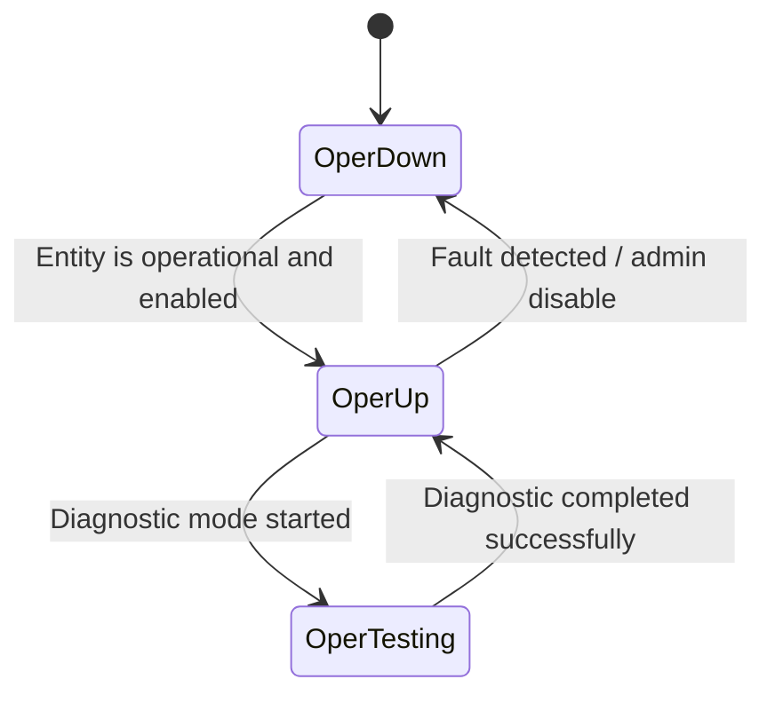

# Feature: Feature 66: Traffic Engineering Topologies Operational State and Statistics (Issue #192)

**Parent Epic:** [Epic 23: Traffic Engineering Topologies Model (Issue #195)](https://github.com/gintatkinson/cogctl-ux-09/blob/main/docs/epics/epic-23-te-topology.md)

This feature introduces operational status parameters, geolocation info, learned information sources, underlay paths, protection/restoration states, and performance/maintenance counter statistics.

## 1. Schema Definitions & Constraints
- Operational Status & Flags: `oper-status`, `is-multi-access-dr`, `is-transitional`.
- Geolocation: `geolocation`, `altitude`, `latitude`, `longitude`.
- Underlays and Paths: `underlay`, `underlay-topology`, `dynamic`, `committed`, `enabled`, `primary-path`, `backup-path`, `index`, `path-element`, `path-element-id`, `protection-type`.
- Learned Info Sources: `information-source`, `information-source-instance`, `information-source-state`, `information-source-entry`, `logical-network-element`, `network-instance`, `topology`, `credibility-preference`.
- Recovery States: `recovery`, `restoration-status`, `protection-status`, `tunnels`, `sharing`, `tunnel`, `tunnel-name`, `tunnel-termination-points`, `source`, `destination`.
- Statistics Counters: `statistics`, `discontinuity-time`, `enables`, `disables`, `modifies`, `ups`, `downs`, `maintenance-sets`, `maintenance-clears`, `creates`, `deletes`, `fault-clears`, `fault-detects`, `protection-switches`, `protection-reverts`, `restoration-failures`, `restoration-starts`, `restoration-successes`, `restoration-reversion-failures`, `restoration-reversion-starts`, `restoration-reversion-successes`, `in-service-clears`, `in-service-sets`, `node`.
- Bandwidth Properties: `max-link-bandwidth`, `max-resv-link-bandwidth`, `unreserved-bandwidth`.

### Typedefs
- **te-info-source**: Enumeration of potential TE information source types (e.g. unknown, local, ospf, isis, bgp-ls).

### Choices
- None defined in this feature.

## 2. Logical System Integration & UI Capabilities
- Displays real-time operational status (up, down, testing) for nodes, links, and termination points.
- Lists learned TE information sources and their credibility preferences.
- Tracks performance and reliability metrics such as fault detections, protection switches, and restoration starts.

## 3. State Machine and Validation Flow

## 4. BDD Given-When-Then Acceptance Criteria
- **Scenario 1: Retrieve operational status of a TE node**
  - **Given** a TE node is configured and operational
  - **When** query request is sent to `oper-status`
  - **Then** status is returned as `up`.

## 5. Specification Context
> This feature covers the geolocation, underlay hierarchy, information source types, recovery actions, statistics counters, and bandwidth values.

## 6. Source References
YANG Schema: [ietf-te-topology.yang](https://github.com/YangModels/yang/blob/954277fad0534e9b0b495774255b0c4ce854f8b2/standard/ietf/RFC/ietf-te-topology%402020-08-06.yang)
Normative Specification: [RFC 8795](https://datatracker.ietf.org/doc/rfc8795/)
