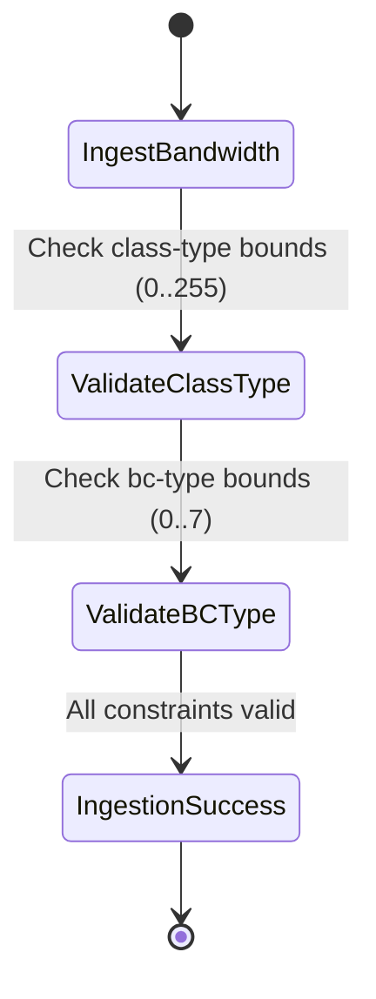

# Feature: Feature 67: Packet Traffic Engineering Core Types (Issue #196)

**Parent Epic:** [Epic 24: Packet Traffic Engineering Types Model (Issue #199)](https://github.com/gintatkinson/cogctl-ux-09/blob/main/docs/epics/epic-24-te-packet-types.md)

This feature introduces the core types and identities representing Diffserv-aware TE (Diffserv-TE) bandwidth constraint models, backup protection modes, and bandwidth representations in kbps/mbps/gbps.

## 1. Schema Definitions & Constraints
- Requested Bandwidth Types: `te-bandwidth-requested-type` (specified or auto).
- Class and Bandwidth Constraints: `te-class-type` (0..255) and `bc-type` (0..7).
- Bandwidth units: `bandwidth-kbps`, `bandwidth-mbps`, `bandwidth-gbps`.
- Protection identities: `backup-protection-type`, `backup-protection-link`, `backup-protection-node-link`.
- Bandwidth Constraint Models: `bc-model-type`, `bc-model-rdm` (Russian Dolls Model), `bc-model-mam` (Maximum Allocation Model), `bc-model-mar` (Max Allocation with Reservation).

### Typedefs
- **te-bandwidth-requested-type**: Enumeration (`specified` or `auto`).
- **te-class-type**: `uint8`.
- **bc-type**: `uint8` restricted to `0..7`.
- **bandwidth-kbps**: `uint64` with unit `Kbps`.
- **bandwidth-mbps**: `uint64` with unit `Mbps`.
- **bandwidth-gbps**: `uint64` with unit `Gbps`.

### Choices
- None defined in this feature.

## 2. Logical System Integration & UI Capabilities
- Path computation and reservation engines use these types to model and allocate Diffserv-TE class-specific bandwidth constraints.
- Allows operators to express bandwidth constraints in distinct granularities (kbps, mbps, gbps) depending on technology levels.

## 3. State Machine and Validation Flow

## 4. BDD Given-When-Then Acceptance Criteria
- **Scenario 1: Validate Bandwidth Constraint bounds**
  - **Given** a Class-Type configuration is being validated
  - **When** an operator inputs a BC-Type value of 8
  - **Then** the validation fails because `bc-type` range is restricted to `0..7`.

## 5. Specification Context
> Defines Diffserv-TE class type, bandwidth constraint type, and various bandwidth representations.

## 6. Source References
YANG Schema: [ietf-te-packet-types.yang](https://github.com/gintatkinson/cogctl-ux-09/blob/main/yang/ietf-te-packet-types.yang)
Normative Specification: [draft-ietf-teas-rfc8776-update](https://datatracker.ietf.org/doc/draft-ietf-teas-rfc8776-update/)
