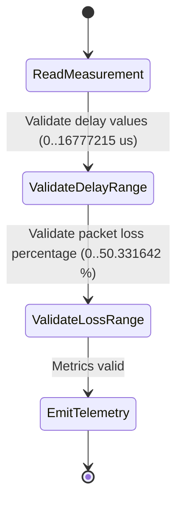

# Feature: Feature 68: Packet Performance Metrics Groupings (Issue #200)

**Parent Epic:** [Epic 24: Packet Traffic Engineering Types Model (Issue #199)](https://github.com/gintatkinson/cogctl-ux-09/blob/main/docs/epics/epic-24-te-packet-types.md)

This feature introduces packet-specific performance metrics mappings (one-way and two-way metrics), including minimum delay, maximum delay, delay variation, packet loss percentages, and their respective normality ratings.

## 1. Schema Definitions & Constraints
- One-Way Metrics: `one-way-min-delay`, `one-way-min-delay-normality`, `one-way-max-delay`, `one-way-max-delay-normality`, `one-way-delay-variation`, `one-way-delay-variation-normality`, `one-way-packet-loss`, `one-way-packet-loss-normality`.
- Two-Way Metrics: `two-way-min-delay`, `two-way-min-delay-normality`, `two-way-max-delay`, `two-way-max-delay-normality`, `two-way-delay-variation`, `two-way-delay-variation-normality`, `two-way-packet-loss`, `two-way-packet-loss-normality`.

### Typedefs
- Delay fields: `uint32` with range `0..16777215` (microseconds).
- Normality fields: `performance-metrics-normality` (e.g. `normal` / `abnormal`).
- Packet loss fields: `decimal64` with `fraction-digits 6` and range `0..50.331642` (percent).

### Choices
- None defined in this feature.

## 2. Logical System Integration & UI Capabilities
- Traffic Engineering performance measurement agents (e.g. TWAMP, BFD) map raw packet measurements into these structures to advertise path latency, jitter, and packet loss constraints.

## 3. State Machine and Validation Flow

## 4. BDD Given-When-Then Acceptance Criteria
- **Scenario 1: Validate packet loss decimal range**
  - **Given** a one-way packet loss value is monitored
  - **When** the measured loss is 50.5%
  - **Then** the value is rejected because it exceeds the maximum supported packet loss of 50.331642%.

## 5. Specification Context
> Defines packet-specific performance metrics used for traffic engineering path optimizations.

## 6. Source References
YANG Schema: [ietf-te-packet-types.yang](https://github.com/gintatkinson/cogctl-ux-09/blob/main/yang/ietf-te-packet-types.yang)
Normative Specification: [draft-ietf-teas-rfc8776-update](https://datatracker.ietf.org/doc/draft-ietf-teas-rfc8776-update/)
