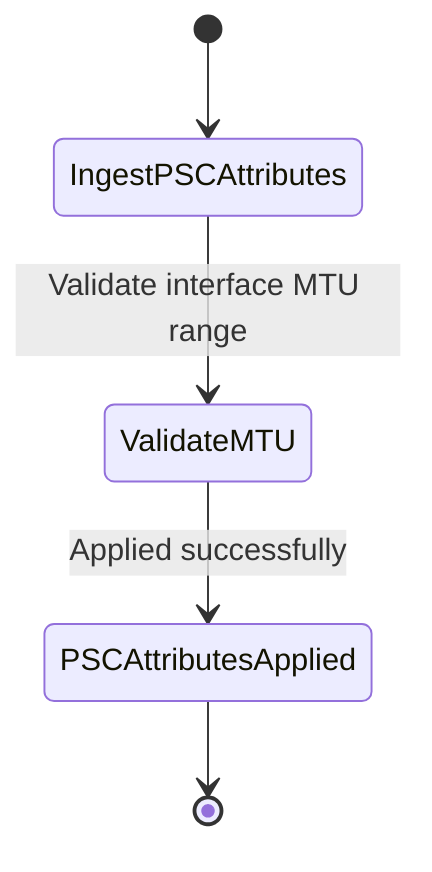

# Feature: Feature 69: Packet Traffic Engineering Topologies Core (Issue #201)

**Parent Epic:** [Epic 25: Packet Traffic Engineering Topologies Model (Issue #204)](https://github.com/gintatkinson/cogctl-ux-09/blob/main/docs/epics/epic-25-te-topology-packet.md)

This feature introduces the packet TE topology type and packet switching capabilities, including minimum LSP bandwidth and interface MTUs.

## 1. Schema Definitions & Constraints
- Packet Topology Type: `packet` container.
- Packet switching capabilities: `packet-switch-capable` container, containing:
  - `minimum-lsp-bandwidth` (rt-types:bandwidth-ieee-float32) in bytes per second.
  - `interface-mtu` (uint16) bytes.

### Typedefs
- None defined in this feature.

### Choices
- None defined in this feature.

## 2. Logical System Integration & UI Capabilities
- Controllers use these attributes to determine the compatibility of interfaces when routing packet LSPs.
- Allows operators to retrieve and configure interface-specific packet MTU limits and LSP bandwidth capacities.

## 3. State Machine and Validation Flow

## 4. BDD Given-When-Then Acceptance Criteria
- **Scenario 1: Ingest valid PSC attributes**
  - **Given** a packet-switching interface is configured
  - **When** the operator assigns a minimum LSP bandwidth of 125000000 bytes/sec and an interface MTU of 1500
  - **Then** the configuration is validated and successfully applied.

## 5. Specification Context
> Defines packet-specific switching capabilities and topology types.

## 6. Source References
YANG Schema: [ietf-te-topology-packet.yang](https://github.com/gintatkinson/cogctl-ux-09/blob/main/yang/ietf-te-topology-packet.yang)
Normative Specification: [RFC 8795](https://datatracker.ietf.org/doc/rfc8795/)
