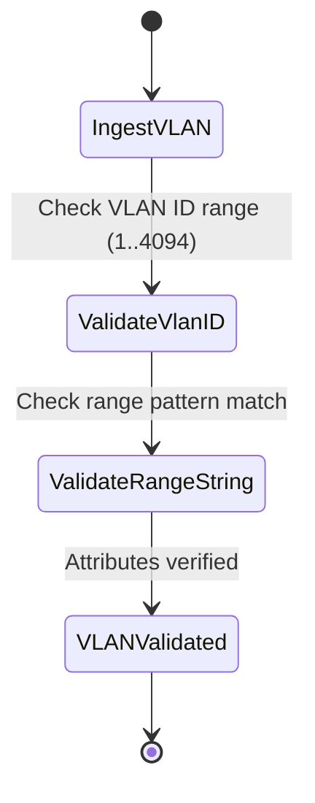

# Feature: Feature 70: Ethernet Transport Client VLAN and Service Classification Types (Issue #205)

**Parent Epic:** [Epic 26: Ethernet Transport Network Client Signals Common Types Model (Issue #210)](https://github.com/gintatkinson/cogctl-ux-09/blob/main/docs/epics/epic-26-eth-tran-types.md)

This feature introduces the classification bases and VLAN tag structures representing Customer (C-VLAN) and Service (S-VLAN/QinQ) classifications on Ethernet transport interfaces.

## 1. Schema Definitions & Constraints
- Tag types: `eth-vlan-tag-type`, `c-vlan-tag-type`, `s-vlan-tag-type`.
- Classification types: `service-classification-type`, `port-classification`, `vlan-classification`.
- Tag classification identities: `eth-vlan-tag-classify`, `classify-c-vlan`, `classify-s-vlan`, `classify-s-or-c-vlan`.
- Basic Ethernet fields: `encapsulation-type`, `tag-type`, `eth-tag-type`, `eth-tag-classify`.
- Ranges & IDs: `vlanid` (1..4094), `vid-range-type` (representing lists of VLAN IDs or VLAN ranges).

### Typedefs
- **vlanid**: `uint16` with range `1..4094`.
- **vid-range-type**: `string` with patterns representing VLAN ranges (e.g. `1..100`, `100, 200`, `all`).
- **eth-tag-type**: Enumeration representing VLAN tag types (C-VLAN/S-VLAN).
- **eth-tag-classify**: Enumeration representing VLAN tag classifications.

### Choices
- None defined in this feature.

## 2. Logical System Integration & UI Capabilities
- Network element managers use these fields to classify incoming traffic on client interfaces to determine encapsulation mapping.
- Validates VLAN ranges and range lists to prevent duplicate provisioning.

## 3. State Machine and Validation Flow

## 4. BDD Given-When-Then Acceptance Criteria
- **Scenario 1: Validate VLAN ID range**
  - **Given** a new Customer VLAN is being provisioned
  - **When** an operator inputs VLAN ID 4095
  - **Then** the system rejects the configuration because `vlanid` is restricted to `1..4094`.

## 5. Specification Context
> Defines VLAN tags, classifications, and ranges for Ethernet transport client interfaces.

## 6. Source References
YANG Schema: [ietf-eth-tran-types.yang](https://github.com/gintatkinson/cogctl-ux-09/blob/main/yang/ietf-eth-tran-types.yang)
Normative Specification: [draft-ietf-ccamp-client-signal-yang](https://datatracker.ietf.org/doc/draft-ietf-ccamp-client-signal-yang/)
