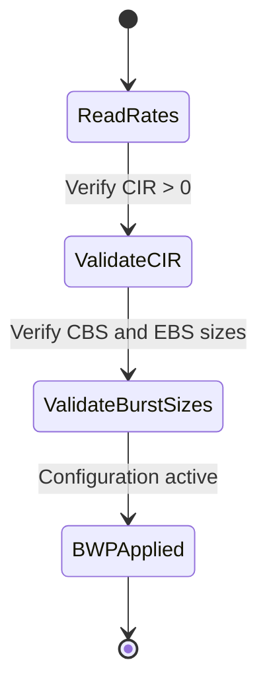

# Feature: Feature 71: Ethernet Transport Bandwidth Profiles and Service Types (Issue #206)

**Parent Epic:** [Epic 26: Ethernet Transport Network Client Signals Common Types Model (Issue #210)](https://github.com/gintatkinson/cogctl-ux-09/blob/main/docs/epics/epic-26-eth-tran-types.md)

This feature introduces the service type definitions and bandwidth profiling capabilities (e.g. MEF-10, RFCs) including CIR, EIR, CBS, EBS, and color-awareness parameters.

## 1. Schema Definitions & Constraints
- Service types: `service-type`, `p2p-svc`, `mp2mp-svc`, `rmp-svc`.
- Bandwidth profile types: `bandwidth-profile-type`, `mef-10-bwp`, `rfc-2697-bwp`, `rfc-2698-bwp`, `rfc-4115-bwp`.
- Bandwidth constraints: `CIR` (Committed Information Rate), `EIR` (Excess Information Rate), `CBS` (Committed Burst Size), `EBS` (Excess Burst Size).
- Algorithmic parameters: `coupling-flag`, `color-aware`, `eth-bandwidth`, `eth-step`.

### Typedefs
- **service-type**: Enumeration (`p2p`, `mp2mp`, `rmp`).
- **bandwidth-profile-type**: Enumeration representing MEF and RFC bandwidth profile algorithms.

### Choices
- None defined in this feature.

## 2. Logical System Integration & UI Capabilities
- Traffic shaping and policing mechanisms on Ethernet switches use these profiles to enforce SLA limits.
- Supports MEF 10, RFC 2697, RFC 2698, and RFC 4115 rate limits.

## 3. State Machine and Validation Flow

## 4. BDD Given-When-Then Acceptance Criteria
- **Scenario 1: Configure MEF-10 Bandwidth Profile**
  - **Given** an operator is configuring a bandwidth profile for a customer interface
  - **When** the type is set to `mef-10-bwp` with CIR of 100 Mbps and CBS of 500 KB
  - **Then** the bandwidth parameters are successfully validated and allocated.

## 5. Specification Context
> Defines bandwidth profiles and rate parameters for Ethernet transport services.

## 6. Source References
YANG Schema: [ietf-eth-tran-types.yang](https://github.com/gintatkinson/cogctl-ux-09/blob/main/yang/ietf-eth-tran-types.yang)
Normative Specification: [draft-ietf-ccamp-client-signal-yang](https://datatracker.ietf.org/doc/draft-ietf-ccamp-client-signal-yang/)
